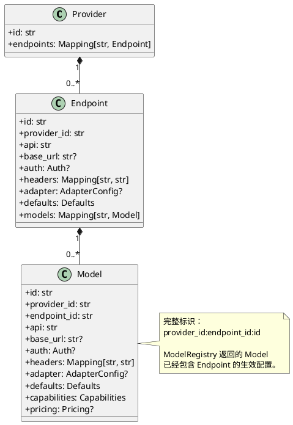
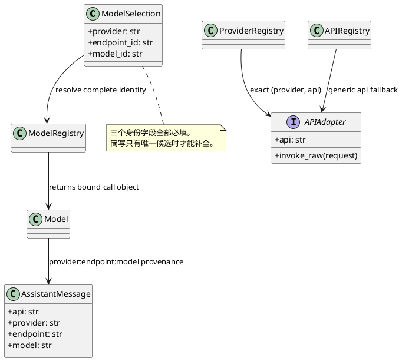

# `loushang.ai` 领域模型 UML

以下关系以当前 `models.json` 和运行时类型为准。

```plantuml
@startuml
skinparam classAttributeIconSize 0
skinparam shadowing false
skinparam linetype ortho

class Provider {
  +id: str
  +endpoints: Mapping[str, Endpoint]
}

class Endpoint {
  +id: str
  +provider_id: str
  +api: str
  +base_url: str?
  +auth: Auth?
  +headers: Mapping[str, str]
  +adapter: AdapterConfig?
  +defaults: Defaults
  +models: Mapping[str, Model]
}

class Model {
  +id: str
  +provider_id: str
  +endpoint_id: str
  +api: str
  +base_url: str?
  +auth: Auth?
  +headers: Mapping[str, str]
  +adapter: AdapterConfig?
  +defaults: Defaults
  +capabilities: Capabilities
  +pricing: Pricing?
}

Provider "1" *-- "0..*" Endpoint
Endpoint "1" *-- "0..*" Model

note right of Model
完整标识：
provider_id:endpoint_id:id

ModelRegistry 返回的 Model
已经包含 Endpoint 的生效配置。
end note
@enduml
```

运行时引用、解析和响应来源关系如下：

```plantuml
@startuml
skinparam classAttributeIconSize 0
skinparam shadowing false

class ModelSelection {
  +provider: str
  +endpoint_id: str
  +model_id: str
}

class ModelRegistry
class Model
interface APIAdapter {
  +api: str
  +invoke_raw(request)
}
class ProviderRegistry
class APIRegistry
class AssistantMessage {
  +api: str
  +provider: str
  +endpoint: str
  +model: str
}

ModelSelection --> ModelRegistry : resolve complete identity
ModelRegistry --> Model : returns bound call object
ProviderRegistry --> APIAdapter : exact (provider, api)
APIRegistry --> APIAdapter : generic api fallback
Model --> AssistantMessage : provider:endpoint:model provenance

note bottom of ModelSelection
三个身份字段全部必填。
简写只有唯一候选时才能补全。
end note
@enduml
```
