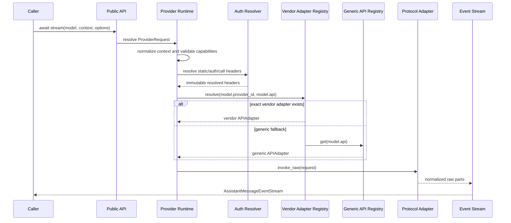
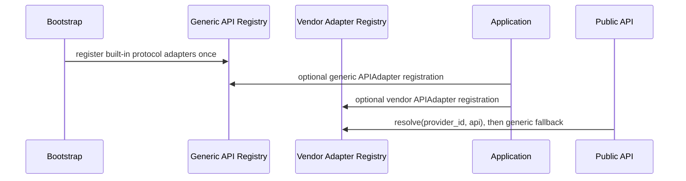

# `loushang.ai` Component Interactions

## Invocation



The selected `Model` remains unchanged throughout the sequence. Neither runtime nor adapter consults a model registry, chooses an endpoint, or derives product/session state.

## Completion

`complete()` follows the same request path as `stream()`, consumes the stream, and returns its assembled `AssistantMessage`. `complete_structured()` adds schema parsing and validation after ordinary completion; it does not call an adapter directly.

## Authentication Merge

```text
endpoint static headers
    -> primary auth header
    -> OAuth auxiliary headers
    -> CallOptions.headers
```

Later ordinary headers win. The primary authentication header is protected from both auxiliary sources.

## Registration



Duplicate registration fails. Public calls do not receive registry objects as parameters.

## Retry, Deadline, And Cancellation

The provider runtime checks cancellation before each attempt, applies one overall deadline to request startup and stream consumption, maps retryable failures through typed policy, and stops retrying once output has been emitted. A successful stream must contain exactly one terminal outcome.

## Tool Round Trip

Context normalization validates assistant tool calls and matching tool results before invocation. Adapters translate the normalized semantic parts to their wire formats. Returned tool-call deltas are assembled by the event stream and retain API/provider/endpoint/model provenance needed for a later turn.

## Trace

The runtime emits sanitized lifecycle, retry, terminal, error, and usage facts. Adapters may add protocol-semantic facts, but never raw headers, URLs, payloads, credentials, or content.
