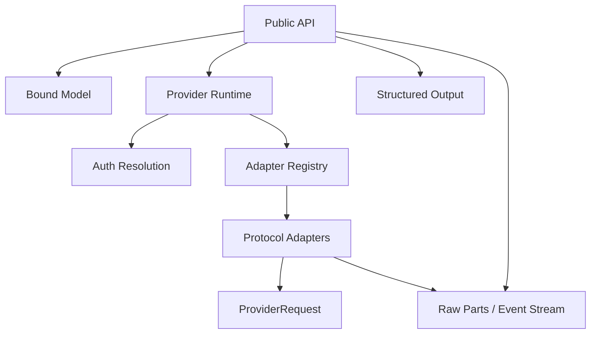

# `loushang.ai` Component Structure

## Package Map

```text
loushang.ai
├── api/                 public invocation orchestration
├── advanced/            explicit adapter-registry setup
├── auth/                request-ready credentials and header resolution
├── event_stream/        raw-part assembly and public stream events
├── model/               catalog domain, loader, and registry binding
├── protocols/           wire-protocol adapters
├── provider/            stable request/runtime/error boundary
├── tool/                tool definitions and context transformations
├── context.py           canonical conversation input
├── messages.py          message and content-part domain
├── options.py           canonical call options
├── structured.py        structured completion projection
├── trace.py             sanitized trace contract
└── usage.py             response token accounting
```

## Dependency Direction



The model loader has no adapter/runtime ownership. The registry binds raw trees once. Protocol adapters depend on stable request/message/tool contracts and do not depend on model lookup or application packages.

## Stable And Variable Areas

Stable core:

- public invocation signatures
- `CallOptions`
- `ProviderRequest`
- model binding and capability semantics
- message, tool, stream, error, usage, and trace contracts

Variable boundary:

- protocol payload fields
- protocol stream event decoding
- protocol error/usage extraction
- a closed typed adapter configuration per supported protocol

Product routing, account lifecycle, session orchestration, endpoint selection, quota operations, and arbitrary payload overrides are intentionally absent.

## Registration Ownership

`bootstrap.py` constructs the built-in adapter set. `api_registry.py` owns validated process-level registration and lookup. `advanced.registry` exposes deliberate setup operations. Public invocation functions only read the default registry.

## Catalog Ownership

`models.json` is the catalog fact source. It stores providers, endpoints, models, auth declarations, endpoint static headers, capabilities, defaults, compatibility, pricing, and adapter mapping switches. Loader validation rejects unknown keys. `ModelRegistry` resolves URL and inheritance/replacement semantics once, producing concrete immutable models for calls.

## Authentication Ownership

The package owns only conversion from request-ready credentials to headers. Applications own acquisition, renewal, persistence, and account/product state. This keeps protocol adapters deterministic and prevents hidden I/O during invocation.

## Test Structure

- `tests/ai/`: public/core/domain/auth/runtime contracts
- `tests/protocols/`: protocol payload and stream mapping
- `tests/examples/test_ai_examples.py`: public example execution
- `scripts/ai/`: catalog, import-boundary, example, and coverage gates

Live provider checks are opt-in through `LOUSHANG_AI_LIVE=1`; the release gate is reproducible offline.
