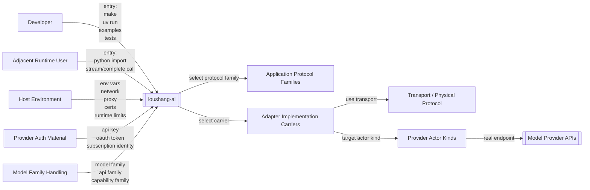

# Loushang AI Physical System Context（对端系统与实现载体口径更新）

## Scope

说明：

- 本文档描述的是物理接线视角。
- 当前模型主轴已经收敛为 `model/domain.py`、`model/registry.py`、`model/loader.py`。

本文档从物理实现视角描述 `loushang-ai` 的内部实现组件、外部实现依赖与真实接线路径。

本文档的目标不是重复 [Loushang AI System Context](./loushang-ai-system-context.md) 的逻辑黑盒边界，而是补充回答：

- `loushang-ai` 内部有哪些关键实现层
- provider API 是通过哪些物理依赖接入的
- `API adapter registry`、adapter、SDK、HTTP client 之间如何连接
- 哪些实现依赖属于内部技术选择，而不是 public contract

本文档只讨论：

- `Top-level AI API`
- `Model Registry`
- `API Adapter Registry`
- `Provider Adapter Layer`
- application protocol families
- adapter implementation carriers
- transport / physical protocol
- official provider SDKs
- `HTTPX Thin Client`
- `Model Provider APIs`
- `Host Environment`
- provider auth material
- provider actor kinds
- model family handling
- physical actors

本文档不讨论：

- message / content / event 的字段级类型定义
- `AgentLoop` 调度
- tool orchestration policy
- provider-specific option schema 细节
- 某个 provider 的正式模块切分

## Why This Needs Updating

随着 `loushang-ai` 已经具备：

- `anthropic-messages`
- `openai-completions`
- `openai-responses` 的最小实现

物理系统环境图里也不能继续只画：

- provider APIs
- SDK
- HTTP client

因为从物理实现视角看，至少还有以下稳定变化面会持续驱动组件演进：

- application protocol family
- provider auth material
- transport mode
- model family handling
- provider actor kinds
- physical actor / user entry

因此，本轮物理系统环境图除了描述接线路径，还需要显式描述这些变化是从哪里进入 `loushang-ai` 的。

同时，还需要把 `user` 作为物理环境图中的正式识别对象显式写出来。
因为在物理实现阶段，很多问题首先不是通过协议对象暴露，而是通过：

- 开发者如何运行 example / test
- 相邻运行时用户如何 import / 调用 `loushang-ai`
- provider service actor 如何返回真实流

这些物理 actor / user 进入系统。

---

## Why A Physical Context

[Loushang AI System Context](./loushang-ai-system-context.md) 把 `loushang-ai` 视为黑盒，这对于定义子系统边界是正确的。  
但当 `loushang-ai` 进入 `API adapter registry`、provider adapter 与真实 provider 接入阶段时，还需要一层物理视图，来避免以下混淆：

1. 把 `Model Provider APIs` 和 `openai` / `anthropic` SDK 混成同一层
2. 把 public contract 和内部实现依赖混成同一组对象
3. 把“支持哪类协议族”与“具体用哪个库实现”混为一个问题

因此，这篇文档的职责是：

- 保留逻辑黑盒边界不变
- 补上内部实现接线图
- 为后续 provider adapter strategy 文档提供落点

---

## Physical View Principle

本视图遵守三个原则：

1. public contract 继续对齐 `reference AI SDK`
2. internal streaming 结构继续吸收 `kimi-cli`
3. provider adapter lower-level shape 继续参考 LiteLLM

落到物理视图的含义是：

- `loushang-ai.__init__` 与 `loushang-ai.types` 不应直接暴露 SDK 类型
- official SDK 与 `httpx` 都应被视为内部实现依赖
- SDK 不是应用协议本身，而是协议内部实现依赖
- `API Adapter Registry -> Provider Adapter -> application protocol -> implementation carrier -> transport -> Provider APIs` 是更准确的主接线路径

---

## Physical Actors / External Systems

从物理实现视角，`loushang-ai` 不只接触代码组件，也接触真实 actor。

当前至少应显式识别：

- `Developer`
  - 通过 `examples/`、`tests/`、`uv run`、`make` 触发 `loushang-ai`
- `AI Package Consumer`
  - 通过 Python import 与 package entrypoint 直接消费 `loushang-ai`
  - 当前最典型的是：
    - `loushang-agent`
    - example/test runner
- `Adjacent Runtime User`
  - 例如 `loushang-agent` 或未来 `loushang-tui`
  - 通过 Python import / runtime call 使用 `loushang-ai`
- `Physical User`
  - 是对 `Adjacent Runtime User` 的更一般化表达
  - 表示谁在物理运行时中直接使用 `loushang-ai` 的 public API
  - 当前最典型的是：
    - `loushang-agent`
    - example / test runner
- `Provider Service Actor`
  - 外部模型服务端点
  - 例如 Moonshot / OpenAI / Anthropic / Google

这几类 actor 的价值在于：

- `Developer` 会暴露 packaging、example、bootstrap、local env 的问题
- `AI Package Consumer` 会暴露 public package entry、export 面、runtime import 契约的问题
- `Adjacent Runtime User / Physical User` 会暴露 public API、stream contract、message/event 语义问题
- `Provider Service Actor` 会暴露 auth / transport / protocol / family 的问题

---

## Internal Physical Components

从物理实现角度，`loushang-ai` 内部建议至少显式区分以下组件：

### Top-level AI API

对外暴露：

- `stream`
- `complete`
- model registry 查询
- api registry 查询/注册

这些对外暴露在物理视角应进一步显式分成几组 public API families：

- `Invocation API`
- `Model Access API`
- `Provider Registry API`
- `Bootstrap API`
- `Auth Helper API`

当前已落地的函数级 public surface 至少包括：

- `stream`
- `complete`
- `get_model`
- `list_models`
- `get_providers`
- `register_api_adapter`
- `get_api_adapter`
- `list_api_adapters`
- `clear_api_adapters`
- `reset_api_adapters`

它负责：

- 接收 public contract 输入
- 根据 `resolve_model_api(model)` 解析 `APIAdapter`
- 将调用委托给 registry 返回的 provider

### Model Registry

负责：

- 持有 `Model` 定义
- 查询模型元数据
- 暴露 `Endpoint.api`，并通过 `resolve_model_api(model)` 供顶层入口与 registry 使用

它不直接接入 provider API。

### API Adapter Registry

负责：

- 维护 `api -> APIAdapter` 映射
- 为顶层入口提供稳定 provider 解析能力

它不自己发起模型请求。

### Provider Adapter Layer

这是内部最关键的实现边界。

它负责：

- 将统一 `Context + Model + CallOptions` 翻译为 provider 请求
- 选择应用协议族
- 选择实现载体
- 发起 SDK 或 HTTP 请求
- 将 provider stream 翻译为 raw parts
- 把 raw parts 交给 assembler

它不应直接成为 public contract。

### Application Protocol Families

这一层表达 `loushang-ai` 需要承接的上游应用协议语义。

当前建议至少显式建模：

- `openai-completions`
- `openai-responses`
- `anthropic-messages`

后续只有在现有协议 adapter 无法表达真实协议差异时才扩展新的 family。

这层回答的是：

- adapter 正在适配哪类 API 语义
- 请求/响应/tool/reasoning/streaming 的应用层兼容面是什么

这层不是具体库选型，也不是传输层。

### Provider Auth Material

这一层表达 provider adapter 在发起真实请求前必须绑定的认证材料。

当前至少应显式识别：

- API key
- OAuth token / subscription token
- provider-specific auth headers

这层回答的是：

- adapter 用什么认证材料与上游交互
- auth 输入从哪里来
- auth 绑定在哪一层完成

这层不是模型语义，也不是 message/content/event 语义。

### Model Family Handling

这一层表达 `loushang-ai` 在进入 provider adapter 之前，就需要识别的模型家族与能力家族差异。

当前至少应显式识别：

- `anthropic-messages` family
- `openai-completions` family
- `openai-responses` family
- future codex / google / local families

这层回答的是：

- 某个模型应落到哪类 API family
- 某个 family 支持哪些 reasoning / tool / image 语义
- 某个 family 对 auth / transport 是否有特殊要求

这层不是 provider actor 本身，也不是 transport 本身。

### Adapter Implementation Carriers

这一层表达应用协议在进程内通过什么实现载体落地。

典型对象包括：

- `OpenAI SDK`
- `Anthropic SDK`
- `HTTPX Thin Client`

这里要特别强调：

- `OpenAI SDK` / `Anthropic SDK` 是协议内部实现依赖
- 它们是应用组件选型实现载体
- 它们不是 `loushang-ai` public contract
- 它们不是外部 provider API
- 它们也不是应用协议本身

### Transport / Physical Protocol

这一层表达实现载体最终如何与外部 provider API 通信。

典型对象包括：

- `HTTPS`
- `SSE`
- provider-specific streaming transport

它回答的是：

- 请求如何发出去
- 流式数据如何被物理传输回来

它不回答应用语义本身。

### Provider Actor Kinds

这一层表达 `loushang-ai` 最终接触的是哪类外部 provider actor。

当前至少应显式识别：

- `Anthropic-family provider actor`
- `OpenAI-family provider actor`
- `OpenAI-compatible provider actor`
- `Google-family provider actor`
- `local / gateway actor`

这层回答的是：

- 当前请求最终会落到哪类真实 actor
- actor 的 base URL、SDK、认证方式、stream 风格是否不同

### Raw Part / Assembler Layer

它负责：

- 接收 adapter 产生的 raw parts
- 组装为 `AssistantMessageEvent`
- 收敛最终 `AssistantMessage`

这一层与 provider SDK 解耦，不应直接依赖 provider 私有对象模型。

---

## External Implementation Dependencies

从物理实现角度，`loushang-ai` 的关键外部实现依赖包括：

### Official Provider SDKs

例如：

- `openai` Python package
- `anthropic` Python package

它们的角色是：

- 为特定应用协议提供现成 client、认证与 streaming 封装

但它们只是内部实现手段，不应上升为 `loushang-ai` 的 public 类型。
它们更准确的定位是 adapter implementation carrier。

### HTTPX Thin Client

建议显式将 `httpx` 薄客户端能力视为一等物理依赖路径。

它的角色是：

- 为不适合使用官方 SDK 的 provider adapter 提供薄 HTTP 接入
- 在 SDK streaming 语义过重、取消传播不透明、事件模型不易映射时提供更可控实现

`httpx-thin` 不应只被视为 fallback。  
它本身就是 `loushang-ai` provider adapter strategy 的基础能力之一。

### Model Provider APIs

这是外部真实服务边界，例如：

- OpenAI Completions APIs
- OpenAI Responses APIs
- Anthropic Messages API
- Google / Kimi / other provider APIs

SDK 与 `httpx` 最终都只是接入这层外部系统的不同物理路径。

### Host Environment

提供：

- env vars
- network capability
- timeout / cancellation
- TLS / proxy / certificate 环境

这些条件会同时影响 SDK 路径与 `httpx` 路径。

---

## Dependency Relations

本节描述物理实现依赖，而不是逻辑黑盒依赖。

```mermaid
flowchart LR
    DEV[Developer]
    USER[Physical User / Adjacent Runtime User]
    TOP[Top-level AI API]
    MR[Model Registry]
    AR[API Adapter Registry]
    ADP[Provider Adapter Layer]
    APP[Application Protocol Families]
    AUTH[Provider Auth Material]
    FAM[Model Family Handling]
    CARR[Adapter Implementation Carriers]
    TP[Transport / Physical Protocol]
    ACTOR[Provider Actor Kinds]
    ASM[Raw Part / Assembler Layer]

    OAI[OpenAI SDK]
    ANT[Anthropic SDK]
    HTTPX[HTTPX Thin Client]
    HTTPS[HTTPS]
    SSE[SSE]
    API[[Model Provider APIs (LLM Providers System)]]
    HOST[Host Environment]

    DEV -->|uses| TOP
    USER -->|calls| TOP
    TOP -->|depends on| MR
    TOP -->|depends on| AR
    AR -->|depends on| ADP
    ADP -->|depends on| ASM
    ADP -->|maps to| APP
    ADP -->|binds| AUTH
    ADP -->|consumes| FAM
    ADP -->|selects| CARR
    CARR -->|uses| TP
    CARR -->|targets| ACTOR

    CARR -->|includes| OAI
    CARR -->|includes| ANT
    CARR -->|includes| HTTPX
    TP -->|includes| HTTPS
    TP -->|includes| SSE

    ACTOR -->|implemented by| API
    OAI -->|depends on| API
    ANT -->|depends on| API
    HTTPX -->|depends on| API

    OAI -->|depends on| HOST
    ANT -->|depends on| HOST
    HTTPX -->|depends on| HOST
```

### Top-level AI API -> Registries

顶层入口直接依赖：

- `Model Registry`
- `API Adapter Registry`

原因是：

- `stream()` 等统一入口需要先解析 `Model`
- 再按 `resolve_model_api(model)` 找到 `APIAdapter`

这里的 `Top-level AI API` 从物理视角看，首先是被 `Physical User` 调用的入口，而不是先被内部组件调用的入口。

### API Adapter Registry -> Provider Adapter Layer

registry 不直接调用上游 API，但它持有的 `APIAdapter` 本质上指向 adapter 能力。

因此，从物理实现看，registry 与 adapter 是相邻层：

- registry 解决查找
- adapter 解决执行

### Provider Adapter Layer -> Application Protocol Families

这是本视图中最重要的技术决策边界。

建议默认承认如下基础支持面：

1. `openai-completions` 协议族，可通过官方 `openai` SDK 或 `httpx-thin` 实现
2. `openai-responses` 协议族，可通过官方 `openai` SDK 或 `httpx-thin` 实现
3. `anthropic-messages` 协议族，可通过官方 `anthropic` SDK 或 `httpx-thin` 实现
4. `httpx-thin` 作为通用薄实现载体，应保持一等地位

因此，adapter 层不应被设计为“必须绑定官方 SDK”。

### Provider Adapter Layer -> Provider Auth Material

provider adapter 不应长期把认证逻辑视为“provider 文件内部顺手加 header”。

从物理实现看，adapter 至少需要显式绑定：

- API key
- OAuth token
- provider-specific auth headers

因此，`auth` 在物理视图中不是 host environment 的脚注，而是 provider execution path 的稳定变化面。

### Provider Adapter Layer -> Model Family Handling

从物理实现看，adapter 不只是按 `provider` 发请求，而是按：

- `model.id`
- resolved api（来自 `Endpoint.api` / `resolve_model_api(model)`）
- model family capability

共同决定请求形态。

因此：

- model family handling 在物理视图中不应继续被压缩进 `ModelRegistry` 一个框中
- 它已经是 provider execution path 前的一条稳定判定层

### Adapter Implementation Carriers -> Transport / Provider Actor Kinds

carrier 选择与 transport / provider actor kinds 高度相关。

例如：

- `httpx-thin` 更适合直接承接 `SSE` / plain HTTPS
- official SDK 可能自带更高层 stream abstraction
- 某些 codex-like provider 未来可能更适合 websocket

因此：

- transport 变化不应上提到 public contract
- 但在物理视图中应被承认是 carrier strategy 的一部分

### Application Protocol Families -> Implementation Carriers

这一层表达的是：

- 一个应用协议可以通过不同实现载体落地
- 一个实现载体服务于某类协议适配，而不是替代协议层

例如：

- `openai-compatible` 可以由 `OpenAI SDK` 承载
- `openai-compatible` 也可以由 `HTTPX Thin Client` 承载
- `anthropic-messages` 可以由 `Anthropic SDK` 承载
- `anthropic-messages` 也可以由 `HTTPX Thin Client` 承载

### Implementation Carriers -> Transport / Physical Protocol

这一层表达的是：

- SDK 与 `httpx` 最终仍然要落到传输层
- 传输层与应用协议层不是同一个建模层级

`HTTPS`、`SSE` 等对象更适合放在这里，而不是直接和 `APIAdapter` 或 `Model` 处在同一层。

### SDK / HTTPX -> Model Provider APIs

official SDK 与 `httpx` 都只是接入外部 `Model Provider APIs` 的物理通道。

从系统边界看：

- `openai` package 不是外部 provider 本身
- `anthropic` package 不是外部 provider 本身
- 它们是 `loushang-ai` 进程内的接入依赖

---

## Physical Information Flow

本节描述物理实现链路上的主要输入输出关系。



## Variation Notes

本轮更新后，物理系统环境图已经显式表明：

- `loushang-ai` 当前至少要吸收三类协议族：
  - `anthropic-messages`
  - `openai-completions`
  - `openai-responses`
- 同时还要吸收至少四类独立变化：
  - auth
  - transport
  - model family handling
  - provider actor kinds

因此，后续白盒组件设计不应只从“已有代码文件”识别组件，还应从这些物理变化面识别：

- 哪些应作为边界组件
- 哪些应作为 supporting component
- 哪些应作为 capability / metadata handling

```mermaid
flowchart LR
    TOP[Top-level AI API]
    MR[Model Registry]
    AR[API Adapter Registry]
    ADP[Provider Adapter Layer]
    APP[Application Protocol Families]
    CARR[Adapter Implementation Carriers]
    TP[Transport / Physical Protocol]
    ASM[Raw Part / Assembler Layer]

    OAI[OpenAI SDK]
    ANT[Anthropic SDK]
    HTTPX[HTTPX Thin Client]
    HTTPS[HTTPS]
    SSE[SSE]
    API[[Model Provider APIs]]
    HOST[Host Environment]

    TOP -->|lookup model| MR
    TOP -->|resolve API adapter by resolve_model_api(model)| AR
    TOP -->|invoke unified stream request| ADP

    ADP -->|choose protocol family| APP
    ADP -->|choose carrier| CARR
    ADP -->|emit raw parts| ASM
    ASM -->|return assistant events + final message| TOP

    APP -->|implemented via| CARR
    CARR -->|uses| TP
    CARR -->|includes| OAI
    CARR -->|includes| ANT
    CARR -->|includes| HTTPX
    TP -->|includes| HTTPS
    TP -->|includes| SSE

    OAI -->|http / streaming calls| API
    ANT -->|http / streaming calls| API
    HTTPX -->|http / streaming calls| API

    HOST -->|env vars / network / timeout / cancellation| OAI
    HOST -->|env vars / network / timeout / cancellation| ANT
    HOST -->|env vars / network / timeout / cancellation| HTTPX

    API -->|provider events / chunks / errors| OAI
    API -->|provider events / chunks / errors| ANT
    API -->|provider events / chunks / errors| HTTPX

    OAI -->|sdk events| ADP
    ANT -->|sdk events| ADP
    HTTPX -->|http response chunks| ADP
```

### Main Path

建议将 `loushang-ai` 的主物理路径理解为：

1. top-level API 接收统一调用
2. model registry 提供 `Model`
3. API adapter registry 根据 `resolve_model_api(model)` 解析 provider
4. provider adapter 选择应用协议族
5. provider adapter 选择 SDK 或 `httpx-thin` 这类实现载体
6. 实现载体经由传输层访问外部 provider API
7. provider stream 被翻译为 raw parts
8. assembler 输出统一 assistant event stream 与最终 message

这条链路正好把：

- registry 设计
- streaming 三层结构
- SDK / HTTP 技术决策

连接成了一条完整实现路径。

---

## Boundary Notes

需要特别说明的边界约束如下：

- official SDK 是内部依赖，不是 public contract
- official SDK 是应用组件选型实现载体，不是协议层对象
- `httpx-thin` 是一等能力，不只是 fallback
- `openai-compatible` / `anthropic-messages` 属于应用协议层
- `HTTPS` / `SSE` 属于传输 / physical protocol 层
- `Provider Adapter Layer` 是内部实现边界，不等同于 `API Adapter Registry`
- `Model Provider APIs` 仍然是外部黑盒系统，不应与 SDK 混成同一对象
- 逻辑 system context 继续回答“谁与 `loushang-ai` 交互”
- physical system context 回答“`loushang-ai` 通过什么实现层与外部 provider 接通”

---

## Current Recommendation

当前建议在物理实现层冻结以下方向：

1. 为 `loushang-ai` 新增独立的 physical system context 视图
2. 默认承认 `API Adapter Registry -> Provider Adapter -> SDK / HTTPX -> Provider APIs` 这条主接线结构
3. 在物理视图中显式区分：
   - application protocol family
   - adapter implementation carrier
   - transport / physical protocol
4. provider adapter strategy 至少覆盖：
   - `openai-compatible`
   - `anthropic-messages`
   - `httpx-thin` 这一通用薄实现载体
5. 是否引入 `openai` / `anthropic` 包，应作为 adapter 级实现决策，而不是 public contract 决策
6. `httpx-thin` 应保留为长期存在的基础实现路径，而不是临时兜底

---

## Next Step

在此基础上，下一步最自然进入：

1. `loushang-ai` provider adapter strategy 文档
2. 四个顶层入口签名设计文档
