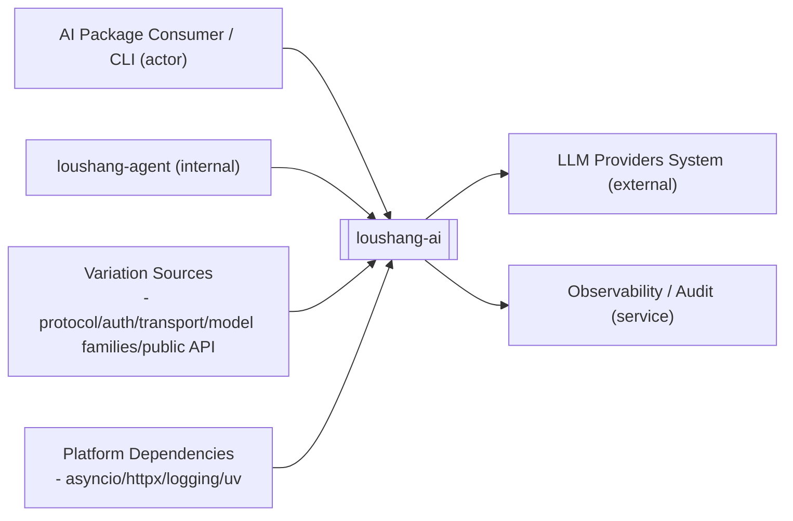
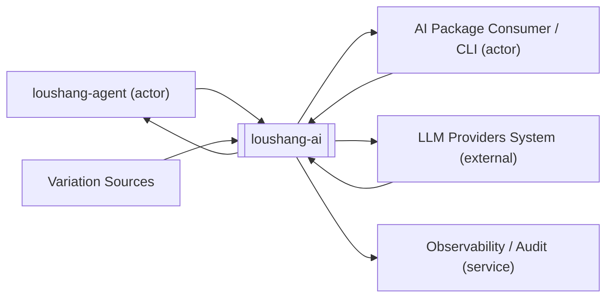

# Loushang AI System Context（外部系统与角色口径更新）

## Scope

本文档将 `loushang-ai` 视为一个黑盒系统，描述它的外部对象、依赖关系与信息流关系。

本文档的目标是先定义 `loushang-ai` 的系统边界，再为后续参考 `reference AI SDK` 的细化分析提供落点。

如果需要查看 `loushang-ai` 的内部实现接线路径、SDK / HTTP 依赖与 provider adapter 物理分层，请参见 [Loushang AI Physical System Context](./loushang-ai-physical-system-context.md)。

本文不展开：

- `loushang-ai` 的内部类型系统细节
- provider adapter 的内部实现
- message / event / content model 的字段级定义

这些内容将在后续文档中继续展开。

## Why This Needs Updating

随着 `loushang-ai` 从单一 `anthropic-messages` 路径扩到：

- `anthropic-messages`
- `openai-completions`
- `openai-responses`

系统环境图里已经不能只画一个抽象的 `Model Provider APIs`。  
因为在黑盒边界层面，至少已经有以下变化维度会稳定存在，并直接驱动后续白盒组件识别：

- application protocol family
- auth style
- transport style
- model family handling
- LLM provider actor 种类

因此，本轮系统环境图除了描述“谁和 `loushang-ai` 交互”，还需要补出“哪些变化从外部边界进入 `loushang-ai`”。

同时，还需要把 `actor` 作为逻辑环境图中的正式识别对象显式写出来。
因为在黑盒阶段，很多后续会长成边界组件的对象，最早并不是以“组件”出现，而是先以：

- internal actor
- external actor
- provider actor
- tool runtime actor

的形式出现。

## External Entities

`loushang-ai` 的外部对象，一部分来自 `loushang` 内部相邻子系统，一部分来自 `loushang` 之外的外部系统。

注意：本节仅把“真正跨系统的对端”作为 External Systems 呈现；调用方主体为 Actors；协议/认证/传输/家族能力为 Variation Sources；async/httpx/logging 等为 Platform Dependencies，避免把依赖库/协议族误画为外部系统。

### External Systems（真实对端系统）
- LLM Providers System（Anthropic/OpenAI/兼容网关/本地推理）
  - 唯一需要在系统环境图中作为“外部系统”呈现的对端

### Actors（调用方主体，非外部系统）
- AI Package Consumer / CLI（可为内部或外部）
- loushang-agent（内部相邻子系统，优先经由它消费 `loushang-ai`）

### Logical Actors

在逻辑系统环境图中，建议先把下列对象统一视为 `logical actors`：

- `AI Package Consumer`
  - 代表谁在逻辑上直接消费 `loushang-ai` 的 public package API
  - 不限定一定是某个具体子系统，也可以是 example/test/developer-facing caller
- `Internal Consumer Actors`
  - 例如 `loushang-agent`
  - 代表谁在逻辑上消费 `loushang-ai`
- `Provider Actors`
  - 代表谁在逻辑上提供 LLM 能力
- `Tool Runtime Actor`
  - 代表谁在逻辑上承接 tool execution 与 tool result
- `Observability Actor`
  - 代表谁在逻辑上接收日志、指标、trace 与审计记录

这样做的价值在于：

- 先识别“谁在和 `loushang-ai` 交互”
- 再识别“哪些变化通过这些 actor 进入系统”
- 最后才进入“这些变化应该由哪些组件吸收”

这里还需要额外识别一类对象：

- `Public API Families`

因为对 package consumer 来说，首先可见的不一定是内部 provider 或模型家族，而是：

- invocation API
- model access API
- provider registry API
- bootstrap API
- auth helper API

这些同样属于系统环境图阶段就应识别的对外交互面。

### Internal Adjacent Subsystems

- `loushang-agent`
  - `loushang-ai` 最直接的内部上游子系统
  - 向 `loushang-ai` 提供模型调用上下文，并消费 AI 输出结果

- `loushang-coding`
  - 面向 coding 场景的上层装配子系统
  - 当前建议通过 `loushang-agent` 间接使用 `loushang-ai`
  - 可以直接依赖 `loushang-ai` 的模型与配置能力，但默认不作为主运行时信息流边界

- `loushang-channel`
  - 与 `loushang-ai` 不直接耦合 provider 协议
  - 但会承接由 `agent` 层消费并转发的 AI 结果
  - 在系统环境图中属于邻接但非主边界

### External Systems

- `LLM Provider Actors`
  - 外部模型能力提供方
  - 不是单一 actor，而是一组不同类型的 provider actor
  - 当前至少应显式识别：
    - `Anthropic-family Providers`
    - `OpenAI-family Providers`
    - `Google-family Providers`
    - `OpenAI-compatible Providers`
    - `Local / Gateway Providers`

- `Provider Application Protocol Families`
  - `loushang-ai` 需要承接的外部应用协议族
  - 当前至少应显式识别：
    - `anthropic-messages`
    - `openai-completions`
    - `openai-responses`

- `Provider Auth Sources`
  - provider 请求需要的认证输入来源
  - 当前至少应显式识别：
    - API key
    - OAuth token / subscription token
    - provider-specific auth material

- `Provider Transport Modes`
  - 外部 provider stream / request 的物理传输方式
  - 当前至少应显式识别：
    - `SSE`
    - `websocket`
    - SDK-native streaming
    - plain HTTPS request/response

- `Model Family Metadata`
  - 用于区分模型归属的协议族、能力族与约束族
  - 当前至少应显式识别：
    - `anthropic-messages` model family
    - `openai-completions` model family
    - `openai-responses` model family
    - future codex / google / local families

- `Tool Runtime`
  - 模型工具调用相关的外部能力执行环境
  - `loushang-ai` 需要承接 tool schema 与 tool-call 结果语义

- `Host Environment`
  - 提供环境变量、网络可达性、超时、中断与进程资源边界

- `Observability / Audit`
  - 承接日志、指标、trace 与审计记录

- `Public API Families`
  - `loushang-ai` 对 package consumer 暴露的外部 API 族
  - 当前至少应显式识别：
    - `Invocation API`
    - `Model Access API`
    - `Provider Registry API`
    - `Bootstrap API`
    - `Auth Helper API`

## Dependency Relations

本节只描述依赖关系，不描述运行时信息是否真的流过该边界。

### loushang-agent -> loushang-ai

这是 `loushang-ai` 在 `loushang` 内部最重要的依赖关系。

依据 [subsystem.md](/home/dev/workspace/loushang/docs/architecture/subsystem.md#L21)：

- `loushang-ai` 负责模型与 provider 接入
- `loushang-agent` 不负责 provider 接入细节

因此，`agent` 必然依赖 `ai` 层。

### AI Package Consumer -> loushang-ai

这是此前系统环境图里遗漏但已经实际存在的一类逻辑 actor。

它代表所有直接以 package 方式消费 `loushang-ai` 的调用方，例如：

- `loushang-agent`
- example/test caller
- future 直接 import `loushang.ai` 的其他子系统

这一层之所以重要，是因为很多对外 API 不首先表现为“provider interaction”，而首先表现为 package consumer 看到的 public surface，例如：

- `stream/complete`
- `get_model/list_models`
- `register_api_adapter/list_api_adapters/clear_api_adapters`
- `reset_api_adapters`
- auth helper

### loushang-coding -> loushang-ai

依据 [subsystem.md](/home/dev/workspace/loushang/docs/architecture/subsystem.md#L117) 与 [subsystem-diagram.md](/home/dev/workspace/loushang/docs/architecture/subsystem-diagram.md#L1) 的关系，`coding` 层可以直接依赖 `ai` 层。

这类依赖更偏产品装配与场景能力依赖。

### Host / Provider / Protocol / Auth / Transport / Family / Tool / Observability -> loushang-ai

这些对象构成 `loushang-ai` 的外部基础依赖边界：

- `Host Environment` 提供运行条件
- `LLM Provider Actors` 提供真实模型能力来源
- `Provider Application Protocol Families` 提供上游 API 语义族
- `Provider Auth Sources` 提供认证输入来源
- `Provider Transport Modes` 提供请求/流的物理传输约束
- `Model Family Metadata` 提供模型家族与能力族信息
- `Tool Runtime` 提供工具调用相关外部能力
- `Observability / Audit` 提供运行记录承接

从逻辑系统环境图识别组件时，建议先把这些对象分成两类：

- actor
- variation source

其中：

- `loushang-agent`、`LLM Provider Actors`、`Tool Runtime`、`Observability / Audit` 更偏 actor
- `AI Package Consumer` 也属于 actor
- protocol family、auth source、transport mode、model family metadata、更外显的 public API families 更偏变化源 / interaction surface

## Information Flow Relations

本节只描述 `loushang-ai` 黑盒边界上的信息输入与信息输出。

### loushang-agent <-> loushang-ai

这是 `loushang-ai` 的主运行时信息流关系。

`loushang-agent` 向 `loushang-ai` 输入的信息包括：

- `system_prompt`
- `messages`
- `tools`
- `model`
- `stream options`
- `session metadata`

`loushang-ai` 向 `loushang-agent` 输出的信息包括：

- assistant message
- stream events
- content parts
- tool call 内容块
- usage
- stop reason
- error

这层关系是 `loushang-ai` 系统环境图中的核心主边界。

### loushang-coding -> loushang-ai

当前文档只将 `loushang-coding` 视为 `loushang-ai` 的依赖方，不将其写成默认运行时信息流边界。

理由是：

- [subsystem.md](/home/dev/workspace/loushang/docs/architecture/subsystem.md#L76) 将 `loushang-coding` 定义为产品装配层
- [subsystem.md](/home/dev/workspace/loushang/docs/architecture/subsystem.md#L96) 给出的建议层次中，`coding` 位于 `agent`、`channel`、`tui`、`methods` 之上
- 因此，在 `loushang` 当前正式架构里，更稳定的主信息流仍应表达为 `loushang-agent <-> loushang-ai`

如果后续实现证明 `loushang-coding` 在特定场景下会直接向 `loushang-ai` 发送 `context`、`messages` 或直接消费 `AssistantMessageEventStream`，应在专门文档中补充为受限场景下的直接信息流，而不是在当前系统环境图中先默认成立。

### Host Environment <-> loushang-ai

进入 `loushang-ai` 的信息包括：

- 环境变量
- 网络可达性
- timeout / cancellation
- 进程与资源限制

`loushang-ai` 向宿主环境输出的信息包括：

- 对外 provider 请求
- 连接占用
- 临时运行状态

### LLM Provider Actors <-> loushang-ai

这是 `loushang-ai` 的核心外部能力来源边界。

进入 provider actor 的信息包括：

- 归一化后的模型请求
- messages / context
- tool schema
- headers / auth
- reasoning / stream settings

provider actor 向 `loushang-ai` 返回的信息包括：

- assistant 内容
- stream delta
- tool call 请求
- usage
- finish reason
- provider error

### Provider Application Protocol Families <-> loushang-ai

这是 `loushang-ai` 黑盒边界上一条现在必须显式识别的变化面。

当前至少应识别：

- `anthropic-messages`
- `openai-completions`
- `openai-responses`

进入 `loushang-ai` 的信息包括：

- 请求/响应语义族
- tool / reasoning / image 的协议映射规则
- stream 事件族

`loushang-ai` 向这一边界输出的信息包括：

- protocol-specific payload shape
- protocol-specific message normalization

### Provider Auth Sources <-> loushang-ai

这是 `loushang-ai` 黑盒边界上一条显式变化面，而不应继续被隐含在 provider 文件中。

进入 `loushang-ai` 的信息包括：

- API key
- OAuth token
- provider-specific credential material

`loushang-ai` 向这一边界输出的信息包括：

- provider request auth binding
- credential usage policy

### Provider Transport Modes <-> loushang-ai

这是一条黑盒层面可识别、但不应直接污染 message/content/event 主协议的变化面。

进入 `loushang-ai` 的信息包括：

- `SSE`
- `websocket`
- SDK-native streaming
- plain HTTPS request/response

`loushang-ai` 向这一边界输出的信息包括：

- transport selection
- connection strategy
- stream consumption pattern

### Model Family Metadata <-> loushang-ai

这是一条从系统环境图就应被识别的变化面。

进入 `loushang-ai` 的信息包括：

- model family
- api family
- capability family
- reasoning / multimodal / tool-use 等能力归属

`loushang-ai` 向这一边界输出的信息包括：

- model-to-api resolution
- family-specific capability routing

### Tool Runtime <-> loushang-ai

这是一条被 `loushang-agent` 编排所中介的能力边界，不应被理解为 `loushang-ai` 自己拥有工具执行运行时。

进入 `loushang-ai` 的信息包括：

- tool result payload
- structured output
- tool execution error

`loushang-ai` 向工具相关边界输出的信息包括：

- tool schema
- tool call blocks
- tool arguments

这里要注意：

- `loushang-ai` 负责 `Tool`、`ToolCall`、`ToolResultMessage` 以及相关 provider 兼容语义
- `loushang-ai` 可以提供 tool argument validation 等 AI 侧辅助能力
- `loushang-agent` 负责工具查找、执行顺序、并行策略、before/after hook、结果回填
- `loushang-ai` 不负责完整的 tool orchestration policy

## Variation Notes

本轮更新后，系统环境图已经显式表明：

- `loushang-ai` 不只是“接一个 provider API”
- 它还需要稳定吸收至少五类变化：
  - LLM provider actor 种类
  - application protocol family
  - auth style
  - transport style
  - model family metadata

因此，后续白盒组件识别时，不应只从功能名词出发，还应从这些外部变化面出发识别：

- 哪些需要边界组件吸收
- 哪些需要支撑组件吸收
- 哪些应上提为 metadata / capability handling

### Observability / Audit <- loushang-ai

该边界主要接收 `loushang-ai` 的输出信息，包括：

- logs
- metrics
- traces
- audit records

## Reference Constraint

`loushang-ai` 的系统边界定义应遵守以下参考约束：

1. 主参考 `reference AI SDK`
2. 辅助参考 `kimi-cli`
3. `loushang-ai` 的职责不超过 `reference AI SDK`
4. `kimi-cli` 的参考价值主要用于识别哪些能力不应下沉到 `ai` 层

因此：

- `loushang-ai` 应优先对齐 `reference AI SDK` 的 AI 层语义边界
- 不应把 `agent` 生命周期、tool orchestration policy、UI/rendering、channel protocol` 下沉到 `loushang-ai`

## Boundary Notes

需要特别说明的边界约束如下：

- `Model Registry` 当前应视为 `loushang-ai` 的内部能力，而不是外部黑盒
- `Config` 当前未在 `loushang` 正式子系统中单列，因此不在本系统环境图中提升为独立外部边界
- 如果后续 `loushang` 引入正式的配置子系统，应单独为该子系统建模，而不是继续使用混合的 `Config / Model Registry` 表达

下列内容不属于本文范围：

- `loushang-ai` 的消息字段级定义
- `loushang-ai` 的 stream event type 详细模型
- provider adapter 的内部实现
- tool-call bridge 的内部状态机
- 与 `channel` 的具体消息协议映射

这些内容应在后续 `glossary`、`types` 与参考分析文档中继续展开。
