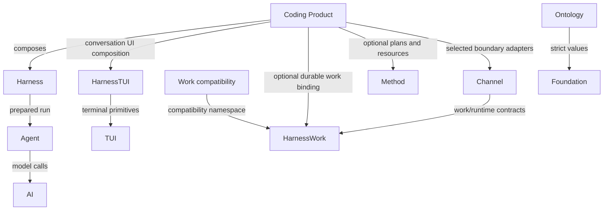

# Loushang Architecture Overview (AOD)

## Status

- Authority: normative — whole-system overview with evidence-linked Current summary
- Design status: accepted
- Implementation status: partial
- Owner: Loushang architecture

## Scope

This Architecture Overview Document describes the top-level Loushang technical
architecture. Product strategy, mission, and positioning live in
[Loushang Strategy](../strategy/strategy.md). Detailed subsystem and component
designs live in their own Architecture Scopes.

Loushang applies the
[Architecture Design And Governance Method](../architecture-method/README.md)
through its
[Architecture Governance Profile](governance-profile.md).

## Architecture In One Sentence

Loushang is a modular-monolith runtime platform for complex AI work: models
reason, Agent owns the model-tool loop, Harness governs execution, Method
defines work contracts, HarnessWork records authoritative fulfillment facts,
and Products compose those capabilities into user experiences.

## Truth And Authority Model

Loushang separates five planes:

| Plane | Meaning |
| --- | --- |
| Conversation / Transcript | interaction history and model-facing records |
| Runtime Event | execution facts emitted by Agent/Harness runtimes |
| Work Event | authoritative business fulfillment facts |
| Ontology Fact | versioned semantic facts and rebuildable projections |
| Architecture Fact | observed source, dependency, entrypoint and contract-test facts |

These planes may project into one another through explicit adapters, but one is
not a universal substitute for the others.

For architecture documentation, Facts, Current, Target, Delta, and History are
also kept distinct. The generated
[Current Package Dependency Graph](generated/current-package-dependencies.md)
is authoritative for observed static imports; architecture tests are
authoritative for allowed and forbidden direction.

## Current Architecture

### Product and runtime chain

The only installed user-facing console entrypoints currently compose the Coding
Product. Their exact targets are listed in the generated Current facts.

The primary Coding execution chain is:

```text
CLI / TUI / SDK host
  -> loushang.coding Product composition
       -> loushang.harness Session / Host / prepared run
            -> loushang.agent loop
                 -> loushang.ai provider and streaming adapters
            -> tools / policy / approval / sandbox / runtime events
       -> loushang.harnesstui -> loushang.tui
       -> loushang.harnesswork for durable Work lifecycle where selected
       -> loushang.method for method resources and plans where selected
       -> loushang.channel for selected boundary protocols
```

Harness calls the one Agent loop through the narrow prepared-run boundary; it
does not own a second loop. Products own final policy choices, prompts,
presentation, domain language, and composition.

### Current top-level scope ownership

| Scope | Current ownership |
| --- | --- |
| `loushang.foundation` | strict JSON and product-neutral observability foundations |
| `loushang.ai` | models, providers, request/response and streaming/tool-call compatibility |
| `loushang.agent` | the model-tool loop, Agent messages, tool calls and Agent events |
| `loushang.harness` | reusable Session, Host, tools, policy, approval, sandbox, resources, extensions, runtime, presentation and continuity mechanisms |
| `loushang.harnesstui` | Product-neutral Harness conversation interaction and TUI composition |
| `loushang.tui` | terminal rendering, input, layout, surfaces and playback substrate |
| `loushang.method` | method resources, compilation, fixed plans and projections |
| `loushang.harnesswork` | durable Work lifecycle, authoritative terminal state, event log, query and replay |
| `loushang.work` | migration-period compatibility/integration namespace over HarnessWork |
| `loushang.channel` | Work/runtime-view boundary values and narrow JSONL framing/delivery adapters |
| `loushang.coding` | Coding Product semantics, LSP/Arch capabilities, prompts, product tools, CLI and final UI composition |
| `loushang.ontology` | versioned semantic schema, immutable facts/provenance, projections and typed queries |

`loushang.resource` remains a small compatibility surface over Harness resource
ownership and appears in the generated physical graph while Python source
exists there. Empty retired directories are not architecture scopes.

### Current semantic scope map

The following diagram shows interpreted ownership and the main runtime path. It
is not the exact physical import graph.



Direct and transitive Python imports differ from this semantic view. Consult
the generated Current graph before making a physical dependency claim.

### Nested Architecture Scopes

Current established nested scopes include:

- `coding.lsp`: Coding-owned semantic code-intelligence Product Capability;
- `coding.arch`: Coding-owned deterministic repository architecture-analysis
  Product Capability;
- `harness.multiagent`: Harness-owned technical child-agent execution and
  coordination capability.

They own internal architecture without becoming top-level subsystems. Their
placement and sibling dependencies are governed by their parent scope.

## Accepted Target Architecture

Accepted Target directions include:

- Product-to-Harness-to-Agent-to-AI remains the one-way execution spine;
- Harness mechanisms remain Product-neutral and Products retain domain policy
  and final composition;
- Method defines required work structure while HarnessWork owns actual Work
  fulfillment facts and terminal outcomes;
- Capability dependencies, binding, Mount lifecycle and graph projection use
  the implemented Harness Planner/Binder/Runtime/Projector owners without
  creating a global mutable service locator; Product Capability rollout and
  refresh semantics remain explicitly bounded;
- Channel grows only from demonstrated boundary-protocol needs and does not
  become a mandatory bus for every Session interaction;
- Ontology evolves through versioned facts, immutable projections and typed
  queries without becoming a universal facade over Product or Work state;
- AI, Agent, TUI and other reusable scopes preserve narrow public contracts and
  independent evolution.

An accepted Target is not an implementation claim. The
[Harness Current Owner Map](harness/current-owner-map.md) records both the
implemented Mount runtime and the remaining Capability rollout boundaries.

Unresolved proposals under `drafts/`, including broader future-v3 material,
remain proposed until promoted by an accepted decision or canonical scope
document.

## Major Current-To-Target Deltas

The most important current gaps are:

| Target | Current delta |
| --- | --- |
| production rollout of declared Capability bundles and refreshable dependency semantics | Planner, transactional Binder, live Runtime and read-only Projector are implemented; selected Harness and Coding capabilities remain rollout targets, and `stable_reference` refresh remains fail-closed |
| complete durable WorkHandle/result/recovery semantics | HarnessWork has an implemented kernel but the full target remains partial |
| capability negotiation and general interaction protocol | Channel currently provides narrower values and JSONL adapters |
| persistent approval, remote/mixed-placement agents and managed runtime | selected local mechanisms exist; broader target remains partial or proposed |
| Ontology source-backed write-back, reconciliation, decisions and production source connectors | ontology-owned Action planning and Fact commits are implemented; Product-hosted source mutation remains unimplemented |
| multiple real Products validating shared abstractions | Coding remains the only installed Product entrypoint |
| physical installation optionality | subsystems remain in one Python distribution |

Detailed gaps belong to the owning scope rather than expanding this AOD.
Cross-system deltas are indexed in the
[Current-To-Target Gap Ledger](current-target-gap-ledger.md).

## Architecture Evaluation Lens

Loushang intentionally keeps mutable cognitive scaffolding out of the stable
runtime substrate. A model may internalize planning, reflection, todo reminders
or verification heuristics; it does not eliminate permissions, side-effect
control, evidence, persistence, coordination, recovery, or Work truth.

Key distinctions are:

| Stable distinction | Architectural value |
| --- | --- |
| AI versus Agent | provider/model change does not redefine the loop contract |
| Agent versus Harness | loop semantics remain small while execution governance evolves above them |
| Method versus Work | required contract is separate from actual fulfillment facts |
| Policy versus Approval versus Enforcement | decisions, user grants and side-effect control remain auditable |
| TUI versus HarnessTUI versus Product UI | terminal mechanics, conversation interaction and Product semantics evolve independently |
| final screen versus terminal playback | intermediate frames, cursor, resize, scrollback and operation budgets become executable contracts |
| semantic facts versus operational state | Ontology projections do not silently become Session or Work authority |

See [Architecture Principles](loushang-architecture-principles.md) for the
normative cross-layer rules.

## Architecture Documentation

- [Architecture Catalog And Reading Order](README.md)
- [Architecture Design And Governance Method](../architecture-method/README.md)
- [Loushang Architecture Governance Profile](governance-profile.md)
- [Architecture Principles](loushang-architecture-principles.md)
- [Subsystems And Architecture Scopes](subsystem.md)
- [Subsystem Diagram](subsystem-diagram.md)
- [Generated Current Package Dependencies](generated/current-package-dependencies.md)
- [Current-To-Target Gap Ledger](current-target-gap-ledger.md)
- [Architecture Artifact Model](../architecture-method/artifact-model.md)

Each top-level and sufficiently complex nested scope owns its detailed
requirements, boundary, component, interaction, dependency, decision,
traceability, validation and history material.
