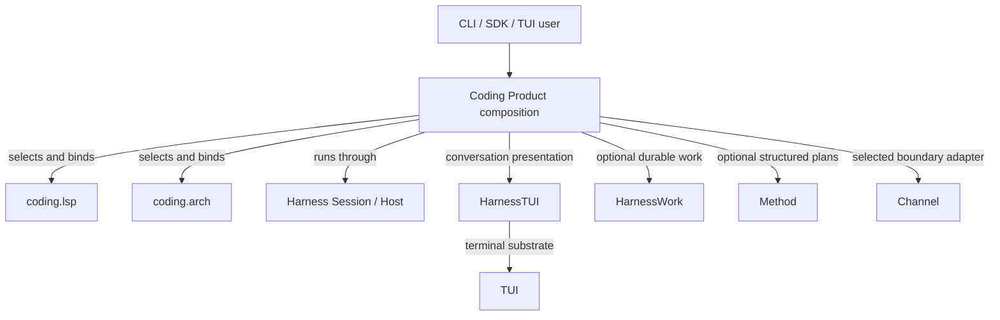

# Loushang Coding Architecture

## Status

- Scope: `coding`
- Parent: Loushang
- Authority: normative — Product boundary with evidence-linked Current summary
- Design status: accepted
- Implementation status: implemented
- Owner: Coding Product

## Scope

Coding is the installed Loushang Product composition root. It turns Harness,
Agent, AI, Method, HarnessWork, Channel, HarnessTUI and TUI contracts into a
coding-specific CLI, SDK and terminal experience.

Coding owns Product semantics and final composition. It does not own a second
copy of reusable Harness mechanisms, the Agent loop, provider protocols, Work
truth, or terminal primitives.

## Current

The current console entrypoints resolve to Coding CLI/UI implementations; see
the generated
[Current Package Dependencies](../generated/current-package-dependencies.md).

Coding currently owns:

- coding prompts, domain vocabulary and Product defaults;
- Product tool and command selection, policy choices and compatibility
  projection;
- model preference/persistence policy over shared AI/Harness mechanisms;
- CLI/SDK composition and final plain/TUI/RPC Product bindings;
- Coding-specific Method/Work/Channel adapters;
- Coding-owned LSP and architecture-analysis capabilities;
- final Coding presentation, surfaces and terminal binding.

Reusable Session, Host/RPC mechanics, tools, resources, extensions, policy,
approval, sandbox, events and conversation mechanisms are Harness-owned.
Product-neutral conversation/TUI composition is HarnessTUI-owned.

## Target

Coding remains a thin but real Product, not an empty facade. It retains domain
policy, Product resources and final composition while shared mechanisms move
behind stable owner contracts.

Accepted target directions include explicit Product Capability composition,
bounded `coding.lsp` and `coding.arch` scopes, Product-owned Method-to-Work
preparation, and evidence-linked architecture/runtime diagnostics. Harness now
owns the implemented Capability Planner/Binder/Runtime/Projector substrate;
production mounting of `coding.lsp` and `coding.arch` through that graph remains
a Product rollout target rather than a claimed Current path.

## Direct Architecture Children

| Child scope | Placement | Current | Target / gap |
| --- | --- | --- | --- |
| [Coding LSP](lsp/README.md) | Coding-owned Product Capability | active implementation slices and tests exist | complete the accepted/proposed lifecycle, passive diagnostics and traceability without moving protocol semantics to Harness |
| [Coding Arch](arch/README.md) | Coding-owned Product Capability | deterministic import graph, cache, providers, CLI and tool pack exist | finish requirements/component/traceability governance and keep LSP consumption optional |

These children are not top-level Loushang subsystems. Coding owns their
placement, activation policy and sibling dependency graph; each child owns its
black-box contract and internal component model.

## Parent-Child And Sibling Rules

- `coding.lsp` and `coding.arch` may depend on narrow Harness workspace,
  process-hosting, tool-composition and lifecycle contracts selected by Coding.
- Harness does not import either Coding capability.
- `coding.arch` remains usable without LSP.
- A future optional semantic-fact dependency is consumer-owned by Arch and
  implemented by an LSP adapter; neither child imports the other's internals.
- Any new sibling dependency requires this parent graph, both child boundaries,
  and an architecture test to change together.

## Current Product Composition

This is a composition view, not a Python import graph.

## Core Invariants

1. Coding does not implement a second Agent loop.
2. Product defaults and domain policy do not leak into Harness.
3. Shared mechanisms have one canonical owner; Coding keeps adapters and
   compatibility projections only where Product meaning exists.
4. LSP and Arch are optional Coding capabilities, not mandatory Agent/AI
   dependencies.
5. Lightweight Session turns do not require Method, Work or Channel.
6. Durable Work facts do not collapse into Session transcript or model todo
   state.
7. Final Product UI remains separate from terminal primitives and
   Product-neutral HarnessTUI interaction.

## Architecture Documents

Read in this order:

1. this Product overview;
2. [Coding System Context](loushang-coding-system-context.md);
3. [Coding Product Boundaries](ARD-001-coding-product-boundaries.md), noting its
   superseded ownership sections;
4. [Harness Current Owner Map](../harness/current-owner-map.md) for shared
   mechanism ownership;
5. the relevant nested scope README;
6. feature specifications, accepted ARDs and executable tests.

Older candidate component inventories and pre-Harness component maps are
historical design inputs when their status points to the Harness owner map.
They are not a second Current Coding topology.

## Current-To-Target Gaps

- `coding.lsp` and `coding.arch` are not yet production nodes in the live Mount
  graph even though the Harness graph substrate is implemented;
- LSP has an initial evidence matrix, while external-mutation and broader
  passive-delivery behavior remain partial and its architecture remains proposed;
- Coding Arch now has a proposed canonical nested-scope package; a second
  concrete language provider and optional LSP semantic port remain absent;
- several older Coding documents still require incremental classification as
  superseded or historical;
- Coding is still the only installed Product validating the shared substrate.
