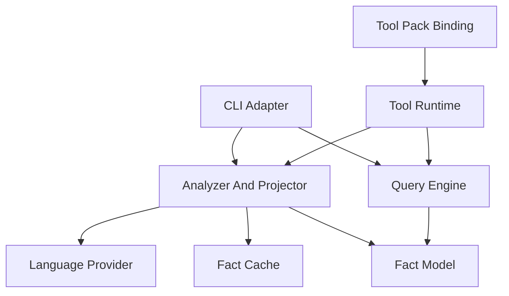

# Coding Arch Component Model

[Coding Arch Architecture](README.md) | [Requirements](requirements.md)

## Status

- Authority: normative — proposed final component model derived from Current
- Design status: proposed
- Implementation status: partial
- Owner: Coding Product

## Component Map

| Component | Owns | Does not own |
| --- | --- | --- |
| Fact Model | immutable modules, dependency evidence, graphs, diagnostics and boundary rules | source discovery or query algorithms |
| Language Provider | source discovery and normalization for one language | graph projection or Product tool policy |
| Fact Cache | fingerprinted/versioned reusable normalized per-file facts and atomic persistence | architecture truth or query meaning |
| Analyzer And Projector | provider selection, scan validation, module/subsystem projection and stable graph construction | CLI/model presentation |
| Query Engine | summary, cycle, edge, path, hotspot and boundary queries | source parsing or Product admission |
| CLI Adapter | arguments, JSON output, cache options and boundary-gate exit status | analyzer semantics |
| Tool Runtime | workspace containment, bounded request adaptation and JSON-compatible model result | Harness authorization mechanics |
| Tool Pack Binding | Coding Capability identity, activation and Harness tool contribution | graph algorithms or Session allowlist policy |

## Composition



## Dependency Rules

- Fact Model imports no provider, cache, CLI, tool or Harness owner.
- Language providers depend on Fact Model and the narrow cache port/data, not
  graph queries or Product adapters.
- Analyzer selects providers and projects facts; providers do not call back
  into Analyzer.
- CLI and Tool Runtime are sibling adapters over the same analyzer/query
  owners; neither wraps the other.
- Tool Pack Binding may consume Coding Capability and Harness contribution
  contracts but core graph/provider/cache modules do not depend on Product
  activation or Agent objects.
- Future LSP consumption enters through a consumer-owned optional port rather
  than a concrete LSP import.

## Main Interaction

```text
boundary adapter
  -> validate bounded request
  -> select language provider
  -> load reusable normalized facts
  -> parse changed files and update cache
  -> validate provider scan
  -> project stable graph
  -> run bounded query
  -> return JSON-compatible result
```

Cache load/write failures are diagnostic/optimization failures. The analyzer
continues from source facts and does not change semantic results.
