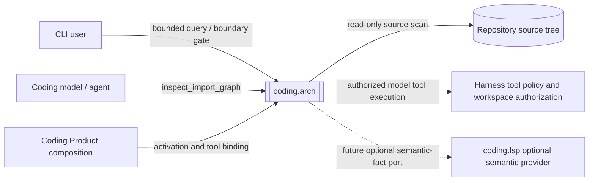

# Coding Arch System Context

[Coding Arch Architecture](README.md)

## Status

- Authority: descriptive — Current black-box context
- Design status: proposed
- Implementation status: implemented
- Owner: Coding Product

## Logical Context



The optional LSP edge is Target-only and is not part of the initial Current
Capability graph.

## External Actors And Systems

- CLI users request deterministic JSON queries and optional boundary-gate exit
  behavior.
- The Coding model requests bounded architecture observations through one
  policy-governed tool.
- Coding Product composition selects activation mode, tool pack and runtime.
- The repository source tree supplies read-only facts; observed imports do not
  become normative architecture automatically.
- Harness supplies authorization, workspace containment and tool-hosting
  mechanics without owning Arch semantics.
- Language-specific providers are internal adapters over external language
  syntax and source layout variation.

## Physical Context

```text
python -m loushang.coding.arch
  -> coding.arch.cli
  -> ImportGraphAnalyzer
  -> PythonImportGraphProvider
  -> repository files
  -> optional versioned cache
  -> bounded JSON result

Coding Agent tool call
  -> Harness tool gateway / policy
  -> ImportGraphToolRuntime
  -> ImportGraphAnalyzer
  -> bounded JSON-compatible result
```

The CLI and model tool share graph/query owners but have separate boundary
adapters. Cache storage is an optimization and not an authoritative source.

## Parent And Sibling Boundary

Coding owns Capability activation, configuration and final tool exposure. Arch
owns the analysis contract. A future LSP relationship is approved and modeled
by the Coding parent; Arch owns the consumer port and LSP owns only its adapter.
