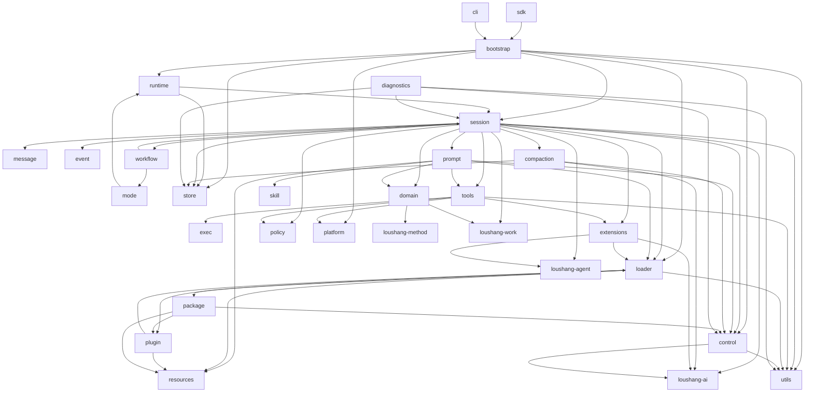
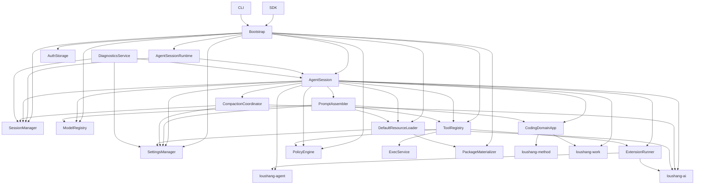

# Loushang Coding Component Dependencies

## Status

Superseded as the current dependency topology by the
[Harness Current Owner Map](../harness/current-owner-map.md) and its import
boundaries. The diagrams below describe the original Coding decomposition and
are retained as design history, not as current Package/Plugin/Extension
ownership.

## Scope

本文档描述 `loushang-coding` 的组件依赖关系。

本文档目标是回答：

- 哪些组件依赖哪些组件
- 哪些依赖是主干依赖
- 哪些依赖是支撑依赖
- 哪些依赖关系应尽量对齐 `reference coding agent`
- 哪些依赖关系是 `loushang-coding` 当前有意识的偏离

本文档不展开：

- 详细方法签名
- 详细时序
- 详细字段级 schema

## Design Basis

本文档建立在以下文档之上：

- [Loushang Coding System Context](loushang-coding-system-context.md)
- [Loushang Coding Component Structure And Responsibilities](loushang-coding-component-structure-and-responsibilities.md)
- [Loushang Coding Core Service Objects](loushang-coding-core-service-objects.md)
- [Loushang Coding Component Interfaces](loushang-coding-component-interfaces.md)
- [reference coding agent Internal Dependency Overview](reference/reference-coding-agent/architecture-dependencies.md)

## Dependency Reading Rule

本文中的依赖箭头采用：

- `A -> B`
  - 表示 `A` 依赖 `B`

依赖图分为两层：

1. 组件层依赖
2. 核心服务对象层依赖

## 1. Component-Level Dependencies

当前建议的组件依赖关系如下：



## 2. Primary Backbone Dependencies

如果只看最关键的主干依赖，当前建议收成：

```text
sdk/cli
  -> bootstrap
  -> runtime
  -> session
      -> store
      -> tools
      -> prompt
      -> control
      -> policy
      -> loushang-agent
      -> loushang-ai
```

这条主链表达了 `loushang-coding` 当前最重要的架构判断：

- `bootstrap` 负责装配
- `runtime` 负责当前活动 session 生命周期
- `session` 是业务中心
- `session` 同时直接依赖 `agent` 与 `ai`

## 3. Service-Level Dependencies

若进一步落到核心服务对象层，当前建议的主要依赖关系如下：



## 4. Strong Alignment With reference coding agent

以下依赖关系建议尽量与 `reference coding agent` 对齐：

- `Bootstrap`/装配链
  - 对齐 `main.ts` + `agent-session-services.ts` + `sdk.ts`

- `AgentSessionRuntime -> AgentSession`
  - 直接对齐 `AgentSessionRuntime` 对 `AgentSession` 的生命周期宿主关系

- `AgentSession -> SessionManager`
  - 直接对齐 `reference coding agent`

- `AgentSession -> SettingsManager`
  - 直接对齐 `reference coding agent`

- `AgentSession -> ModelRegistry`
  - 直接对齐 `reference coding agent`

- `AgentSession -> DefaultResourceLoader`
  - 直接对齐 `reference coding agent`

- `AgentSession -> ExtensionRunner`
  - 直接对齐 `reference coding agent`

- `AgentSession -> ToolRegistry`
  - 语义上对齐 `core/tools/*` + tool registry 能力

- `DefaultResourceLoader -> extensions/skills/prompts/themes`
  - 语义上对齐 `discover -> load -> bind -> run` 资源链

- `AgentSession -> loushang-agent`
  - 对齐 `AgentSession -> Agent`

- `AgentSession -> loushang-ai`
  - 对齐 `reference coding agent` 对 `reference AI SDK` 的直接依赖

## 5. Intentional Explicit Modeling

以下依赖关系当前更适合视为有意识保留的显式建模：

- 它们大多不是对 `reference coding agent` 主语义的分叉
- 更主要是在 `loushang-coding` 中把原本分散、隐含或容易被忽略的依赖显式写出来
- 少数边界也服务于 Python 实现中的结构拆分

### `Session -> AI`

理由：

- `reference coding agent` 确实也直接依赖 `reference AI SDK`
- 但在结构文档里，这条边比 `AgentSession -> Agent` 更容易被忽略
- 当前显式强化它，是为了后续 model registry / summarization / helper call 的落位更清楚

### `Tools -> Exec`

理由：

- `reference coding agent` 更偏向把执行能力压在工具层中
- `loushang-coding` 先显式拆出 `exec`，是为了 Python 里 subprocess/sandbox 边界更清楚
- 这条边更准确地表达 built-in executable tool family 对执行边界的依赖，而不是 `ToolRegistry` 核心本身依赖 `ExecService`

### `Tools -> Policy`

理由：

- `reference coding agent` 存在 permissions / guardrails / approvals 语义，但没有显式单一 policy center
- `loushang-coding` 把这条判定边显式写出，是为了把可执行工具与 guardrail 判定清楚分开

### `Prompt -> Loader/Resources/Tools/Domain`

理由：

- `reference coding agent` 的 prompt 组装更分散
- `loushang-coding` 当前先显式表达 prompt 的资源来源、工具元数据输入与 domain-prepared turn 输入，有利于后续拆出清晰装配边界
- `prompt` 不直接拥有 method registry/compiler/projector；method plan 应先经 `domain` bridge 变成 coding prepared turn

### `Domain -> loushang-method / loushang-work`

理由：

- `loushang.method` 是 method resource、compiler 与 projector 的拥有者
- `loushang.work` 是 method plan / step observability 与 event log 的拥有者
- `domain` 只负责 coding-specific prepared turn bridge，不把 method/work lifecycle 并入 `loushang-coding`

### `Package -> Plugin/Resources`

理由：

- `package` 是资源分发与 lifecycle 边界
- `plugin` 是 manifest-backed source view 与资源展开边界
- package provenance 应经 `resources` descriptor 被 loader、CLI、RPC 与 TUI 投影，不应由各 adapter 重新推断

### `Control -> AI`

理由：

- 当前显式保留 `coding` 对 `ai` 的直接控制平面接缝
- 主要服务于 `ModelRegistry` / model selection 设计
- 它表达的是聚合边界上的接缝，而不是要求 `control` 对齐成 `reference CLI` 的单一中心对象

### `Compaction -> AI`

理由：

- 对齐 `reference coding agent` 里 direct summarization / completion helper 的语义
- 当前显式写出，可避免把 compaction 错误下沉进 `agent`

## 6. Dependency Constraints

当前建议明确约束这些依赖方向：

### A. `mode` 不直接依赖 `agent` 或 `ai`

`mode` 应通过：

- `AgentSessionRuntime`
- `AgentSession`
- `AgentSessionEvent`

来消费 runtime，而不应绕过 session facade。

### B. `cli` 不直接依赖 `session` 内部细节

`cli` 应优先通过：

- `Bootstrap`
- `SDK`
- `ModeAdapter`

进入系统。

### C. `tools` 不直接依赖 `store`

工具执行结果应优先由 `AgentSession` 协调并写入 `SessionManager`，而不是由工具层直接改写持久化。

### D. `loader` 不直接依赖 `session`

资源加载应保持为相对独立的资源平面，不应被 session 生命周期反向吞并。

### E. `policy` 不应依赖 `mode`

权限与审批策略应是 mode-neutral 的；mode 只负责呈现或交互适配。

### F. `rpc` 不承担 `loushang.channel` 职责

当前 `RpcMode` 是 transitional headless mode surface。它可以暴露 JSONL command/event
surface，但不拥有未来 package-level `loushang.channel` 的协议层职责。

## 7. Open Questions

当前仍保留这些依赖层面的开放问题：

- `DiagnosticsService` 是否需要直接依赖 `ModelRegistry`
- `AgentSessionRuntime` 是否需要直接依赖 `SettingsManager`
- `ModeAdapter` 是否需要直接依赖 `SessionManager`
- `ExtensionRunner` 是否需要显式依赖 `ToolRegistry`
- `PromptAssembler` 是否需要直接依赖 `PolicyEngine`
- `Workflow` 是否未来演化为更完整 orchestration 边界，还是继续保持 prompt workflow harness

## Next Step

基于当前依赖关系，后续建议继续：

1. 关键 mode 的时序
2. P0 实现切片
3. 第一批对象与接口裁剪
