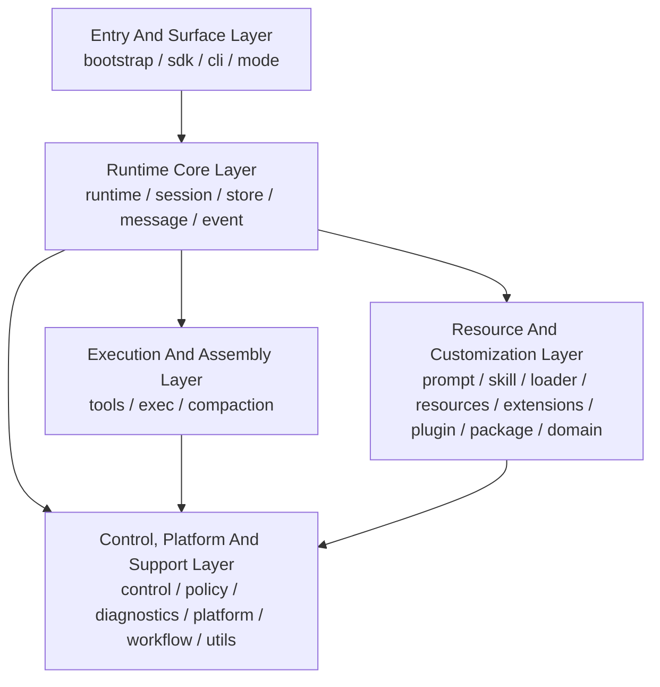

# Loushang Coding Component Structure And Responsibilities

## Status

Superseded as the current ownership topology by the
[Harness Current Owner Map](../harness/current-owner-map.md). The original
component analysis remains design history; current Package, Plugin, and
Extension ownership is defined by the
[Platform Resource Layout Boundary](../harness/platform-resource-layout-boundary.md)
and [Extension Runtime Core Boundary](../harness/extension-runtime-core-boundary.md).

## Scope

本文档描述 `loushang-coding` 的内部候选组件结构关系与职责边界。

本文档建立在以下已接受文档之上：

- [Loushang Coding System Context](loushang-coding-system-context.md)
- [ARD-001: Loushang Coding Product Boundaries](ARD-001-coding-product-boundaries.md)
- [ARD-004: Package And Plugin Boundary](ARD-004-package-plugin-boundary.md)
- [Loushang Coding Candidate Components](loushang-coding-candidate-components.md)
- [Loushang Coding Deployment Unit Terminology](loushang-coding-du-terminology.md)

本文档不展开：

- 具体类名与函数签名
- 详细数据对象字段
- 详细接口定义
- 具体时序图

## Design Goal

本轮目标不是给出最终文件树，而是把 `loushang-coding` 的组件层次先稳定下来，回答这些问题：

- 哪些组件是主干
- 哪些组件是支撑层
- 哪些组件属于运行表面
- 哪些组件属于控制平面
- 哪些组件属于资源与定制平面

## Candidate Components

当前候选组件列表为：

- `bootstrap`
- `sdk`
- `cli`
- `mode`
- `runtime`
- `session`
- `store`
- `message`
- `event`
- `tools`
- `exec`
- `prompt`
- `skill`
- `loader`
- `resources`
- `extensions`
- `plugin`
- `package`
- `domain`
- `control`
- `policy`
- `compaction`
- `diagnostics`
- `platform`
- `workflow`
- `utils`

## Structural Classification

为便于后续细化，当前建议把这些组件分为五个结构层次。

### 1. Entry And Surface Layer

这一层负责对外入口与运行表面。

- `bootstrap`
- `sdk`
- `cli`
- `mode`

它们的共同特点是：

- 面向进程入口或宿主入口
- 负责装配、启动、分发、切换运行表面
- 不应承载核心 session 业务逻辑

### 2. Runtime Core Layer

这一层负责 `loushang-coding` 最核心的产品运行骨架。

- `runtime`
- `session`
- `store`
- `message`
- `event`

它们的共同特点是：

- 承接 coding runtime 的事实状态与生命周期
- 定义运行过程中的核心数据与事件语义
- 形成各个 mode 共享的核心执行骨架

### 3. Execution And Assembly Layer

这一层负责把 session 运行真正装配成 coding agent 行为。

- `tools`
- `exec`
- `compaction`

它们的共同特点是：

- 直接参与一次 coding run 的装配或执行
- 负责工具、命令、压缩等运行时行为
- 与 `session` 紧密协作，但不应吞并 session 生命周期

### 4. Resource And Customization Layer

这一层负责资源加载、domain bridge 与扩展定制。

- `prompt`
- `skill`
- `loader`
- `resources`
- `extensions`
- `plugin`
- `package`
- `domain`

它们的共同特点是：

- 提供 coding-specific 的资源注入、扩展能力、Resource Package lifecycle、
  Plugin source/activation 与 method bridge
- 更多负责“装什么”和“从哪里装”，而不是直接推进 run loop
- 其中 `prompt` 是桥接组件：
  - 上接 `loader` / `resources` / `skill` / `domain`
  - 下接 `session`
  - 负责把资源层输入装配成运行时 prompt

### 5. Control, Platform And Support Layer

这一层负责控制平面、权限、平台能力与工作流支撑。

- `control`
- `policy`
- `diagnostics`
- `platform`
- `workflow`
- `utils`

它们的共同特点是：

- 为多个主干组件提供共享能力
- 更偏运行控制、权限限制、诊断与通用支持
- 不应成为隐藏的“万能层”

## Structure Overview

当前建议的结构关系可概括为：

这张图表达的是结构主方向，而不是完整依赖图。

关键点是：

- `Entry` 层不直接承载业务核心
- `Runtime Core` 是 `coding` 的业务中心
- `Execution` 与 `Resource` 都围绕 `session` 运作
- `prompt` 是 `Resource` 与 `Runtime Core` 之间最重要的桥接组件
- `Control` 是共享支撑平面，而不是业务中心

## Component Roles

### `bootstrap`

角色：

- 内部装配中心

职责：

- 创建共享依赖
- 组装默认 `runtime`
- 为 `sdk` 与 `cli` 提供统一构造入口

不应负责：

- 持有长期 session 状态
- 承担 mode-specific 交互逻辑

### `sdk`

角色：

- 对外嵌入入口

职责：

- 向宿主暴露 coding runtime 的创建与调用入口
- 复用 `bootstrap` 完成装配

不应负责：

- 自己重新实现 runtime 逻辑
- 承担 CLI 特有行为

### `cli`

角色：

- 命令行入口层

职责：

- 参数解析
- 子命令分发
- 把 CLI 输入映射成 mode 启动参数

不应负责：

- 业务核心执行
- 自己管理 session 内部状态

### `mode`

角色：

- 运行形态适配层

职责：

- 定义 `print` / `rpc` / `interactive` 等 adapter
- 承接 `json` 这类输出 projection
- 组织不同 mode 的 I/O 适配与控制流程

不应负责：

- 通用 session 状态管理
- 工具系统内部逻辑

### `runtime`

角色：

- 当前活动 session 的生命周期宿主

职责：

- 创建、切换、替换、恢复当前 session
- 为 mode 提供当前活动 runtime 入口

对应参考：

- `reference coding agent` 的 `AgentSessionRuntime`

备注：

- 这里最关键的是 lifecycle host 语义
- runtime 是否额外携带 cwd-bound services、diagnostics 等载荷，可以按实现形态调整

### `session`

角色：

- 单个 coding session 的业务中心与核心门面

职责：

- 协调 prompt、tools、loader、policy、compaction
- 管理 session 内部状态与高层动作
- 驱动一次 coding session 的实际运行
- 保持 mode-neutral orchestration center 的主语义

对应参考：

- `reference coding agent` 的 `AgentSession`

备注：

- 当前阶段不单列 `context`
- 相关职责先由 `session` 协调
- 横切协作者的显式抽离不应削弱 `session` 作为业务中心的角色

### `store`

角色：

- 会话持久化与恢复层

职责：

- transcript 存储
- metadata 存储
- branch / fork / restore 持久化语义
- `custom` / `custom_message` 的分层持久化语义
- 基于 entry 图重建 `SessionContext`

它与 `session` 的边界是：

- `session` 负责“运行”
- `store` 负责“持久化”

### `message`

角色：

- session entry 与 coding-specific message projection 层

职责：

- 定义 `SessionEntry` 体系
- 定义 coding-specific custom message 扩展
- 提供 `SessionEntry` 与 `AgentMessage` 之间的投影辅助

补充说明：

- `message` 同时覆盖两类核心对象：
  - 持久化 entry 层
  - runtime custom message projection 层
- 前者以 `SessionEntry` 为中心
- 后者对齐 `reference coding agent/messages.ts` 中的 custom message family

### `event`

角色：

- 动态运行事件层

职责：

- 定义 session/run/message/tool 的生命周期事件

### `tools`

角色：

- 工具系统入口

职责：

- 内置工具定义
- 工具注册
- 工具调用路由

### `exec`

角色：

- 命令执行子系统

职责：

- shell/subprocess 执行
- 输出采集
- 审批与约束协同

它与 `tools` 的边界是：

- `tools` 负责工具框架
- `exec` 负责命令执行能力

### `prompt`

角色：

- 资源与运行之间的提示词桥接层

职责：

- system prompt
- tool prompt
- session prompt
- 方法/skill 注入后的 prompt 组装

它的结构定位是：

- 资源来源上接 `loader` / `resources` / `skill` / `domain`
- 运行时装配上服务 `session`

### `compaction`

角色：

- 压缩、摘要与上下文预算协调层

职责：

- 上下文压缩
- 摘要生成
- 上下文预算收缩策略
- 与 `session` 配合完成结果回填与上下文重建协调

### `skill`

角色：

- skill 运行接缝

职责：

- Coding skill 内容与默认激活策略
- Harness skill descriptor 到产品运行时的投影
- skill prompt/tool 注入

标准目录发现、解析和 provenance 由 `loushang.harness.resources` 负责。

### `loader`

角色：

- Harness 平台资源运行时的 Coding facade

职责：

- 注册 Coding 内置资源 package
- 选择 `AGENTS.md`/兼容 conventions 与附加 roots
- 注入 Coding settings、filters、trust 和激活策略
- 将 Harness resource snapshot 投影为 Coding 运行资源

### `resources`

角色：

- Coding 资源内容、策略与兼容投影边界

职责：

- 注册 Coding prompt/skill/theme/extension 内容
- 兼容导出 Harness-owned descriptors 与加载结果
- 为 prompt/session 提供稳定资源投影

### `extensions`

角色：

- 扩展运行时

职责：

- 扩展发现
- 扩展加载
- hook 绑定与生命周期管理

备注：

- `extensions` 是 runtime 扩展面
- `plugin` 是 manifest-backed 可选贡献源的身份与启停边界，不取代
  `extensions`，也不是 Package 分发组件

### `plugin`

角色：

- plugin identity、source、启停与资源根解析层

职责：

- 管理 plugin source 与 enabled state
- 读取 plugin manifest
- 将 plugin 展开为 extensions / skills / prompts / themes 资源描述符

### `package`

角色：

- Resource Package lifecycle、source 与物化管理层；Plugin identity 和启停
  状态保持独立

职责：

- 管理 package catalog/source
- 安装、更新、移除 package
- 将 Resource Package materialize 为资源加载器可消费的 package root

### `domain`

角色：

- coding domain bridge

职责：

- 接收 `CodingDomainRequest`
- 应用 `MethodPolicy`
- 调用 `loushang.method` 的 loader/compiler/projector
- 生成 `CodingDomainPreparedTurn`
- 将 method plan/step metadata 传递给 CLI runner 与 work-log path

### `control`

角色：

- 控制平面聚合边界

职责：

- settings
- config
- model selection / model registry
- 其他运行控制配置
- 统一组织 coding 产品侧的控制平面语义

备注：

- `control` 与 `loushang-ai` 存在直接接缝
- 它负责 coding 产品层的控制组织，不取代 `ai` 的 provider/model 语义
- 它更像 `SettingsManager` / `ModelRegistry` 等控制面服务的聚合边界，而不是单一中心对象

### `policy`

角色：

- 权限与执行策略层

职责：

- tool permission
- approval policy
- sandbox policy
- destructive action guardrails

### `diagnostics`

角色：

- 诊断与检查能力

职责：

- 配置检查
- 环境检查
- 错误归一化
- 诊断输出

备注：

- `diagnostics` 是支撑边界，可被 `bootstrap` / `cli` / `mode` 调用
- 但不应反向依赖这些入口层

### `platform`

角色：

- 平台能力 helper 层

职责：

- clipboard
- filesystem
- terminal/platform capability detection
- 其他跨 mode 的平台差异封装

### `workflow`

角色：

- prompt workflow loader / runner

职责：

- 加载 prompt workflow 文件
- 展开 workflow step
- 将 prompt workflow 映射到 coding session 调用

### `utils`

角色：

- 通用支撑代码

职责：

- 提供跨组件复用的轻量辅助能力

约束：

- 不能成为隐藏业务层

## Primary Backbone

如果只看 `loushang-coding` 的主干骨架，当前建议收成：

- `bootstrap`
- `sdk`
- `cli`
- `mode`
- `runtime`
- `session`
- `store`
- `message`
- `event`
- `tools`
- `prompt`
- `control`
- `policy`

其中真正最核心的业务主链是：

- `mode`
- `runtime`
- `session`
- `store`
- `tools`
- `prompt`

## Secondary Components

当前更适合作为第二层增强或支撑边界的有：

- `exec`
- `skill`
- `loader`
- `extensions`
- `plugin`
- `package`
- `resources`
- `domain`
- `compaction`
- `diagnostics`
- `platform`
- `workflow`
- `utils`

这并不表示它们不重要，而是表示它们当前更适合围绕主干展开，而不是被当作结构中心。

## Open Points

当前仍保留这些结构问题，后续可继续收敛：

- `control` 是否未来进一步拆分为 `settings` / `config` / `models`
- `session` 是否未来拆出显式 `context`
- `domain` 是否未来按 method / intake / domain app 拆出更细 adapter
- `workflow` 是否未来演化出更完整的 orchestration 边界

## Next Step

基于当前组件结构关系，后续建议继续：

1. 组件核心数据对象
2. 组件接口
3. 组件依赖关系
4. 关键 mode 的交互/时序
