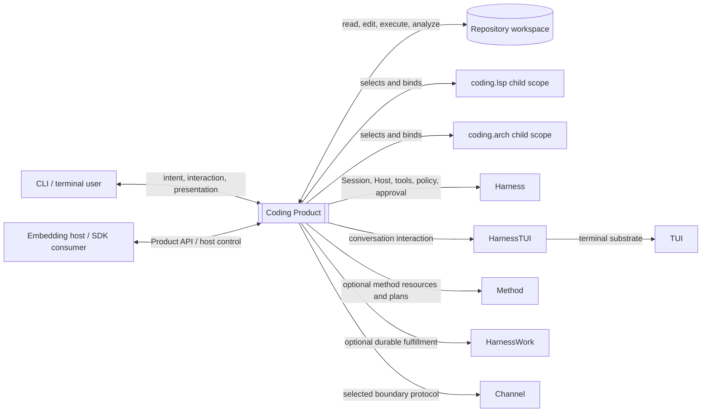
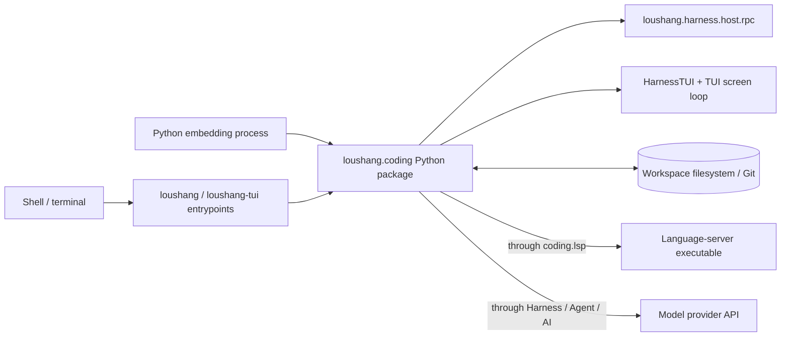

# Loushang Coding System Context

[Coding Architecture](README.md)

## Status

- Scope: `coding`
- Parent: Loushang
- Authority: descriptive — Current black-box context
- Design status: accepted
- Implementation status: implemented
- Owner: Coding Product

## Scope

This document treats `loushang.coding` as a black-box Product and describes its
direct actors, neighboring Architecture Scopes, information flows, trust
boundaries, and physical carriers. Coding internals and child-capability
components are deliberately deferred to their owning documents.

## Positioning

Coding is the installed Product composition root. It owns coding-specific
intent, prompts, policy choices, tools, Capability selection, compatibility
projection and final CLI/UI composition.

Coding consumes reusable contracts from Harness, Agent, AI, HarnessTUI, TUI,
Method, HarnessWork and Channel. Reusable mechanisms retain their lower owner;
Coding does not reimplement them to make the Product convenient.

## Logical System Context



The diagram is an information/composition view. It is not the physical import
graph.

## Direct Actors

### CLI / terminal user

Provides intent, input, workspace selection, configuration overrides,
approvals, interrupts, follow-up and steering. Receives Product-projected
messages, tool activity, diagnostics, status, approval requests and terminal
presentation.

### Embedding host / SDK consumer

Creates or controls Coding Product sessions through supported Product entry or
Host surfaces. It does not gain access to Harness or Session internals merely by
embedding Coding.

## Direct Neighboring Scopes

### Harness

Harness is Coding's primary reusable execution substrate. Coding supplies
Product policy, defaults, prompts, adapters and final bindings. Harness supplies
Session/Host lifecycle, prepared runs, tools, policy/approval/sandbox
mechanisms, resources, extensions, events and shared runtime contracts.

Product command JSONL is implemented by Harness Host/RPC mechanics with Coding
bindings. It is not `coding.mode.RpcMode` and is not the Channel Work JSONL
protocol.

### Agent and AI

The primary execution path reaches Agent and AI through Harness:

```text
Coding -> Harness prepared run -> Agent loop -> AI provider stream
```

Coding may consume stable Agent/AI public values directly for Product-level
model selection, compatibility and composition where architecture gates allow
it. It does not own provider transport or a second Agent loop.

### HarnessTUI and TUI

HarnessTUI owns Product-neutral conversation interaction and presentation
composition. TUI owns terminal rendering, input, layout, surfaces and playback
mechanisms. Coding owns feature-local interpretation and final Product/terminal
binding.

### Method

Method provides optional resources, compilation, fixed plans and projections.
Coding interprets Method output as Product work preparation or turn guidance.
Method does not execute Coding tools or own Coding runtime state.

### HarnessWork

HarnessWork owns an accepted durable business operation's lifecycle,
authoritative outcome, event log, query and replay. Lightweight Coding Session
turns do not require HarnessWork. Coding owns the adapter from Product intent,
Method output and runtime evidence into Work semantics.

`loushang.work` is a compatibility/integration namespace over the migrated
HarnessWork kernel, not a second Work owner.

### Channel

Channel owns its accepted boundary values and JSONL framing/correlation/delivery
adapters. It is optional and does not mediate every local Session or UI
interaction. Coding supplies Product/Host adapters for the operations and views
that a Channel boundary explicitly accepts.

### Coding LSP and Coding Arch

LSP and Arch are direct child Architecture Scopes and Product Capabilities.
Coding owns their placement, activation policy, configuration sources, tool
exposure and sibling dependency decisions. Each child owns its internal
components and black-box contract.

## Deliberately Not Direct

- model providers are reached through AI owner contracts;
- language-server processes are inside the `coding.lsp` child boundary;
- terminal devices and protocols are inside TUI's physical boundary;
- Agent child execution internals are owned by Harness multi-agent;
- Work persistence internals are owned by HarnessWork;
- Ontology is consumed only through an explicit Product/domain adapter when
  semantic facts are required.

Keeping indirect systems out of the direct context prevents their physical
details from becoming Coding Product contracts.

## Physical System Context



Exact console targets and package imports are generated in
[Current Package Dependencies](../generated/current-package-dependencies.md).

## Dependency Policy

- shared owners do not import `loushang.coding`;
- Coding may depend on stable public contracts from the scopes it composes;
- Coding child scopes do not import one another's internals;
- new `coding.arch`/`coding.lsp` relationships require a Coding-owned narrow
  port, explicit optionality, and an architecture gate;
- Product UI adapters may depend on HarnessTUI/TUI, but generic TUI and
  HarnessTUI do not depend on Coding;
- Coding does not introduce a compatibility facade for a removed shared owner
  unless an accepted compatibility decision requires it.

## Authority And Trust Flow

Coding owns:

- Product defaults and user-facing configuration semantics;
- admission of Product tools, language-server definitions and Capability
  activation requests;
- Product risk choices and approval wording;
- Product intent parsing and final presentation;
- Product adapters into Method, Work and Channel.

Harness owns enforcement mechanics, but Coding does not grant itself authority
by constructing a tool or capability. External packages/extensions may
contribute declarations only through the admitted Harness/Product mechanism.

Method plans, model todo state and Session transcript are not durable Work
authority. Work events and terminal outcomes remain HarnessWork-owned.

## Current And Target

Current:

- installed CLI/TUI entrypoints compose Coding;
- shared mode/Host mechanisms have moved to Harness/HarnessTUI;
- Harness provides the live Capability graph Planner, Binder, Runtime and
  Projector, while Coding LSP and Arch are not yet production-mounted graph nodes;
- LSP and Arch have concrete implementation slices;
- Method, HarnessWork and Channel integrations are optional;
- Coding remains the only installed Product.

Accepted or proposed Target:

- selected Coding Product capabilities move onto the implemented Harness Mount
  runtime without turning Coding into a service locator;
- LSP and Arch complete their child-scope requirements, component and
  traceability governance;
- additional Products validate shared Harness boundaries through real
  composition rather than forecast abstractions.

Target-only Product Capability rollout, stable-reference refresh, remote
runtime and durable recovery behavior must remain labeled until implemented.

## Child Scope Entry Points

- [Coding LSP Architecture](lsp/README.md)
- [Coding Arch Architecture](arch/README.md)

## Related Decisions

- [ARD-001: Coding Product Boundaries](ARD-001-coding-product-boundaries.md),
  retained for accepted Product principles but superseded for old Coding-owned
  shared topology and mode placement;
- [ARD-005: RpcMode Transitional Positioning](ARD-005-rpc-mode-transitional-channel-positioning.md),
  superseded by the completed Harness Host separation;
- [Harness Mode/Host Boundary](../harness/mode-host-boundary.md);
- [Harness Session/RPC Operation Boundary](../harness/session-rpc-operation-boundary.md).
