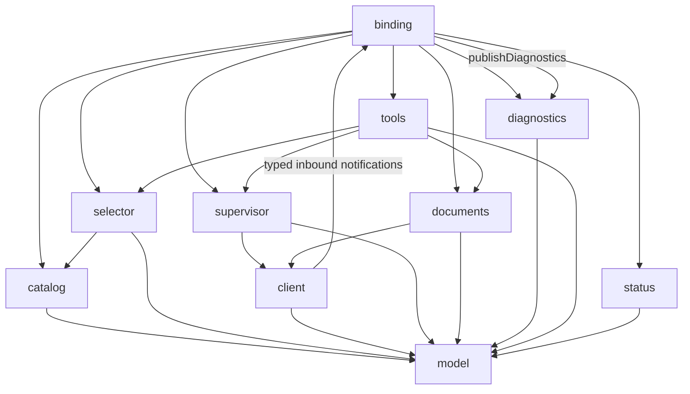

# Coding LSP Candidate Components

## Status

- Authority: descriptive — proposed candidate inventory
- Design status: proposed
- Implementation status: not-applicable
- Owner: Coding Product

This is candidate-discovery material, not the final Current component model.
Once the LSP architecture is accepted, the canonical final model is
[Component Boundaries](component-boundaries.md) and this inventory becomes
historical rationale.

## Selection Basis

Components are chosen around independent state and policy boundaries, not one
component per LSP method. The split must support:

- Product-owned capability binding;
- immutable configuration and deterministic selection;
- long-lived, workspace-scoped protocol connections;
- ordered document synchronization;
- bounded active results and passive diagnostics;
- lifecycle testing with fake language servers.

## Candidate List

| Component | Primary responsibility |
| --- | --- |
| `model` | Immutable LSP Product value types and normalized results |
| `catalog` | Collect, validate, admit, and version server definitions |
| `selector` | Deterministically choose a server and workspace root |
| `client` | One typed JSON-RPC/LSP connection |
| `supervisor` | Own keyed server processes, recovery, and disposal |
| `documents` | Track open documents, content, versions, and ordered sync |
| `diagnostics` | Maintain current diagnostic sets and delivery deltas |
| `tools` | Expose bounded Product tool contracts and invoke queries |
| `binding` | Assemble the capability into one Coding session/workspace |
| `status` | Project runtime/catalog health for CLI, SDK, and UI |

## Component Notes

### `model`

Defines value types shared inside the package: server definition and selection,
server key, position/range/location, symbol summaries, code diagnostics, query
results, status snapshots, and error categories. It contains no processes,
registries, policy calls, or filesystem access.

### `catalog`

Builds an immutable catalog generation from built-ins, admitted capability
packages/extensions, and explicit Product configuration. It rejects malformed
or unauthorized definitions before selection and preserves provenance for
status and audit output.

### `selector`

Maps a path or explicit language to one server definition and workspace root.
It owns tie-breaking rules and actionable no-match/ambiguity results, but does
not launch a process.

### `client`

Owns one initialized LSP connection: framing, request ids, pending requests,
cancellation, notifications, allowed server requests, negotiated capabilities,
and protocol shutdown. It is deliberately unaware of Coding tools and mount
policy.

### `supervisor`

Owns the session/workspace-scoped map from `(server_definition_id, root)` to
runtime state. P0 single-flights lazy startup, permits replacement on later
demand after failure, and disposes every owned process. It launches through the
injected Harness `AuthorizedProcessLauncher`; it does not create OS subprocesses
directly. Restart budgets, idle eviction, and live catalog-generation migration
are later Product policies.

### `documents`

Owns the open-document mirror for each runtime, including canonical URI,
language id, content hash, monotonic version, and synchronization ordering. It
reconciles the target file from disk before P0 queries. The later passive slice
also translates committed workspace mutations into `didOpen`, `didChange`,
`didSave`, and `didClose` notifications.

### `diagnostics`

H4.1 consumes diagnostic publications, validates source runtime and version,
and replaces the bounded current set for a document. H4.2 computes delivery
deltas, deduplicates delivery, and expires pending state. The component owns
`CodeDiagnostic`, not Harness operational diagnostic records.

The ordinary H4.1 binding instantiates this component. It does not expose a
diagnostic query tool or inject model context.

### `tools`

Owns Product-facing tool definitions, input validation, query dispatch, result
normalization, and context budgets. It never exposes raw JSON-RPC and does not
own process or document state.

### `binding`

Is the composition root for one mounted capability instance. It consumes the
Coding capability configuration, connects Harness policy/workspace/lifecycle
ports, registers the tool family, and owns refresh/disposal ordering. The later
passive slice subscribes to committed mutations.

### `status`

Builds read-only snapshots for `coding lsp status`, `doctor`, SDK inspection,
and UI presentation. It does not repair or restart state as a side effect of a
query; control commands are delegated to the owning component.

## Candidate Dependency Shape



The diagram shows logical dependencies. To avoid a runtime import cycle, the
client publishes typed inbound messages through callbacks/protocols provided at
construction; it does not import `binding` or `diagnostics`.

## Suggested Physical Package

```text
src/loushang/coding/lsp/
  __init__.py
  model.py
  catalog.py
  selector.py
  client.py
  supervisor.py
  documents.py
  diagnostics.py
  tools.py
  tool_pack.py
  binding.py
  commands.py
  status.py
```

This is a target mapping, not a requirement to create every module in the first
commit. Small adjacent records may begin together and split only when the
component boundary has independent behavior or state. `tool_pack.py` is a
physical declaration owned by the logical `tools` component; `commands.py` is
the Coding Session projection of logical `status`, not an additional runtime
owner.

## Rejected Candidate Components

### Global LSP manager

Rejected because it leaks mutable document, request, diagnostic, and process
state across sessions and workspaces.

### Language-server installer

Rejected for the initial capability. Installation changes the host and needs a
separate supply-chain, policy, and user-consent design.

### One component per language

Rejected. Language packages contribute data and, only when unavoidable, a
small Product adapter. Core lifecycle and protocol behavior remain generic.

### Harness LSP extension surface

Rejected for P0. Coding can project existing package/extension configuration
into Product-owned definitions. A new Harness surface is justified only after
another Product needs the same declaration kind.

### Architecture analyzer integration component

Rejected as a core dependency. `coding.arch` can later consume an optional
semantic-fact protocol without sharing runtime ownership.

### Combined tools-and-client component

Rejected because model-facing budgets and Product schemas change for different
reasons than protocol framing, cancellation, and connection recovery.

## Selection Outcome

The ten components are the complete target list for the first architecture.
Implementation may stage them, but must preserve four hard separations:

1. declarations/admission from selection and launch;
2. tool activation from process startup;
3. protocol connection from Product tool schemas;
4. code diagnostics from operational diagnostics.
