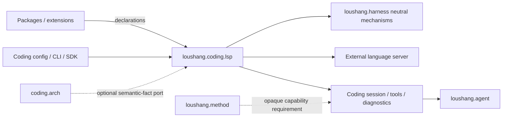

# Coding LSP Subsystem Placement

## Status

- Authority: normative proposed parent placement and black-box boundary
- Design status: proposed
- Implementation status: partial
- Owner: Coding Product

The filename is retained for stable links; under the repository architecture
method this document serves as `placement-and-boundary` for the nested scope,
not as a claim that LSP is a top-level Loushang subsystem.

## Placement Decision

`coding.lsp` is an internal capability subsystem of the `loushang.coding`
Product. It is not a new package-level Loushang subsystem and does not justify
a top-level `loushang.lsp` package.

```text
loushang.coding (Product)
  |
  +-- capability policy and Product binding
  |
  +-- coding.lsp (optional Product Capability Bundle)
        |
        +-- language-server catalog and admission
        +-- semantic tools and diagnostic feedback
        +-- Session-scoped LSP runtime (workspace identity is a binding input)
```

This placement follows two rules:

1. LSP has meaning here because Coding turns protocol facts into coding tools,
   edit feedback, configuration, and user-facing status.
2. Product-neutral mechanics may be reused from Harness, but Harness must not
   own language-server selection, LSP methods, or diagnostic semantics.

## Product Classification

The bundle has three separate identities:

| Identity | Value | Meaning |
| --- | --- | --- |
| Product capability | `coding.lsp` | Configuration, mounting, dependencies, and Product policy |
| Tool family | `coding.lsp.tools` | Model-visible semantic query tools |
| Python package | `loushang.coding.lsp` | Product-owned implementation boundary |

The capability may be mounted as `disabled`, `on_demand`, or `always`. Mounting
the tool family does not itself start a language-server process. P0 process
startup is always lazy; workspace warm-up is a later Product policy.

## Ownership

### `loushang.coding`

Owns:

- the `coding.lsp` capability definition and default mount policy;
- accepted language-server definitions and deterministic selection;
- LSP readiness, pooling, graceful protocol shutdown, and all JSON-RPC/LSP
  behavior; future restart/idle policy remains here if introduced;
- semantic tool contracts and result budgets;
- document synchronization and code-diagnostic semantics;
- CLI, SDK, status, doctor, and prompt integration;
- projection of admitted extension declarations into the server catalog.

### `loushang.harness`

May own or provide only Product-neutral mechanisms:

- capability/tool composition and activation;
- policy decisions and optional approval resolution for executable launch;
- workspace/path abstractions and, for the later passive loop, committed
  mutation facts;
- lifecycle/disposal primitives and context budgets;
- authorized Process Hosting primitives, lifetime sandbox binding, session
  quotas, and termination/kill cleanup;

Harness must not import `loushang.coding.lsp`, name LSP methods, rank language
servers, or define Coding diagnostic presentation.

### `loushang.agent` and `loushang.ai`

They consume the tools and context assembled by Coding. They do not own the
LSP client or a global language-server registry. The LSP runtime does not call
a model provider directly.

### `loushang.method` and `loushang.work`

They may declare an opaque Product capability requirement such as
`coding.lsp`, but cannot select a Harness tool pack, install a server, bypass
policy, or own the runtime. This architecture package is produced using the
repository's architecture design method; it is not a `MethodPlan` design.

### Extensions and capability packages

An extension or package may contribute declarative server definitions. Coding
normalizes, validates, admits, and ranks those definitions. A contribution is
never equivalent to permission to execute its command.

### External language servers

Language servers are separately installed executables. They are untrusted
subprocesses at the execution boundary and receive only the admitted root,
environment, initialization options, and document content.

## Dependencies



Allowed dependency direction:

```text
coding Product binding
  -> coding.lsp
     -> selected Harness abstractions
     -> standard library / protocol codec

coding.arch -> optional semantic-fact protocol <- coding.lsp adapter
```

Forbidden dependency direction:

```text
Harness -> coding.lsp
coding.lsp -> Agent loop, AI provider, Method runtime, Work runtime, or TUI
coding.lsp client -> Coding tool or presentation layers
coding.arch deterministic core -> concrete coding.lsp implementation
```

## Required Adjacent Contract

The later passive diagnostic loop needs a committed workspace-mutation signal. The target
contract is a Product-neutral `WorkspaceMutationFact` emitted only after a
successful mutation, containing at least the canonical path and mutation kind.
It belongs with Harness workspace mutation mechanics, not in the LSP package.

The first implementation may safely resynchronize a document from disk before
an active query. It must not infer successful edits from tool names or parse
arbitrary tool result text. Passive edit-to-diagnostic feedback should be added
only after the committed mutation contract exists.

Active LSP also requires the Product-neutral Process Hosting and authorization
contracts specified by [Harness Foundation](harness-foundation.md). Coding
must consume those injected ports and must not call the local subprocess API
directly.

## Why This Is Not A Top-Level Subsystem

LSP is a protocol used to implement a Coding capability. Its server catalog,
queries, diagnostics, and presentation all depend on Coding Product semantics.
Extracting `loushang.lsp` now would create a protocol-shaped subsystem without
an independent consumer and would move Product policy into a lower layer.

Extraction can be reconsidered only when at least one other Product needs the
same lifecycle and protocol model without depending on Coding semantics.

## Placement Acceptance

The placement is valid when:

- disabling `coding.lsp` removes its tools and runtime without weakening the
  Coding core;
- Coding can mount it through the existing Product capability model;
- Harness remains unaware of LSP-specific methods and server identities;
- no process or mutable registry is shared globally across unrelated sessions;
- `coding.arch` and CI analysis continue to work when no language server is
  installed.
