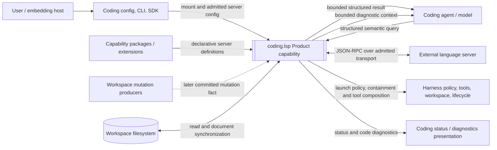

# Coding LSP System Context

## Status

- Authority: normative proposed black-box context
- Design status: proposed
- Implementation status: partial
- Owner: Coding Product

## Scope

This document treats `coding.lsp` as a black-box capability inside the Coding
Product. It defines actors, neighboring systems, information flows, and trust
boundaries. Internal component decomposition is deferred to the following two
documents.

## Context Diagram



## External Actors And Systems

### User or embedding host

Chooses capability mount and configuration, installs a language server outside
Loushang, and can inspect status or request stop. Admitted P0 Servers start
without routine interactive approval; an explicit user policy may still ask or
deny. The user does not need an editor process.

### Coding agent and model

Sees only the mounted semantic tool contracts and bounded results. It does not
send raw JSON-RPC, choose arbitrary executable commands, or receive an entire
workspace symbol graph by default.

### Coding configuration, CLI, and SDK

Provide Product-level configuration and control operations. They use the same
normalized capability and server models; CLI flags are not a second source of
runtime semantics.

### Capability packages and extensions

Contribute declarative server definitions. Their declarations have provenance
and lower precedence than explicit user configuration. They cannot activate
themselves or grant execution authority.

### Workspace mutation producers

Include built-in file-edit tools and admitted external tools that commit file
changes. In the later passive-feedback slice, native producers publish a
Product-neutral committed mutation fact after success. They do not call LSP
APIs directly. Active queries do not depend on this event path.

### Harness

Provides neutral composition, policy/optional approval, path, Process Hosting,
lifecycle, and context-budget mechanisms. A later neutral mutation fact uses
existing ordered-event mechanics. Coding projects these mechanisms into
LSP-specific behavior.

### External language server

Is a separately installed process speaking LSP. It may parse workspace files,
publish diagnostics, and answer semantic queries. Its availability and quality
are not assumed by the Coding core.

### Workspace filesystem

Remains the source of truth for committed content. The document mirror is a
runtime cache with monotonic versions, not an independent source of file data.

## Primary Information Flows

### Catalog and admission

```text
built-in definitions + package declarations + explicit user definitions
  -> normalize and validate
  -> policy/admission check
  -> immutable catalog generation
  -> deterministic server selection
```

An unadmitted command never reaches process launch. If no eligible server is
available, Coding returns an actionable unavailable result rather than silently
falling back to another executable.

### Active semantic query

```text
model invokes a coding.lsp tool
  -> validate path, position, and result budget
  -> select server by language/root/priority
  -> lazily ensure one runtime for (server definition, workspace root)
  -> synchronize the current document from disk
  -> issue typed LSP request
  -> normalize, bound, and return a structured result
```

Tool activation and process activation are distinct. An `always` mounted tool
may still cause no process to run during a session that never needs LSP.

### Later edit and diagnostic feedback

```text
file mutation commits
  -> WorkspaceMutationFact(path, kind)
  -> document synchronization with a monotonic version
  -> language server publishes replacement diagnostics
  -> diagnostic inbox computes a bounded current-set delta
  -> Coding attaches the delta to the next eligible turn/tool batch
```

Diagnostics are advisory feedback. They do not roll back a file edit, bypass
the agent loop, or become Harness operational diagnostics.

### Refresh and shutdown

```text
configuration/package generation changes
  -> build a new immutable catalog
  -> stop affected runtimes before adopting changed definitions

session/workspace disposal
  -> cancel pending requests
  -> shutdown/exit each owned server
  -> force terminate after timeout
  -> release document and diagnostic state
```

No language-server process survives merely because another unrelated Coding
session exists.

Live catalog-generation migration is deferred; P0 may apply changed
configuration at the next binding/session replacement.

### Missing or failing server

Missing executable, denied launch, initialization failure, timeout, crash, or
protocol corruption are represented as capability status and structured tool
failure. They do not fail Coding startup, mutate files, or trigger automatic
package installation.

## Trust Boundaries

### Declaration to admitted configuration

Server definitions cross from package/user input into Product configuration.
Validation covers command identity, arguments, root markers, language mapping,
environment allowlists, initialization options, and provenance.

### Product to subprocess

Launching a server crosses an execution boundary. The launch must use admitted
configuration and existing policy rules. Server-originated requests
that can mutate files, execute commands, or show interactive prompts are denied
in the first version.

### Filesystem to model context

Paths, symbols, hover text, and diagnostics can contain sensitive or very large
content. Results must be workspace-scoped, path-normalized, and bounded before
entering model context.

### Notifications to current state

`publishDiagnostics` is replacement state for a document/version, not an
append-only log. Stale versions and notifications from a retired runtime are
discarded.

## Context Boundary Rules

- The model cannot provide a command to launch.
- A server contribution cannot grant its own authority.
- Server responses cannot directly mutate the workspace.
- Tool results and passive diagnostics use independent budgets.
- Operational failures and code diagnostics use different data types and
  presentation channels.
- LSP absence degrades semantic assistance only; ordinary Coding tools remain
  available.
- `coding.arch` may request semantic facts through an optional protocol, but
  does not become an LSP lifecycle owner.

## Out Of Context

This boundary does not include language-server installation, editor emulation,
debug adapter protocol, compiler/build orchestration, architecture judgments,
or a general remote-process platform.
