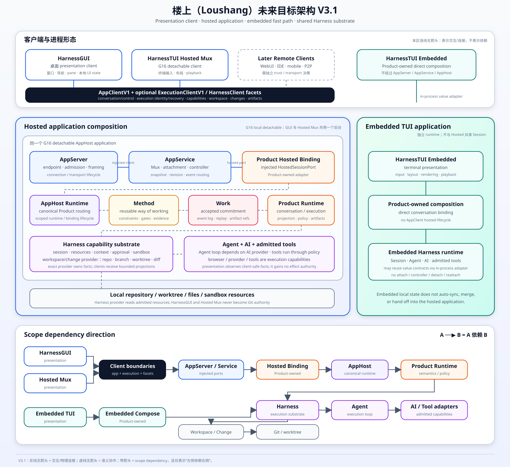

# Loushang Future Target Architecture V3.1

[Architecture](../README.md) · [Drafts](README.md) ·
[Open SVG](../future-loushang-architecture-v3.1.svg) ·
[HarnessGUI System Context](gui-system-context-and-boundary-contract.md)

## Status

Status: proposed target architecture.

Revision: V3.1 replaces the former V3.0 target artifacts. The V3.0 Markdown,
SVG, and PNG paths are removed rather than retained as a parallel architecture.

V3.1 aligns the future target with the accepted AppServer, AppService, AppHost,
G16 detachable workspace, G17 hosted-session, and Execution V1 boundaries. It also carries
the proposed HarnessGUI black-box boundary forward as a target client profile.
That inclusion does not by itself accept a GUI package, framework, optional
HarnessClient facet, or public API.

This document explains the decisions and invariants shown in the V3.1 diagram.
It is not a complete description of the current Python package or public API
surface. Existing AppServer/AppService/AppHost contracts remain governed by
their accepted decisions; proposed GUI, optional client facets, cloud,
WebSocket, relay, and distributed-state behavior still require their own
accepted delivery requirements.

Current code, tests, and accepted ARDs remain authoritative. When this document
conflicts with them, the live source wins until a later ARD explicitly accepts
the target decision.



The overview separates interaction/physical connection from scope dependency.
In architecture diagrams an arrow always means `A --> B`: **A depends on B**.
Runtime request and event order is described with numbered steps rather than a
second arrow meaning. Programming-language return annotations and API
signatures are not architecture arrows.
Product resolver/factory contracts, Session-turn versus Work submission, and
Capability-internal Binding Facets remain in the prose below.

## Purpose

The target architecture supports three client/deployment profiles without
creating competing Product or Harness semantics:

- a small local Product TUI may bind Harnesstui directly to one embedded Product
  runtime and Harness instance;
- a G16 detachable local application may retain live Sessions and admitted Work
  while HarnessGUI and HarnessTUI Hosted Mux attach through separate AppClient
  scopes; and
- a later daemon or cloud deployment may expose the same admitted App Contract
  to WebUI, IDE, mobile, or P2P peers after its trust decisions are accepted.

All profiles reuse the same Product definitions, factories, Harness contracts,
and Product-owned semantics. They do not share a mutable Session or Work runtime
instance across process boundaries.

HarnessGUI is a presentation client, not a Desktop GUI Host. HarnessTUI Hosted
Mux and HarnessGUI can share one detachable hosted application without sharing
drafts, focus, scroll state, attachment generations, or control authority.
HarnessTUI Embedded remains a separate Product-owned composition and bypasses
AppServer, AppService, and AppHost.

The primary mobile story is:

1. A local daemon starts a Coding Session.
2. A phone attaches through an AppClient.
3. The phone submits work and later disconnects.
4. The Session or Work continues in the daemon.
5. The phone reconnects from a new attachment.
6. AppService returns a snapshot plus subsequent events.
7. The current controller handles any new approval interaction.

## Core Decisions

### 1. Share definitions and factories, not runtime instances

A Product composition root supplies immutable definitions, factories, and
capability descriptors. The host uses them to construct a fresh Product runtime
binding for each admitted Session or Work execution.

The embedded instance and hosted instance may be created by the same factory,
but each owns independent mutable state, cancellation, transcript bindings,
approval presentation, and lifecycle.

The Product registry is therefore a narrow `ProductResolver`, not a runtime
service locator and not a capability-routing god object. AppHost uses the
resolver to own canonical admitted Product runtime bindings. The outer hosted
application composition injects narrow AppHost-backed Product ports into
AppService; AppService imports neither AppHost nor Coding, Research, PPT, or
Design.

The target type shape is deliberately small. The names below are conceptual,
not current public API:

```python
class ProductResolver(Protocol):
    def resolve(self, product: ProductKey) -> ResolvedProductDefinition: ...


@dataclass(frozen=True)
class ResolvedProductDefinition:
    identity: ProductIdentityView
    capabilities: ProductCapabilityView
    create_session_binding: Callable[
        [SessionActivationContext], ProductSessionBinding
    ]
    create_work_binding: Callable[
        [WorkActivationContext], ProductWorkBinding
    ]
```

Resolution returns one immutable typed definition, never `dict[str, Any]`.
Identity and capability views are safe to cache. Each factory invocation
creates a new runtime binding; it cannot return a process-global mutable
Session, executor, Approval presenter, or Work runtime. Exact Product binding
protocols evolve only through the governing AppHost and Product decisions, not
through presentation-specific shortcuts.

### 2. Select Session or Work semantics explicitly

Loushang does not infer durable business meaning from implementation details
such as the number of prompts, whether an artifact was produced, or whether an
approval was requested. The caller selects one of two explicit application
operations:

| Operation | Meaning | Route |
|---|---|---|
| `session_turn` / `run_once` | A lightweight interaction with no durable business commitment | via Product conversation binding and Harness |
| `submit_work` | An accepted business intent requiring a queryable, replayable terminal outcome | via Product work preparer, Work, Product executor and Harness |

The standard Coding Channel `SubmitCodingTurn` adapter is a Work operation and
uses the second route. A local lightweight Coding prompt may use the first
route. Method enactment always uses Work.

This distinction follows the Work definition: Work is a persistent commitment,
not a synonym for every message, turn, Agent invocation, or in-process task.

### 3. Keep Product semantics in Product bindings

A hosted Product runtime binding contains narrow capabilities rather than one
universal Product interface:

- Conversation capability: prompts, admitted tool selection, policy, and Session
  operations;
- Work preparer: Product intent to `WorkOperation`, current `WorkRunSpec`, and a
  future frozen `WorkPlanSpec`;
- Work execution binding: the Product-owned `WorkDomainExecutor` that binds a
  Work step to Harness execution;
- event and interaction projection: Harness/Work facts and Product-specific
  views for application clients.

Product bindings retain domain language, prompts, model and provider policy,
tool selection, artifact content, validation, event vocabulary, and
presentation decisions. They do not reimplement AppService, Work, or Harness.

### 4. Match remote Agent contracts to interaction semantics

Remote placement does not imply a persistent Agent session. A remote Agent may
be exposed as one of three progressively stronger capabilities:

| Interaction semantics | Minimum contract | Architectural treatment |
|---|---|---|
| One-shot invocation | `invoke(request) -> result` | Ordinary admitted Harness tool/capability; not multiagent |
| One-shot asynchronous job | `submit(request) -> RunRef`, `await_result`, `cancel` | Job/delegation capability; no addressable collaboration actor |
| Stateful collaboration | `spawn`, `send`, `wait`, `list`, `interrupt`, `close` | Multiagent collaboration port with follow-up and steering semantics |

An execution may have progress without requiring one stateful server process,
and an asynchronous `RunRef` does not imply an attachable Agent session. Job
state may live in a queue or store and be served by interchangeable instances.
V3.1 therefore does not define one universal provider containing `invoke`,
`submit`, `attach`, `send`, `inspect`, `cancel`, and `close`.

The LSP analogy applies only to the local-client/remote-service boundary. The
model calls a stable admitted tool; its handler invokes an injected capability
client; a transport adapter calls the remote service. The model-visible tool
schema is not the wire protocol. The client adds protocol version, request and
caller identity, idempotency, authorization scope, and event cursor fields that
the model must not control.

The dependency direction is: local Agent depends on an admitted tool; the tool
depends on a capability client; the client depends on its selected stdio
JSON-RPC, IPC, HTTP, gRPC, or A2A adapter; and that adapter depends on the remote
capability service.

The first collaboration implementation binds one explicitly selected provider
for a Session-scoped collaboration Capability: either the current local
`SessionMultiAgentRuntime` or one remote collaboration service behind the same
tool façade. If alternative providers are admitted, this is an Exclusive
Replacement surface: Plugin identity and discovery order are not selection
policy, although a Plugin may carry an admitted Extension provider. The first
implementation does not require per-child mixing of multiple local and remote
providers in one logical tree. That simpler choice keeps the remote service
free to own its child tree and mailbox while the local Host retains Capability
admission, authority, bounded result projection, and Product interaction
routing.

An internal `AgentExecutionPort` is optional and deferred. It is justified only
when the Host must transparently mix physical backends inside one logical tree
or provide attach, lease, fencing, checkpoint, orphan detection, and recovery
under one local control model. It is then extracted from at least two proven
backends. A remote `invoke` client, an asynchronous job service, or a
Session-level remote collaboration adapter does not by itself require that
port.

AppService is not a dependency of the capability client. Product/Host
composition admits and injects the client. Channel is not its worker transport,
and Work participates only when the invocation is also an accepted durable
business commitment. A2A may be one adapter for an independent external Agent;
a Loushang-controlled service may use a smaller worker protocol without
changing the tool contract. See
[Remote Agent Capability Boundary](../harness/multiagent/remote-agent-capability-boundary.md).
The implemented local CLI P0 is documented in
[One-Shot Agent Invocation Tool Boundary](../harness/agent-invocation-tool-boundary.md):
it proves the admitted-tool path without introducing an execution provider,
job lifecycle, or new multi-agent runtime abstraction.

### 5. Keep model-contingent cognition outside the stable substrate

Model capability may absorb more planning, decomposition, reflection, context
selection, generic verifier prompting, and tool-selection heuristics over time.
Those features are model-contingent cognitive scaffolds, not durable system
authority. V3.1 therefore does not grow the Agent loop or AppService around the
current limitations of a particular model generation.

The stable Loushang substrate owns invariants that remain necessary even when a
model becomes substantially more capable:

- authority, Policy, Approval, sandboxing, and least privilege;
- effectful tool execution, idempotency, cancellation, retry, and failure
  convergence;
- Conversation, transcript, Session, event ordering, persistence, and recovery;
- Product-owned Capability admission, tenant/workspace isolation, and secret
  boundaries;
- multi-agent communication, concurrency, and cross-process coordination
  contracts; and
- Work admission, authoritative events, artifacts, evidence, acceptance, and
  terminal outcome.

The low-level Agent loop remains a mechanical model/tool protocol engine. It
may expose narrow seams for context transformation, tool preflight, result
projection, events, and cancellation, but it does not own a planner, verifier,
plan mode, todo policy, memory policy, or Product semantics. Model-contingent
features belong in Product-owned strategies behind declared Capability Slots,
admitted Extensions or Skills, or explicitly selected Runtime Profile
bindings.

Planning and verification each have a durable and a disposable form:

| Form | Architectural treatment |
|---|---|
| plan as cognitive aid | replaceable model strategy |
| plan as coordination / approval / resume / audit contract | Product binding and Work-owned fact after acceptance |
| self-verification prompt or fixed verdict format | replaceable model strategy |
| compiler / test / scanner / independent-environment evidence | Product-interpreted evidence correlated by Work |

At the Method boundary, the durable rule is: **Method specifies what must hold;
the model decides how to achieve it.** Method owns reusable roles,
constraints, gates, expected artifacts, acceptance conditions, and evidence
requirements. Within that envelope the model may change its decomposition,
tool order, reasoning strategy, or use of subagents as model capability evolves.
When a plan must coordinate people or agents, gate approval, survive restart,
or support audit, the Product binds it into a run-specific contract and Work
accepts it as an authoritative fact. See [Method Architecture](../method/README.md).

Presentation invariants are also part of the stable substrate. Native TUI
playback scripts input, streaming, resize, surface, and control-flow events
through render planning and terminal-operation boundaries, while HarnessTUI
playback adds neutral conversation routing, state snapshots, and real
screen-loop fixtures. This playback is not a second transcript or Work replay
engine: it is an executable client contract proving that snapshots and events
produce bounded, cursor-safe, scrollback-safe, deterministic terminal effects.
The same playback substrate remains useful for embedded and AppClient-backed
profiles and across different Products. See [TUI Architecture](../tui/README.md)
and [Terminal Playback Harness](../tui/native-terminal-core/key-designs/KD-010-terminal-playback-harness.md).

An architectural feature should not become kernel ownership or an
irreversible persistent schema merely because today's models need it. A useful
test is: if a future model with materially stronger native reasoning could
remove the feature without weakening authority, evidence, persistence, or
coordination, the feature stays outside the stable substrate.

Model capability may swallow Agent cognition; it must not swallow authority,
effect control, evidence, persistence, coordination, or Work truth.

### 6. Separate presentation, application coordination, and runtime hosting

V3.1 makes four previously compressed boundaries explicit:

| Boundary | Owns | Must not own |
|---|---|---|
| HarnessGUI / HarnessTUI | window or terminal interaction, layout, rendering, drafts, focus, scroll and client-local recovery UX | Product runtime, Session truth, AppHost lifecycle, Git truth or tool authority |
| AppServer | endpoint publication, connection admission, authentication, framing, limits and transport lifecycle | Mux/Session semantics, Product resolution, Agent execution or presentation |
| AppService | Mux/member, attachment, controller, detach/reattach, snapshots, revisions and client-safe request/event/interaction routing | AppHost construction, Product policy, Harness execution or UI state |
| AppHost | canonical admitted Product catalog/routing and scoped Product runtime binding lifecycle | AppServer transport, AppService coordination semantics or GUI/TUI rendering |

The outer hosted application composition is the lifecycle owner that constructs
and injects these parts. Sharing one process does not collapse their ownership.
AppService depends on an injected hosted Product port; a Product-owned hosted
binding uses AppHost canonical routing. AppServer depends on an injected
connection-scoped semantic client. No core scope imports a presentation.

`AppClientV1` is the stable conversation/control client boundary. The accepted
optional `ExecutionClientV1` adds explicit execution identity, status, query,
interrupt and recovery behavior without changing the base client. Proposed,
versioned HarnessClient facets may later project capabilities, workspace,
changes and artifacts. An optional client or facet is not a new service owner:
AppService owns its wire availability, while the exact Product or Harness
provider owns the fact.

## Client And Process Profiles

### G16 detachable hosted profile

```text
dependency direction: A --> B means A depends on B

HarnessGUI -----------------------> AppClientV1 + optional ExecutionClientV1 / HarnessClient facets
HarnessTUI Hosted Mux ------------> AppClientV1 + optional ExecutionClientV1 / HarnessClient facets
client adapters ------------------> App Contract / local transport
AppServer ------------------------> connection-scoped semantic client
AppService -----------------------> injected HostedSessionPort
Product-owned hosted binding -----> AppHost
AppHost --------------------------> admitted Product runtime
Product runtime ------------------> Harness
Harness --------------------------> Agent / admitted tool boundary
Agent ----------------------------> AI
```

HarnessGUI and G16 detachable HarnessTUI Hosted Mux may connect to the same
hosted application. Each connection has its own AppClient scope, attachment
generation, cursor and local presentation state. They may control different
Muxes; a second attachment to the same Mux remains subject to the AppService
controller contract and does not silently become an observer or takeover.

The hosted request sequence is: (1) client, (2) admitted AppServer endpoint,
(3) AppService, (4) injected Product-owned hosted binding, (5) AppHost canonical
runtime, (6) Product and (7) Harness/Agent/AI/tools. Results and events return
through the same owned boundaries.

Normal client detach does not stop the G16 application or accepted execution.
G15/G17 foreground launchers remain a different deployment profile: their
controller owns and settles the child application, so they are not used as the
shared HarnessGUI backend.

### Embedded TUI profile

```text
dependency direction: A --> B means A depends on B

HarnessTUI Embedded -------------> Product-owned embedded composition
embedded composition ------------> per-Session Harness runtime
Harness runtime -----------------> Agent / admitted tool boundary
Agent ---------------------------> AI
```

HarnessTUI continues to own terminal input, layout, rendering, local surfaces,
and playback. The Product-owned composition binds the embedded conversation
directly and bypasses AppServer, AppService, and AppHost. An in-process adapter
may reuse compatible workspace/change value semantics, but it does not acquire
hosted attachment, controller, detach or reattach lifecycle.

An embedded Product may persist a local transcript, but V3.1 defines no automatic
sync, merge, or runtime handoff to a daemon. The embedded profile is therefore
local-only and non-migratable. A Session that must survive the foreground
process or support multi-device attach starts in a hosted profile. The
default-native-TUI delivery choice in
[AppService Hosted Boundary With An Embedded TUI](appservice-embedded-tui-hosted-boundary-plan.md)
keeps this as an explicit Product election rather than the default local path.

### Later remote-client profile

A daemon or cloud deployment may later admit WebUI, IDE, mobile, or P2P peers
through the same App Contract. AppServer remains the transport/admission edge;
AppService remains the application coordinator; AppHost remains the canonical
Product runtime/binding host. Deployment changes placement, isolation,
admission and credentials without changing Product, Work or Harness semantics.

Client processes own presentation and user interaction only. A P2P peer is a
remote application peer for pairing, attach, resume, and notification. It is
not `loushang.agent` and does not participate in the Agent loop.

## App Contract, Channel, And Transport

The diagram places App Contract and Channel as parallel semantic boundaries
above Transport. They do **not** define one mandatory serialization pipeline.

### App Contract

The App Contract is the stable client-facing application API. Its protocol
values cover, initially:

- initialization and capability summary;
- Session open, attach, detach, snapshot, and close;
- prompt, steer, follow-up, abort-turn, and selected capability operations;
- work submission and observation;
- ordered application events;
- interaction request/response, initially approval; and
- version negotiation and typed errors.

Protocol values are client-safe projections, not serialized SessionFacade,
Product runtime, or widget objects.

The base `AppClientV1` remains useful when no optional execution client or facet
is available. Accepted connection profiles may negotiate `ExecutionClientV1`;
capability discovery may advertise separately versioned HarnessClient facets
for workspace, changes, artifacts, or other proven capability families. Unknown,
incompatible, withdrawn, or stale-generation facets fail closed without
breaking the base conversation/control contract. HarnessGUI and HarnessTUI
Hosted Mux consume the same provider-owned value semantics; presentation type
does not select a different source of truth.

### Channel

`loushang.channel` remains a narrower operation/event boundary. It carries
`WorkOperation`, `WorkEvent`, and selected transport-safe
`RuntimeEventView` values. It may provide correlation, subscription, cursor,
resume, and delivery semantics for those families.

App protocol commands are not added wholesale to `ChannelEnvelope`. Channel is
not the transport behind every `AppClient` request and does not become a
universal UI command bus. AppService consumes injected Channel/Work ports where
the operation requires them and direct Session ports where it does not.

### Transport and AppServer

In-process calls, local IPC, HTTP/WebSocket, P2P direct connections, and relay
fallback are transport adapters over admitted protocol values. They own
framing, connection lifecycle, limits, and delivery mechanics. They do not own
Session commands, Product discovery, Work state, approval policy, or UI layout.

AppServer is the admitted endpoint owner over those transports. It publishes
and revokes endpoint records, authenticates and fences a connection, constructs
its bounded client scope, and dispatches only to an injected semantic client.
It does not resolve Product runtimes or become AppService/AppHost.

### Duplex direction

Client input and server delivery are separate directions even when one duplex
connection carries both:

Client input is processed in this runtime order:

1. AppClient, transport and AppServer admission;
2. the connection-scoped AppService client;
3. either the Product Session port and Harness for `session_turn`, or the
   Product Work port, Work and Product executor for `submit_work`.

Server delivery is processed in this runtime order:

1. Harness or Work emits facts;
2. Product projects client-safe values;
3. AppService orders and routes them; and
4. AppServer and transport deliver events, snapshots or interaction requests
   to AppClient.

Only payload families admitted by the Channel contract use a Channel endpoint.
Neither `session_turn` nor `submit_work` is forced through Channel merely
because the AppClient connection is remote. A standard Coding Channel adapter
does use Channel and Work by its own explicit contract.

## AppService Boundary

AppService is the single hosted application coordinator. It owns:

- principal and device context;
- attachment identity and the current control lease;
- idempotency admission for externally retried side effects;
- Session/Work routing through injected Product ports;
- client-safe snapshots and revisions;
- subscriptions and bounded delivery buffers;
- request, event, and interaction routing; and
- deterministic detach and close behavior.

AppService does not own:

- Agent loops, model calls, tool execution, or sandbox policy;
- transcript or Work lifecycle truth;
- Method selection, compilation, or Method-to-Work conversion;
- Product prompts, tools, artifact semantics, or event vocabulary;
- approval futures, timeout, fallback, cancellation, or decision policy; or
- terminal, WebUI, IDE, or mobile rendering.
- AppServer endpoint/connection lifecycle or AppHost runtime lifecycle.

Host infrastructure may add resource admission, a live Session routing table,
execution dispatch, workers, and bounded outbound delivery. Execution remains
serialized within one Session while independent Sessions may run concurrently.

At composition time the outer hosted application resolves the Product and
constructs an AppHost-backed hosted binding. AppService receives narrow
providers for admitted Session, Work, and optional Channel or HarnessClient
facet ports. The invariant is that AppService never consults a global registry,
imports AppHost or a Product implementation Python package, or performs
provider discovery while dispatching a request.

AppHost maintains canonical admitted Product runtime/binding identity. Hosted
application infrastructure may maintain a live Session routing table, not a
filesystem directory or persistent Session catalog. AppServer remains outside
both authorities.

## Method, Work, Harness, Agent, And AI

The semantic execution sequence is:

1. MethodPlan;
2. Product Work Preparer;
3. WorkRunSpec or a future WorkPlanSpec;
4. Work;
5. Product WorkDomainExecutor;
6. Harness;
7. Agent; and
8. AI.

Method owns reusable ways of working, constraints, expected artifacts, and plan
preparation. A MethodPlan returns to the Product work preparer because Product
owns the conversion from method vocabulary into an executable Work contract.
Method never executes Harness directly.

Work owns an accepted business commitment, idempotent operation admission,
run/plan/step lifecycle, terminal outcome, authoritative Work events, replay,
and Work-correlated `ArtifactRef` values. Work does not own an Agent turn.
Likewise, an Agent turn does not own a Work run.

Harness owns reusable Session, transcript, context, tools, approval integration,
retry, compaction, workspace, and sandbox mechanisms. Harness does not import
`loushang.work` or a Product implementation Python package. The Product executor
is the adapter that connects a Work step to Harness without reversing that
dependency.

Agent owns the execution loop and calls AI. Harness and Agent coordinate tool
execution through admitted tools and sandbox policy; the AI layer remains
independent of Harness and Product code.

### Product Capability Requirement resolution and scoped activation

The overview uses stable owner-level Capability IDs. Its initial Harness
boundaries are `harness.workspace`, `harness.resources`, and
`harness.session`; Product-owned examples include `coding.lsp` and
`coding.arch`. Repository identity, branch, worktree and diff/change facts are
generic `harness.workspace`/change-provider concerns rather than GUI or Coding
presentation state. A Capability Plan node is an ID and its declared
requirements, while a live runtime node is a Mounted Capability bound to a
concrete scope.
Product, Plugin, Package, and Extension identities remain composition,
provenance, delivery, or admission facts rather than graph nodes.

In Capability dependency diagrams, `A -> B` means A depends on B. Internal
providers, tools, permissions, and narrow injected facet views do not become
additional top-level nodes. The accepted
[Capability Dependency And Mount Lifecycle](../harness/capability-dependency-and-mount-lifecycle.md)
decision owns the detailed planning, binding, disposal, and diagnostic rules.

Method and Skill resources may declare opaque Product Capability Requirement
values, such as `coding.arch`. They do not name Harness `ToolPackDefinition`
values, register executable handlers, or grant themselves execution authority.
For structured work, the Product work preparer carries the requirement into the
run-specific Work contract and the Product executor resolves it through the
Product's admitted Capability catalog. For a lightweight Session turn, the
Product conversation binding performs the equivalent resolution without
creating a Work run.

A Product Capability Requirement may resolve to an admitted Capability Bundle
for one Capability ID. That resolution may separately activate related Product
Capability Bundle resources and one or more family-specific Capability Packs,
including a named tool pack. The Product retains the requirement mapping,
Capability Mount defaults, bundle activation, and policy; Harness retains
contribution resolution, allow-list enforcement, live tool rebinding, sandbox
and approval integration, and scoped activation mechanics. A Product may expose
`disabled`, `on_demand`, and `always` Mount Policy, but no mode may bypass or
widen host admission, delegated execution restrictions, Session allow-lists,
or tool policy.

Scoped activation is additive and owner-aware. Manual selection, Product
defaults, a Skill invocation, and a Method/Work step may independently request
the same capability. Releasing one activation removes only that owner's request;
completion, failure, cancellation, and runtime disposal must all release their
owned activation idempotently. This capability activation scope is distinct
from the AppService control lease that selects which attached client may mutate
a Session.

### Method visibility in clients

V3.1 does not add `MethodPlanStatus` or `MethodStepStatus` to the base App
protocol. When a Product first needs to render method progress, its projection
may derive a Product-facing application view from Method identity and
Work-owned plan/step facts. Harnesstui consumes that view without importing the
`loushang.method` Python package.

A stable Method editing, steering, or inspection protocol is added only after a
Product surface requires it and defines its compatibility needs. The target
does not pre-commit that future view to `RuntimeEventView`, `WorkEvent`, or a
new App protocol value family.

## State And Persistence

Authority remains with the semantic owner:

| State | Authority | Notes |
|---|---|---|
| Conversation records | Product-bound Harness transcript runtime | Product/Host supplies the codec, store, path, and retention policy; embedded local state is not automatically merged |
| Client snapshot and revision | AppService projection | Derived from authoritative Session/Work state; it is not a second transcript store |
| Work run, events, replay, and Work-correlated artifacts | Work event log | Required only for admitted Work |
| Method resources and reusable definitions | Method catalog | MethodPlan execution facts belong to Work |
| Workspace, repository, branch, worktree and change/diff facts | Harness workspace/change provider | AppService/App Contract may project bounded client-safe values; Product owns content meaning and validation; presentation never reads Git as an authority |
| Product artifact meaning and materialization | Product, with Work owning Work-correlated references | A lightweight Session output need not become a Work `ArtifactRef`; a client facet is only a projection |
| Session approval audit events | Harness event source plus an optional Product/Host retention sink | Runtime delivery is observable but not durable by default |
| Attachment, lease, device, and idempotency records | AppService control plane | These are application coordination facts, not transcript facts |

There is no V3.1 state-merge protocol between an embedded Session and a hosted
Session. Import or migration, if later required, must be an explicit Product
operation with conflict and identity semantics; it must not be an accidental
side effect of attach.

## Events, Snapshots, And Reconnection

AppService exposes a client-visible state stream as:

1. a snapshot at revision `N`; and
2. ordered events after revision `N`.

Each attachment has a bounded delivery buffer and cursor. When the requested
cursor is no longer retained, AppService returns `SnapshotRequired`; the client
loads a fresh snapshot instead of guessing across a gap.

Attachment disconnect is not Session or Work cancellation. The daemon or cloud
host continues the admitted execution, subject to its resource and retention
policy. Reconnection creates a new attachment generation and control lease; it
does not resurrect transport-owned futures.

Durable Work replay and client delivery buffering are different mechanisms.
AppService must not create a second transcript or Work audit log merely to
support reconnect.

## Approval And Interaction Routing

`ApprovalBroker` remains the sole owner of pending approval futures, timeout,
fallback, cancellation, and resolution. AppService only projects an existing
request, validates the responding principal, attachment generation, control
lease, and idempotency key, then forwards the response to the bound Harness
approval interaction port.

An ordinary Session approval is correlated by Session, invocation, interaction,
and action identifiers. A WorkRun correlation exists only when the invocation
was admitted through Work. Harness currently emits session-scoped tool approval
request/resolution runtime events, so a lightweight approval is correlated and
observable without inventing a WorkRun.

Runtime events are not, by themselves, a durable audit log. V3.1 does not require
approval decisions to be inserted into transcript records, copied into every
client snapshot, or written to a second approval store. If a Product or
deployment requires historical compliance queries outside Work, it must bind an
explicit Session audit sink and retention policy to the existing approval audit
events. AppService may project retained session-scoped approval history, but it
does not become its authority or lifecycle owner.

Multiple observers may attach, but only the current controller may submit
mutating input or answer a blocking interaction. Observer, stale-generation,
duplicate, and late responses are rejected without changing Broker state.

## Cloud Trust And Accounting

A cloud AppServer applies tenant scope before resolving a Product runtime,
Session, store, workspace, or credential reference. The AppService
control/trust plane owns principal/tenant authorization policy and lease
admission. AppService, or an injected authorizer at its boundary, enforces that
decision on every route; it does not decide Product tool/policy outcomes.

Supported credential policies may include:

- principal-provided BYOK references; and
- host-managed secret references authorized for the tenant and Product.

Secret resolution belongs to the credential owner/resolver. Secret values are
not exposed as App protocol state. Usage collection and cost attribution belong
to Host Infrastructure and correlate provider/model usage with a principal,
tenant, Product, Session, and optional WorkRun as policy requires. Store
namespaces, workspace roots, artifact access, logs, caches, and worker placement
are all tenant-scoped in the cloud profile.

The exact authorization model, retention policy, quotas, billing export, and
secret backend require separate security and deployment decisions before a
cloud implementation is accepted.

## Explicit Non-Goals

The V3.1 target does not require:

- routing every Product turn through Work or Method;
- turning Channel into the universal App protocol;
- sharing mutable runtime instances across processes;
- automatic Embedded-to-Daemon transcript merge;
- AppService-owned approval or Extension-interaction futures;
- a public P2P relay in the first AppService release;
- a base App protocol for MethodPlan/MethodStep state before a Product needs to
  render, inspect, or steer it;
- treating every remote Agent call as a stateful collaboration Session;
- one universal remote-Agent interface or a mandatory `AgentExecutionPort`;
- Product imports inside AppService; or
- one universal Product runtime binding capable of arbitrary injection;
- a second Desktop GUI Host beside AppHost;
- Product-specific Coding, Design, Research, PPT, or Work GUI classes; or
- direct GUI/TUI ownership of repository, worktree, diff, artifact, model,
  browser, provider, or tool facts.

## Staged Delivery

The V3.1 delivery sequence starts from the accepted AppServer/AppService/AppHost
and G16/G17 baseline and remains subordinate to governing ARDs:

1. Preserve the direct Embedded TUI path and the accepted G16 detachable and
   G15/G17 foreground lifecycle distinctions. Do not migrate or merge their
   mutable Session runtimes.
2. Accept the HarnessGUI scope and component placement before adding a GUI
   package. Keep the native desktop process presentation-only and use the
   existing G16 detachable hosted application.
3. Preserve the accepted optional Execution V1 profile and freeze the smallest
   optional HarnessClient capability-discovery and
   workspace/change value contracts, including source identity, version,
   revision, bounds, invalidation and closed errors. Keep `AppClientV1` usable
   when these facets are absent.
4. Implement one read-only workspace/change vertical slice through the exact
   Harness provider, AppService projection, App Contract and both HarnessGUI
   and Hosted Mux adapters. Neither client reads Git directly.
5. Prove two clients against one G16 application: different-Mux concurrency,
   one controller per Mux, `already_attached`, normal detach without stop,
   cursor/revision recovery, stale-generation rejection and presentation-state
   isolation.
6. Add HarnessGUI navigation, conversation, changes/review, artifacts and
   environment/status panes only from accepted client-safe projections.
7. Add WebUI/IDE or managed-channel adapters over the same App Contract only
   after a consuming requirement is accepted.
8. Add cloud tenant isolation, authorization, credential policy, usage
   attribution, quotas and worker admission before multi-tenant deployment.
9. Add P2P direct transport and relay fallback only after identity, pairing,
   authorization and reconnect semantics are stable.

Two capabilities have independent gates rather than mandatory phase numbers:

- Before exposing embedded-to-hosted transfer, each Product explicitly chooses
  `no migration`, export/import only, or a migration operation with identity and
  conflict semantics. Attach never implies merge.
- Before exposing Method progress, inspection, or steering, a Product identifies
  a consuming surface and defines the minimum Product-facing projection and
  compatibility contract.
- A remote Agent starts with the weakest sufficient contract: `invoke`, then an
  asynchronous job only when execution outlives one tool call, then
  collaboration only when steering or follow-up is required. Transparent mixed
  placement and a common execution port require a separate proven need.

Each phase must preserve the embedded fast path, Product neutrality, Work and
Harness dependency direction, and a single lifecycle owner for every pending
interaction.

## Related Decisions

- [Application Service Refactor](application-service-refactor.md)
- [AppService Hosted Boundary With An Embedded TUI](appservice-embedded-tui-hosted-boundary-plan.md)
- [HarnessGUI System Context And Boundary Contract](gui-system-context-and-boundary-contract.md)
- [G16 Detachable Local Workspace](../appserver/detachable-local-workspace-g16.md)
- [G17 Hosted Session Workflow](../apphost/hosted-session-workflow-g17.md)
- [Execution Contract](../appservice/execution-contract.md)
- [Execution Service Delivery](../appservice/execution-service-delivery.md)
- [AppHost Architecture](../apphost/README.md)
- [Agent, Harness, And Product Adapters](../agent/ARD-001-agent-harness-and-product-adapters.md)
- [Harness Product Runtime Core Boundary](../harness/product-runtime-core-boundary.md)
- [Capability Dependency And Mount Lifecycle](../harness/capability-dependency-and-mount-lifecycle.md)
- [Capability Variation And Replacement Boundary](../harness/capability-variation-and-replacement-boundary.md)
- [Session Facade Boundary](../harness/session-facade-boundary.md)
- [Channel Architecture](../channel/README.md)
- [Work Architecture](../work/README.md)
- [Method Architecture](../method/README.md)
- [Remote Agent Capability Boundary](../harness/multiagent/remote-agent-capability-boundary.md)
- [One-Shot Agent Invocation Tool Boundary](../harness/agent-invocation-tool-boundary.md)
