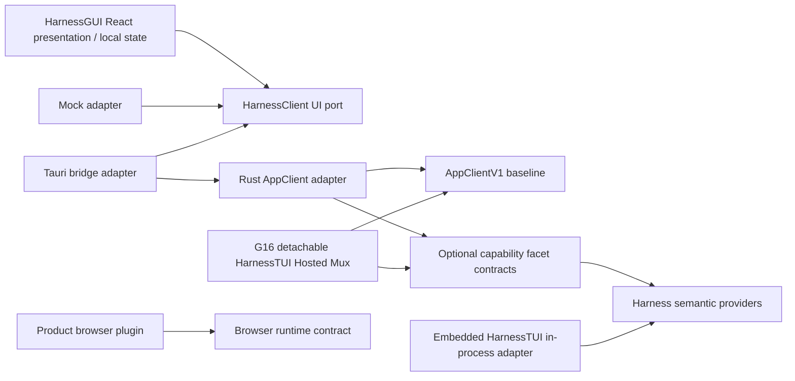

# Loushang GUI 工程启动建设方案

## Status

- ID: `GUI-ENGINEERING-BOOTSTRAP-V2`
- Scope: Loushang proposed graphical client / cross-scope delivery
- Parent: Loushang
- Authority: descriptive — proposed delivery plan; not an accepted scope contract
- Design status: proposed
- Implementation status: not-started
- Owner: Loushang architecture / future GUI delivery owner
- Source baseline: `0e3cfc2f` on `main`, updated 2026-09-09
- Execution contract update: `d89c4c9f` on `main` (PR #580), inspected 2026-09-09
- Target architecture: [Loushang Future Target Architecture V3.1](future-loushang-architecture-v3.1.md)
- Delivery objective: GUI engineering bootstrap, execution handoff, and V3.1 AppHost/presentation alignment

本文是单一中文方案源。用户已选择 Tauri + React 的讨论方向、独立浏览器窗口、
GUI 文档展示和 GUI playback；具体工程建设尚未执行。本文不安装工具链、不新增
运行入口、不改变默认 CLI/TUI，也不把拟议的目录、命令和协议扩展描述为已实现。
实施跟踪 issue、GUI lane 和正式 scope placement 在实施启动时建立。
补充需求：macOS、Windows 与 Linux 均作为正式开发环境，允许同时协作开发。
V2 进一步固定：桌面 GUI 不新建 Host，而与 G16 detachable HarnessTUI Hosted
Mux 复用既有 AppHost/AppService application；HarnessTUI Embedded 仍走直接
Product/Harness 组合，G15/G17 foreground child lifecycle 保持不变。

继承 [架构方法](../../architecture-method/README.md)、
[治理规范](../governance-profile.md)、
[系统原则](../loushang-architecture-principles.md) 与
[AppService 边界设计](appservice-embedded-tui-hosted-boundary-plan.md)。

用户结果、功能与质量验收口径见 [GUI 需求](gui-requirements.md)；本文负责
工程准备与交付顺序，不能以计划替代需求确认或正式架构设计。
Windows/macOS 接手机器从 [原生开发交接](gui-native-development-handoff.md) 开始，
其中提供 GitHub 获取方式、阅读顺序、服务能力基线与首轮实施切片。

## 1. 决策与交付范围

采用同仓库中的独立 `gui/` 工程：React + TypeScript 负责交互和文档展示，
Tauri/Rust 负责桌面集成与 AppClient 连接。保留现有 Python Product/Harness
运行时，通过 App Contract 协作。首期一个 Rust crate、一个前端 package，
共享库出现真实第二个消费者时再提取 Cargo workspace 或前端 workspace。

首期只有 Product-neutral 的 HarnessGUI，不建立 Coding/Design/Research/Work 等
Product-specific GUI surface，也不提前承诺独立 GUI 插件运行时。当前 hosted
Product 仍在 AppHost 后方提供运行时 binding，不因此成为前端目录或 identity。

本轮建设目标：

- 可复现的工具链、依赖锁、开发入口、构建和分平台验证；
- 从工程基线起支持 Linux/macOS/Windows 本地开发、调试、回放和 Git 协作；
- 能脱离真实 Agent 运行的 GUI shell、Mock AppClient 和文档阅读界面；
- 输入、事件、状态与画面证据组成的 GUI playback；
- 在明确的本机连接配置下接入已有 AppService，证明最小交互闭环。

首期不包含：浏览器内嵌、多 WebView 浏览器、远程 AppService 部署、后台服务安装、
自动启动/升级 Python 后端、完整插件 UI 市场、PDF/Office 全格式渲染或公开发布。
浏览器操作以后由产品选择的浏览器插件负责，可使用 Playwright 并打开独立窗口；
它提供执行能力及可选的结果面板，GUI 基础层不拥有浏览器会话。

## 2. Current：已有基础与缺口

| 当前事实 | 证据与含义 |
| --- | --- |
| Python/uv 是现有工程主体；本次 Git 文件检查未发现 Cargo、Node package 或 GUI 工程 | `pyproject.toml`、`uv.lock`、`git ls-files`；GUI 从独立子工程起步 |
| 当前 shell 可定位 Node/npm，未定位 rustup/cargo/rustc/pnpm | 仅为 PATH 观察；实施时检查安装位置，不能据此断言机器从未安装 |
| AppClient 已有 mux、member、快照、turn、交互响应和事件读取操作 | [client.py](../../../../src/loushang/appserver/client.py) |
| wire vocabulary 为 `loushang.app/v1`，payload 由封闭 codec 校验 | [model.py](../../../../src/loushang/appserver/protocol/model.py)、[codec.py](../../../../src/loushang/appserver/protocol/codec.py) |
| 已提交的 JSON Schema 主要冻结请求外壳、操作和错误词汇 | [schema](../appserver/app-protocol-v1.schema.json) 中 payload 仍为一般 object；不能直接生成完整正确的客户端 |
| G14 与 G16 的连接生命周期不同 | [G14](../appserver/foreground-stdio-hosted-app-g14.md)、[G16](../appserver/detachable-local-workspace-g16.md)；禁止因 GUI 接入而混同 EOF/Ack/恢复语义 |
| G16 是显式本机、带认证的可分离连接 | [local_auth.py](../../../../src/loushang/appserver/local_auth.py)、[connection_profile.py](../../../../src/loushang/appserver/protocol/connection_profile.py)；不是 HTTP/WebSocket 公网服务 |
| TUI playback 已有输入、逐步状态、画面、操作预算和失败产物 | [TUI playback](../tui/native-terminal-core/key-designs/KD-010-terminal-playback-harness.md)、[HarnessTUI](../harnesstui/README.md#conversation-playback-testing)；复用方法与场景意图，不直接把 Python 终端驱动移入 React |

当前协议不承诺全局历史 Session 发现、图片上传、完整工具/Diff/Artifact 的结构化
投影或同 mux 多控制者。初版文档阅读可以使用本地固定样例；真实产品缺失的数据
必须由对应 owner 增量扩展契约，不能包装成通用任意 payload 绕过现有闭合校验。

### 2.1 服务端就绪复核：2026-09-09

上节保留原始 `3c06f5b9` 基线。本次以已合并的 `main@d89c4c9f` 复核，
以下更新取代旧基线中的会话发现与 execution 缺口判断。GUI 的 C1 跨语言兼容
和原生运行验收仍待完成，服务端能力交付不改变 GUI 的 not-started 状态。

| 能力 | 当前证据与状态 | GUI 可以如何推进 |
| --- | --- | --- |
| G16 同机连接、快照、事件、控制与重连 | 已在 main；既有合同继续适用 | 新 execution profile 复用本机认证和 attachment 边界；旧 `start_turn` 保留等待完成语义 |
| G17 受控会话发现和显式 Hosted 工作流 | [PR #577](https://github.com/zhnt/loushang/pull/577) 已合并；[验收记录](../apphost/hosted-session-workflow-g17-acceptance-record.md) 包含 Linux/macOS/Windows 原生与独立安装证据 | GUI 如需有界 cwd/home 候选发现，显式选择 §6 的 discovery + execution 组合 profile；旧 G16 profile 不提供发现能力 |
| 稳定执行身份与生命周期 | [PR #580](https://github.com/zhnt/loushang/pull/580) 已合并；真实 Coding/Harness Product 端口、明确 running 通知、AppService 登记/去重、独立执行容量和清理归属已交付 | 消费服务发布的 execution 状态；无输出命令也可进入 running，通信等待结束不等于执行清理完成 |
| 执行提交、查询、定向中断与恢复协议 | [交付记录](../appservice/execution-service-delivery.md) 与 [可选客户端](../../../../src/loushang/appserver/execution/client.py) 已在 main；真实 Coding 装配可显式注入，默认构造继续保持旧行为 | B2 显式选择 execution profile，C1 对接已交付 codec、恢复参考和 JSON 样例；无需再等待 #576 服务端增量 |
| Rust/TypeScript 客户端兼容与 GUI 原生回放 | 尚无 GUI 工程和 C1/L2 实证 | 进入 GUI 组件设计、原生工程基线与 Mock playback，不等待全部后端扩展 |

[PR #580 检查](https://github.com/zhnt/loushang/actions/runs/34338671469) 在
`ea97cd26` 上完成并通过，合并提交为 `d89c4c9f`。这是本次采用的服务端集成
证据，不代表 GUI 的 Rust/TypeScript、桌面 IPC 或 playback 已通过。早期
[main 定时检查](https://github.com/zhnt/loushang/actions/runs/34286885467) 的
Windows quarantine 失败，以及交付记录中的本地 G10/G17 超时是历史记录；
本次 CI 通过不构成这些计时差异的原因归属，也不将历史失败作为服务尚未交付的依据。

开工结论：GUI 方案、独立原生界面、离线回放与 C1 可以推进；B2 按 §6 明确的
可选 execution 合同接入。其开发不依赖 G18 完成，默认启用和 GUI 自身性能、
恢复及三平台证据仍分别验收。

## 3. Proposed：职责与依赖

下面只画依赖关系，并统一采用 `A --> B` 表示 **A 依赖 B**：



运行时请求顺序不使用依赖箭头表达：React 先调用 UI-facing port；被选择的
Mock 或 Tauri adapter 处理请求；本机真实路径再由 Rust AppClient 编码 App
Contract，经过 AppServer/AppService、Product-owned resolver 和既有 AppHost
Runtime 到达 Product。G16 Hosted Mux 使用同一 AppService/AppHost application
但保留独立 client scope；它与 GUI 对 optional facet 使用同一合同。HarnessTUI
Embedded 则由 Product outer composition 直接绑定 conversation，并通过 in-process
adapter 复用相同值语义，不进入 hosted 生命周期。

| 责任 | 唯一 owner | 边界 |
| --- | --- | --- |
| 布局、控件、文档阅读、焦点、滚动和选择 | GUI presentation | 不读取 Python Session 存储，不执行 Agent 工具 |
| UI 事件归约与展示缓存 | GUI client state | 服务端事实可重建；草稿、选中项等本地 UI 状态单独管理 |
| 会话、mux/member、workspace、changes/review、artifacts 和 capability 呈现 | HarnessGUI responsibility | Product-neutral；不导入 Coding/Design/Research/Work 类型，不直接读取 Git |
| 可选 facet 的 availability、wire version 与错误 | AppService/AppContract owner | HarnessGUI 与 Hosted Mux 使用同一合同；不按前端类型分叉 |
| Workspace/ChangeSet/Artifact 值语义、来源、revision、容量和失效 | Harness exact provider owner | `loushang.harness.workspace` 是 Git 只读事实机制；AppService 投影，不建立 GUI/TUI authority |
| 桌面窗口、菜单、受限系统入口 | Rust desktop adapter | 不成为 Product Runtime 或第二个 AppHost |
| wire framing、认证、请求关联和连接状态 | Rust AppClient | 不重新定义 turn、审批和 Session 语义 |
| client scope、attachment、controller、detach/reattach 语义 | AppService | GUI 与 G16 Hosted Mux 是消费者；沿用 different-mux concurrency、one-controller-per-mux 和 `already_attached` |
| canonical Product Runtime 与 hosted Session binding | 现有 AppHost | 只证明 runtime/binding 不复制；不拥有 AppService client semantics，Embedded/G15/G17 foreground 不进入共享 lifecycle |
| Session 执行、交互、transcript 与资产事实 | Product/Harness owner | GUI 通过注入合同消费，不建立第二个 authority |
| 浏览器启动、执行、重跑和关闭策略 | 以后由 Product 选择的浏览器 provider | 不从 GUI pane 是否可见推断浏览器进程寿命 |
| 录制、场景执行、断言与证据输出 | GUI testing/playback support | 测试依赖不进入正常桌面发布包 |

AppService 不导入 GUI/Tauri/React/Playwright。GUI 不直接读取 Product 内部对象，
也不建立隐藏 Python HTTP bridge、通用 RPC escape hatch 或新的插件注册体系。
桌面 GUI 与 G16 detachable HarnessTUI Hosted Mux 共用既有 AppHost application；
HarnessTUI Embedded 保留直接 Product/Harness 组合，G15/G17 foreground 仍由
controller 拥有 child。共用 Host 不等于共享草稿、焦点或同 mux controller 权限，
也不能把不同 deployment profile 折叠为同一生命周期。
首期所有 pane 都属于 HarnessGUI。扩展 workspace、changes、artifact 等能力时，
先扩展共享 facet 与 exact provider 合同，不能因为新增一个面板就创建新的 Product
GUI、registry 或前端专用运行时管理者。

首期 Markdown、代码和 Diff 展示采用受控渲染；文档内容不执行脚本、不获得
Tauri 系统命令权限，链接通过显式导航策略处理。读取本地文档使用窄文件入口，
避免以通用文件系统或 shell invoke 代替产品协议。

## 4. 仓库、工具链与开发 lane

以下全部为拟建目录；实施 PR 应只创建当前交付真正需要的文件。

```text
loushang/
  src/loushang/                  existing Python runtime
  gui/
    AGENTS.md
    README.md
    rust-toolchain.toml
    .node-version
    package.json
    pnpm-lock.yaml
    src/
      app/                       composition and layout
      ui/                        reusable visual/document components
      client/                    UI port, mock, reducer, bridge adapter
      features/                  workspace, changes, artifacts and other Harness panes
    src-tauri/
      Cargo.toml
      Cargo.lock
      tauri.conf.json
      capabilities/
      src/lib.rs
      src/app_client/            initially modules within one crate
    tests/playback/
    tests/fixtures/
  scripts/gui/
  docs/internals/architecture/gui/  established after placement decision
  .github/workflows/gui-quality.yml
```

工程形态依据 [Tauri 标准结构](https://v2.tauri.app/start/project-structure/)。
这是混合语言工程，Rust 不取代 Python 业务实现，也不替代 React 的界面代码。

工具链策略：

1. Rust 使用 rustup；在 `gui/rust-toolchain.toml` 固定经过验证的确切 stable
   版本，安装 rustfmt/Clippy，编辑器使用 rust-analyzer。不要让 CI 随 `stable`
   浮动。Cargo 命令从 `gui/src-tauri/` 执行，确保 rustup 找到父目录的固定文件；
   仅在仓库根传 `--manifest-path` 不能替代这一工具链选择规则。
2. 固定 Node LTS 的确切版本和 pnpm 版本；`packageManager` 与 CI 一致。
   React/TypeScript/Vite/Tauri/测试工具在首个基线 PR 解析并锁定，本文不预填
   未验证的最新版本。应用提交 `Cargo.lock` 与 `pnpm-lock.yaml`，CI 使用锁定安装。
3. Python 保持现有 uv、本地 `.venv` 和 `uv.lock`；Mock GUI 开发不要求启动 Python。
4. 系统依赖遵循 [Tauri prerequisites](https://v2.tauri.app/start/prerequisites/)：
   Linux 配置 WebKitGTK/GTK 等构建依赖，Windows 配置 MSVC/SDK/WebView2，macOS
   配置 Xcode 工具链。安装系统包与拉取依赖属于后续环境初始化，不是文档动作。
5. Cargo registry/pnpm store 可以按工具默认共享，各 worktree 的 `target`、前端
   构建输出与测试产物分别保存。此处共享限同机适用的缓存，不跨操作系统复制
   安装目录或编译结果。先以清楚的构建来源为目标，再评估共享编译缓存。
6. 扩展 `.gitignore` 覆盖 node_modules、GUI 测试输出；保留锁文件与可审核 golden。
   检查现有宽泛 `lib/`、`*.manifest` 规则，避免误忽略新增源码或安装配置。

新增 `.worktrees/gui` 作为 GUI lane，集成分支建议 `lane/gui`，任务分支基于最新
`main`；不改用现有 TUI/Harness lanes。Windows/macOS 使用各自 checkout，按
同一 commit 与锁文件协作，不通过共享 node_modules/target 同步环境。切换前
检查并保留未提交内容。实施阶段先建立跟踪 issue，再按本地高风险工作流执行。
GUI-B0 同步仓库根 `AGENTS.md` 的 lane 路由、
[lane_status.py](../../../../scripts/dev/lane_status.py) 的 `EXPECTED_LANES` 与
相关管理文档，避免新 lane 被现有入口持续识别为 `extra`；脚本行为有变化时
运行其必要检查。本方案只列出这些交付，不提前注册尚未建立的 lane。

### 4.1 三平台同步协作约定

Linux、macOS、Windows 均可承担完整 GUI 任务：修改 Rust/React、启动 Mock 与
原生 GUI、调试、运行回放并提交变更。macOS/Windows 的开发入口随 GUI-B0/B1
建设，不延后到 B3；各成员按实际设备选择主开发平台。

- 每台机器使用独立 Git clone 与本机 worktree，通过任务分支、commit 和集成
  流程同步源码、契约、fixtures 与锁文件。`lane/gui` 是逻辑集成分支，不要求
  所有开发者共用一个可写工作目录；同一任务由明确 owner 集成，平台修复并回
  同一代码库。远程推送继续遵守工作区既有时间与授权规则。
- 环境同步指固定工具版本与可重复初始化；每机自行安装对应平台依赖，不同步
  `.venv`、node_modules、target、凭据或运行中的 Session 数据。各平台以同一
  commit 的锁文件安装，不各自维护漂移的依赖锁；版本升级须联合验证三平台。
- `scripts/gui/` 的公共编排使用跨平台 Node 脚本，包脚本是正式入口；可选 Make
  包装调用同一实现。Windows 原生开发不要求 Bash、WSL 或 GNU Make，macOS
  不依赖 Linux 包管理器。GUI lane 与脚本以仓库相对路径定位，机器绝对路径
  留在本地配置；Python 子进程入口兼容 `.venv/bin` 与 `.venv/Scripts`。
- 公共代码使用路径 API、子进程参数数组与统一退出码，不拼接平台 shell 命令。
  GUI-B0 固定 UTF-8/换行规则，检查大小写敏感的文件引用，并验证包含空格或
  中文的 checkout 路径。共享场景保持语义一致，平台按键、菜单和视觉 golden
  通过小型适配层表达。
- GUI-B0 记录三平台 OS/CPU 架构、工具链、系统依赖、初始化步骤与故障诊断。
  每个系统至少建立一个具名开发基线；其他 CPU 架构单列状态，不把一个系统
  的单架构结果扩展为全架构支持。环境缺口留在对应平台任务中跟踪。

### 4.2 主开发环境与交接：2026-09-09 用户方向

GUI 的主要实现、交互调试与 playback 工作放在 **Windows 或 macOS 的真实图形
环境机器**。三平台支持范围保持不变；Linux 可继续承担服务端开发、设计、静态
检查和其平台验证。主开发机器尚未指定，本节不声称已连接或初始化任何新机器。

交接先完成需求/边界与候选组件设计、可运行切片清单和仓库文档同步；原生 GUI
实现从选定机器开始，不等 Linux 实现完毕才移交。在本机独立 clone/worktree
中按锁文件安装工具与依赖，使用各机本地配置和凭据，禁止复制 Linux 的 `.venv`、
`node_modules` 或 Rust 编译产物充当 Windows/macOS 环境。

GUI-B0 记录实际 OS/CPU、Rust/Node、系统构建依赖、图形会话与自动化驱动配置。
GUI-B1 的第一个原生切片就提供同一场景的本机回放入口：输入 → 流式输出 →
中断 → 文档阅读 → 逐步断言与失败截图；至少一条经过真实 Rust IPC。此后每个
交互切片在主开发机器边开发边回放，输入法、焦点、剪贴板与缩放另做原生检查。
driver 是否适用必须在所选机器验证，不把浏览器 Mock 通过算成桌面通过。

B2 在这台机器运行显式启用 execution 的本机 Python 服务，按 §6 接入已交付
协议并取得 C1 兼容证据。另一桌面平台和 Linux 按原有阶段补齐各自必需证据，单机
开发顺畅不免除三平台验证。首轮只运行 GUI 相关静态/状态/回放检查；协议改变
才增加对应服务契约检查，不因桌面布局修改重跑所有 Python 包。

## 5. 三平台开发布局与 SSH/Linux 工作方式

**Linux、macOS、Windows 均为正式开发环境；SSH/Linux 是可选的主工作方式。**
完整桌面验收需要相应平台的图形会话。对于远程工作，
区分 SSH 传输方式、操作系统、图形显示能力与自动化 driver，不能把它们合成
“远程可以/不可以开发”一个判断。

| 环境 | 可以证明 | 不能据此宣称 |
| --- | --- | --- |
| 纯 SSH Linux，无图形显示 | 编辑、静态检查、Rust 编译、纯状态/协议测试、装好依赖后的浏览器 headless 回放 | Tauri 桌面窗口、真实 IME、桌面集成已验证 |
| SSH Linux + Xvfb/必要 D-Bus/软件渲染环境 | 真实 Linux Tauri 进程、WebKitGTK、IPC、自动操作和截图的限定配置 | Wayland、真实 GPU、中文 IME、剪贴板及缩放组合已通过 |
| 本地浏览器 + SSH 隧道访问远端 Vite | React + Mock 客户端的可视化开发、文档与布局检查 | 本地浏览器正在执行远端 Rust bridge 或真实 Tauri WebView |
| Linux 图形桌面或远程图形桌面 | 所选桌面会话的输入、窗口和渲染；可观察独立浏览器窗口 | 所有桌面协议/显卡或其他操作系统都兼容 |
| Windows/macOS 原生 checkout + 本机图形会话 | 本地 Rust/React 开发与调试、Mock/原生 GUI、回放，以及菜单、路径、输入法、DPI 和安装行为 | 其他平台验证可以因此省略 |

Tauri 官方 CI 示例使用 Xvfb 运行 Linux GUI 自动化；这为环境路线提供依据，
实际 driver、WebKitGTK 与显示配置仍需在 GUI-B1 保存验证结果。
[Tauri CI 文档](https://v2.tauri.app/develop/tests/webdriver/ci/)

可继续在 SSH Linux 写代码和跑快速检查、本地浏览器查看 Mock GUI；也可直接
在 macOS/Windows 本机开发和调试，三者可以同时进行。各平台通过 Git 同步，
对同一待集成 commit 取得各自的构建与回放证据。无需为了开始 GUI 工作迁走
现有环境，也无需所有修改先在 Linux 完成。

### 5.1 后端位置必须明确

首个真实连接里程碑要求 GUI 与 G16 应用服务处于**同一台机器、相容的本机身份
与文件权限环境**。本地桌面 GUI 连接本地 Python 后端；远端 Linux 图形会话
里的 GUI 连接那台 Linux 上的后端。
GUI-B2 在 Linux/macOS/Windows 各自完成这个闭环；每机使用自己的本机记录、
认证与测试数据。跨机器协作开发通过 Git 同步，运行时远程连接属于另一个合同。

Vite 的 SSH 转发仅服务前端开发。它不意味着 G16 的 private record、原生文件
准入、认证和 local-only 策略可以跨机器沿用。首期不复制远端凭据到本地、不
把 G16 监听地址扩大、不把 SSH 隧道视为已经交付的远程 AppClient profile。
真正的远程运行时以后由 AppHost/AppServer 等 owners 单独设计。

浏览器插件同样运行在其执行宿主上：远端启动浏览器不会自动在笔记本上弹窗。
需要人工看浏览器时选择本机执行或远程图形会话，GUI 内可以读取返回的截图。

## 6. AppClient 跨语言接入与生命周期

GUI-B2 首个真实接入选择 `local-detachable-execution/v1`；需要 G17 有界会话
发现时，显式选择 `local-detachable-discovery-execution/v1`。C1 同时核对服务
record 的封闭 capabilities、认证后的 hello 与客户端配置，禁止静默切换 profile。

| 使用场景 | 连接 profile | 可用合同与兼容边界 |
| --- | --- | --- |
| B2 执行接入基线 | `local-detachable-execution/v1` | 既有 AppClient + 可选 ExecutionClient；不包含会话发现 |
| B2 执行与会话发现 | `local-detachable-discovery-execution/v1` | 上述合同 + 可选 SessionDiscoveryClient；发现范围仍受 cwd/home 与权限限制 |
| 既有 G16 客户端兼容 | `local-detachable/v1` | 保留 `start_turn` 完成语义；不提供 execution 或 discovery 扩展 |
| 既有 G17 客户端兼容 | `local-detachable-discovery/v1` | 既有 AppClient + discovery；不提供 execution 扩展 |

既有操作继续使用 `loushang.app/v1`，六个 `execution/*` 操作独立使用
`loushang.execution/v1`。能力缺失或版本不支持时拒绝该 execution 接入，不以旧
`start_turn` 代替提交或恢复。Mock 阶段不依赖连接；G14 仅可作为显式标注的
foreground 诊断实验。服务端仍由开发者显式装配；真实 Coding 的可选装配方式见
[交付记录](../appservice/execution-service-delivery.md#composition-and-protocol)，
该接入选择不改变默认 CLI/TUI、Product 或服务构造。

`AppClientV1` 保持现有 mux、member、turn、interaction 和 event 基线，不为 GUI
改名或破坏兼容性。`HarnessClient` 表示的是可组合接口族，不是新的 service owner：

- `CapabilityClientV1` 发现服务声明的 facet name、version、availability 和 limits；
- `WorkspaceClientV1` 只读描述 workspace/repo/worktree identity 和 source revision；
- `ChangeSetClientV1` 读取具名 change scope 与有界文本 Diff；
- `ArtifactClientV1` 是预留可选 facet，等待 exact value contract acceptance；
- HarnessGUI 与 G16 Hosted Mux 可消费相同 facet；Embedded 只通过 in-process
  adapter 复用值语义，不使用 hosted attachment lifecycle。

首个实现切片只包含 capability discovery、Workspace 与 ChangeSet 只读查询；不加入
stage、discard、commit、push、branch switching、worktree creation 或 Handoff mutation。

跨语言契约准备由 AppServer owner 负责，GUI 消费：

- 完整请求/响应/快照/事件/错误 payload 定义，以及与 reference codec 的一致性；
- execution 的 [model/codec](../../../../src/loushang/appserver/execution/codec.py)、
  [JSON 样例](../../../../tests/appserver/fixtures/execution_v1.json) 和
  [恢复参考](../../../../src/loushang/appserver/execution/recovery.py) 已交付；
  C1 补齐 Rust/TypeScript 的独立兼容证据，样例存在不等于跨语言验证完成；
- 由协议 owner 维护一个带版本的完整合同源，生成所需 JSON Schema、Rust/TypeScript
  类型或绑定，避免各语言手写同一字段集合；具体生成路径在 C1 选择。生成产物
  与合同版本/摘要绑定，只在相关合同变化时检查漂移；现有宽泛 payload Schema
  补齐前不能直接用来声称类型完整，生成类型也不能替代下面的行为测试向量；
- Rust 与 Python 双向测试向量：合法值、重复字段、未知字段、无效 UTF-8、越界
  整数、消息上限和错误值；类型生成不能替代 codec 行为测试；
- framing、hello/profile、认证 transcript、完整性序号、超时、连接关闭；
- 有界 pending 请求、普通/控制请求独立容量、单 writer 与持续运行的 response/
  event reader；等待长 turn 不得持有阻断中断、审批或读事件的客户端总锁；
- 本机记录验证的 POSIX/Windows 原生差异与互认证，不把“能读到文件”当成准入；
- JS 安全整数边界：cursor/revision/generation 等值在 Rust 与 TypeScript bridge
  中采用经过约定的无损表示，测试超过 `2^53 - 1` 的值；不修改既有 wire 数值语义；
- 版本、schema/codec 兼容证据与 frontend 类型更新的联合检查。

UI-facing port 隐藏 transport/profile/auth 细节；Tauri bridge 只暴露所需操作。
浏览器 Mock 与真实 bridge 使用相同的 UI 值模型和行为样例。Rust 网络/认证模块
不依赖 React，不把浏览器可访问凭据作为通信捷径。

GUI-B1 的界面切片同时覆盖会话状态总览、文档/Diff 阅读时控制可达，以及明确的
项目上下文与会话归属，按 [需求](gui-requirements.md) 的 GUI-FR-014 和 FR-007/010
验收。结构化轮次/工具条目、行级反馈、系统通知按 GUI-FUT-001/002/003 后续推进；
不将尚未提供的服务能力加到 Mock 并冒充真实接入。

GUI 断开时展示 disconnected；终止当前 event reader，拒绝旧连接/attachment
generation 的迟到事件。重新连接使用新认证、attachment 和复合快照屏障。保存
原 `submission_id`、精确文本、Session identity 与 `serviceInstanceId`；丢失提交
响应时先按 submission 查询，查无记录也不自动重发。用户明确重试时只在同一
服务实例与会话、当前权限下复用原提交和文本；实例变化保留未知结果并停止重放。
登记保存到服务实例结束，无跨服务重启去重或执行恢复保证。

`execution/submit` 返回执行记录，不等待终态；返回或重试取得的记录可能已经
running 或终态。按 revision 合并，较迟的 accepted 响应不得覆盖较新的状态。
`start_turn` 继续返回完成式 Ack，不能单凭 Ack 推断业务成功；审批、关闭与其他
mutation 不自动重放。完整身份、恢复和清理语义见
[边界合同 BC-004/006](gui-system-context-and-boundary-contract.md)。

连接仍存活也可能丢失增量。UI reducer 原子安装 membership 与每个 member 的
snapshot/cursor 屏障，按 member/session 身份追踪游标，并忽略重复事件。
遇到 `attachment_lagged`、`snapshot_required`、cursor 缺口或成员身份变化时，
冻结受影响展示的增量应用及依赖旧状态的 mutation，显式取得并安装新屏障后
恢复；不能从不完整的累计 delta 猜补事实。恢复过程同时隔离旧 generation
和已移除 member/session 的迟到事件，避免新旧快照与增量混装。

以上接入义务依据 [G16](../appserver/detachable-local-workspace-g16.md)、
[execution 交付合同](../appservice/execution-service-delivery.md)、
[现有客户端](../../../../src/loushang/appserver/remote_client.py) 与
[mux reducer](../../../../src/loushang/harnesstui/mux/reducer.py)；Rust 实现需
取得自己的契约测试证据，不能仅以 Python 客户端通过替代。

关闭 GUI 只释放所借用的客户端连接及控制权，不停止已有应用服务。按照 G16，
已经接纳的执行可继续；未回答交互在控制权丢失时失效。GUI 不宣称重新连接能
复活旧审批。一个 mux 同时只有一个控制者，冲突应可解释，不静默接管。

## 7. GUI playback 与证据层次

| 层级 | 被测对象 | 工具/适配 | 核心证据 |
| --- | --- | --- | --- |
| L0 状态与契约 | UI reducer、客户端契约、Rust codec | 无真实模型的确定性测试 | 输入、每步状态、错误与边界值 |
| L1 Web presentation | React 页面 + Mock AppClient | 首期选一个浏览器测试 runner；与 L2 共用场景意图 | DOM/可访问性断言、截图、焦点、滚动、时间线 |
| L2 三平台 desktop 自动化 | 各平台实际 Tauri binary + Rust bridge | WDIO Tauri service；Linux Xvfb，macOS/Windows 使用已验证的图形 runner | native WebView、IPC、日志、截图和 binary identity |
| L3 原生桌面 | Linux/Windows/macOS 各声明配置 | 自动化加人工桌面验收 | IME、粘贴、选择、缩放、窗口、真实 GPU 和安装行为 |

首选验证 WDIO 的 browser mode 与 Tauri service，减少场景编排的重复实现。
当前官方文档推荐的 embedded WebDriver 路径支持 Windows/Linux/macOS；直接
使用上游 `tauri-driver` 仅支持 Windows/Linux。macOS 的覆盖需采用相应服务/插件
或另行验证的 driver，不误报为上游原生 driver 已支持。
[Tauri WebDriver](https://v2.tauri.app/develop/tests/webdriver/)、
[WDIO Tauri](https://webdriver.io/docs/desktop-testing/tauri/)

GUI-B1 为三平台分别锁定验证过的 driver/provider/plugin 组合，L2 从开发阶段
提供本机入口和最小必需场景。自动化 server、backend
execute 与 IPC Mock 入口只装配到专用测试构建；发布构建以依赖/feature 检查和
实际产物探测证明这些入口不可用。测试构建通过不能替代发布构建的启动验收。
L2 每个平台至少一条 canary 禁用 IPC Mock，真实经过 React 与 Rust invoke/event
边界；B1
可在 Rust AppClient port 后使用固定 fixture，B2 的 canary 则经过真实本机
AppClient transport。脚本设置输入值、WebDriver 输入与系统原生输入分别记录，
不能把 DOM 注入视为中文 IME、原生粘贴或系统剪贴板的证明。
Playwright 是以后浏览器产品插件的候选实现，不因此成为 GUI 产品的运行依赖。

### 7.1 回放内容与可重复性

场景保存语义输入、服务端 fixture 事件、状态等待和断言；定位优先 role、名称
与稳定 test ID。录制的鼠标轨迹或截图历史不足以构成自动回归。TUI/GUI 各自
保留输入驱动与原生证据，统一场景命名、结果与产物约定，不复用终端 escape 序列。

第一组场景：输入/粘贴/选择、流式草稿合并、会话切换、审批失效、断连快照恢复、
旧事件隔离、事件队列溢出/lag、cursor 缺口、成员更换与屏障恢复竞态、文档长
列表、窗口 resize 和滚动锚定。契约未提供的图片/Diff/Artifact 只作为明确标注
的 renderer fixtures，不能记为真实 Product 接入通过。

每个场景重置窗口、草稿、localStorage/IndexedDB 及测试服务状态；通过专用测试
接口控制时钟与随机值，等待字体和资源 ready，并为视觉场景固定动画和光标
闪烁策略。使用状态/渲染条件等待，不用固定 sleep 掩盖时序。逐步断言中间态的
焦点、用户消息回显次数和事件归属，不能只等待最终画面正确而漏过先错后修。

GUI-B1 冻结 workload、计时方法与预算后再优化：普通文本输入到可见更新 p95
初始目标 100 ms，真实呈现测量方式需先验证。应用内输入到提交/下一帧的计时
是代理指标，driver 往返是自动化耗时，两者都不直接等于屏幕已呈现；基线声明
每个指标的起点、终点和同一时钟域，不以远程 WDIO 往返或 DOM 更新冒充视觉
延迟。流式长列表使用固定 fixture，验证历史节点/缓存有界、用户输入不中断。
具体硬件、条目数、流速、预热、采样数量与内存/重绘预算写入基线，虚拟显示和
真实桌面成绩分别比较，不把它们混算成一个性能数字。受控场景时间与性能测量
的单调时钟分开，不能用被快进的测试时钟计算延迟。

每次运行保存 commit、dirty diff 指纹、OS/图形后端、工具链、WebView 与 driver
及 provider/plugin 版本、输入注入路径、字体/locale/时区、viewport/DPR、测试/
发布 profile、二进制和前端 bundle 摘要、fixture 摘要、逐步状态、截图、日志
与失败原因。原始产物放入被忽略的
`.artifacts/gui/`；仅无敏感信息的固定 fixtures/goldens 经审核进入 Git。
不同 OS/WebView 的视觉基线分开维护。大尺寸截图/trace 使用产物引用和按需加载，
不通过 App Contract 的有界事件队列持续传输大块数据。

浏览器历史查看只渲染已有证据；浏览器操作重跑由插件在重置的测试环境执行。
GUI 回放默认离线，不调用真实模型、不隐式执行浏览器插件产生外部效果。

## 8. Proposed 工程命令与 CI

下列命令尚未存在。三平台统一使用 package scripts，公共编排由 Node 实现；
Make 作为现有 Linux 工作流的可选别名。两种入口调用同一实现，实际工具从各
子工程目录执行，并兼容 Windows PowerShell 与 macOS/Linux shell。

| 拟建跨平台入口 | 可选 Make 别名 | 预期责任 |
| --- | --- | --- |
| `pnpm --dir gui run doctor` | `make doctor-gui` | 检查固定版本、系统库、空间与图形/driver 条件，明确区分 missing 与 unsupported |
| `pnpm --dir gui run bootstrap` | `make bootstrap-gui` | 按锁文件准备工程依赖；系统包/工具链安装单独说明，避免隐式提权安装 |
| `pnpm --dir gui run dev:web` | `make dev-gui-web` | Vite + Mock；支持本机浏览器及 SSH 转发 |
| `pnpm --dir gui run dev` | `make dev-gui` | 当前平台真实 Tauri 开发入口；声明所需图形会话与显式后端模式 |
| `pnpm --dir gui run check` | `make check-gui` | 静态检查、L0 与离线 L1；不把缺少 display 当成全部验证通过 |
| `pnpm --dir gui run playback:native` | `make playback-gui-native` | 按平台运行 L2/L3 自动化；必需场景缺条件失败，探索性运行可单列 unavailable |
| `pnpm --dir gui run check:contract` | `make check-gui-contract` | Python/Rust/TypeScript 的 codec、bridge 与版本兼容检查 |
| `pnpm --dir gui run build` | `make build-gui` | 当前平台正式构建；产物带可核对的构建来源 |

首次实施保存必要 baseline。执行 Python pytest 的命令继续遵守 workspace 的
沙箱外执行规则，保留 `not live` 等选择器；文档方案不更改这条本地规则。

CI 从 B0 建立 Linux/macOS/Windows 的依赖初始化、静态检查与最小原生构建矩阵，
B1 在三平台加入 L0/L1 和最小 L2 原生回放，B2 加入各平台真实协议兼容检查，
B3 补齐发布 profile 与 L3 桌面验收。三平台必需 jobs 共同构成 GUI 集成门禁，
不能把 macOS/Windows 仅设为发行前的可选任务。GUI 路径触发对应 jobs；
AppServer 协议、codec、auth/framing 和测试
fixtures 变更也触发跨语言检查。共享配置/脚本/锁文件变更不能被路径过滤漏掉。
普通 Python PR 不要求安装整套桌面工具链，既有后端质量检查保持独立。

缓存按 OS/架构/工具链/锁文件隔离；没有 GUI 源码时不建立空 CI job。原生 runner
需声明实际桌面会话条件，不能以“runner 是 macOS/Windows”推断它能测试 IME。
某平台资源未准备好应显示尚未验证，而不是绿色跳过后宣称三平台支持。

GUI-B1 提交最小必需 case manifest。必需 CI gate 对 missing、skipped、零场景、
缺少要求的证据均非零退出，核对 case ID、平台与构建 profile，并始终上传已
生成的日志、逐步状态和失败截图。启动前失败应保留诊断，不伪造截图。探索性
平台的 unavailable 只说明缺口，不能满足里程碑；规则沿用现有
[AppService CI](../../../../.github/workflows/appservice-quality.yml) 的严格
场景验收习惯。

## 9. 交付顺序、owner 与退出条件

| 里程碑 | 主要 owner | 依赖 | 可审核交付与退出条件 |
| --- | --- | --- | --- |
| GUI-B0 工程基线 | GUI delivery + 三平台 owners | 本方案评审；实施 issue | scope placement/目录边界、lane 管理入口、版本锁、AGENTS；三平台从独立 checkout 初始化，统一 doctor/dev/build 入口、最小 React/Tauri 构建及原生窗口启动证据 |
| GUI-B1 独立界面与回放 | GUI presentation/testing + 三平台 owners | B0 | Mock AppClient、文档/会话 shell、三平台 L0/L1 与最小 L2、各平台真实 invoke/event canary、必需 case manifest 与失败产物；GUI 与 Hosted-Mux-shaped 双 client fixture 证明 capability/Workspace/ChangeSet 值语义、不可用降级、本地状态隔离、不同 mux 投影和同 mux `already_attached`；锁定 workload/预算、场景重置与测试入口隔离 |
| GUI-C1 跨语言契约准备 | AppServer/AppService + GUI/Harness client owners | B0；可与 B1 并行 | §6 profile/版本与 capability 准入、完整 payload/codec 及 execution 恢复样例对齐；认证/framing/record 测试向量、JS 数值 bridge、兼容与拒绝策略；冻结 capability discovery 与 Workspace/ChangeSet identity/source/revision/limits/error schema，并证明 G16 attachment/controller 值在 Rust/前端解释一致；observer/takeover 不进入首期合同 |
| GUI-B2 本机真实连接 | GUI client + AppService/Product owners | B1 + C1 | 三平台各自完成 §6 的本机 execution 路径；G16 Hosted Mux 与 GUI 使用同一 detachable AppHost application 并控制不同 mux；两端消费同一 provider 投影；创建/选择 mux、提交、流式、定向中断、审批、断开重连闭环；无输出 running、丢失响应查询、实例变化不重放、清理后终态、`already_attached`、normal detach 和 fresh generation/barrier 均有证据 |
| GUI-B3 桌面开发验收 | GUI + HarnessTUI + platform owners | B2 | 已声明平台的发布 profile 启动、L3 桌面体验及离线交互 canary；保留 G16 Hosted Mux/GUI 共用同一 detachable application 的原生证据，以及 Embedded TUI 与 G15/G17 foreground lifecycle 未改变的回归；未验平台明确列缺口；开发者构建可交付 |

B1 使用实际 Tauri 测试构建与 Mock/IPC fixtures，不依赖真实 AppService；每个平台
至少一条 canary 保留真实 Rust invoke/event 路径。双 client fixture 只证明
GUI-FR-019 的 UI 投影与本地状态规则，不证明真实 AppHost 并发。B2 使用 §6 选定的
同机 execution profile、同一个 G16 detachable application 和受控离线 Product；
发现功能只在组合 profile 下验收，observer/takeover 继续是非目标。B3 另查发布
profile、Embedded TUI 与 G15/G17 foreground omission/regression。
各平台子任务可以并行推进；阶段整体完成要求三平台对应的必需证据齐全。
环境未就绪的平台保持未完成并落实 owner，不阻止其他平台继续编码，也不
以其他平台的成功替代其退出条件。
真实 Product canary 使用现有可控离线 provider/fixture；实时模型请求属于单独
显式选择的验证，不作为 GUI 基线的隐含依赖。

面向最终用户的发布是后续独立交付：固定兼容后端、安装/签名/升级、支持范围、
运行时分发与进程所有权都要明确。单个 Tauri binary 不等于可独立工作的完整
Loushang 安装包。各平台打包按 [Tauri distribution](https://v2.tauri.app/distribute/)
规则验证；公开发布另行交付，不把开发机 `.venv` 当作发行依赖。

## 10. 评审方法与启动判断

三位独立评审者分别检查：

1. 架构与生命周期：Product-neutral 边界、协议权威、控制权、插件与 GUI 分工；
2. 开发与验证：SSH 工作流、driver 实际可用范围、回放确定性、原生与模拟证据；
3. 交付与维护：工具链/目录/CI、分平台产物、开发与发布区别、范围和投入顺序。

记录具体问题、严重度、对应段落与修订；有实质修订时交原评审者复核。
具体发现与处理结论见 [三视角评审记录](gui-engineering-bootstrap-review.md)。
评审通过只表示方案可以进入实施准备，不表示 GUI 或平台验收已经通过。
实施第一步是 GUI-B0，保持 AppService 与 GUI 工作流可独立推进。
