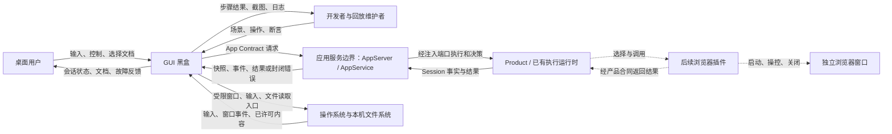
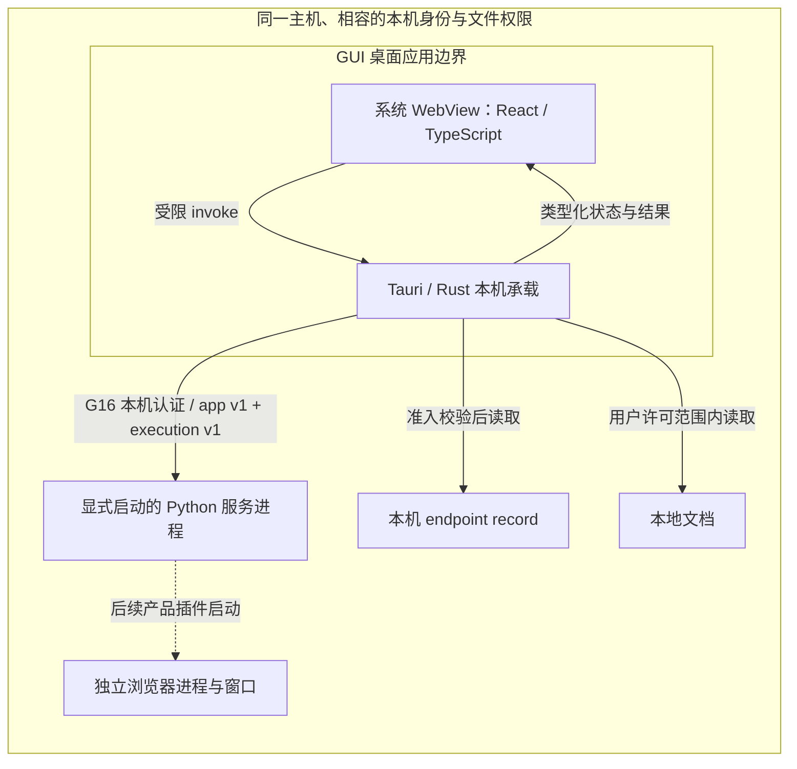

# GUI 系统上下文与边界合同

## Status

- ID: `GUI-BOUNDARY-V1`
- Scope: Loushang proposed graphical client
- Parent: Loushang
- Authority: normative — proposed boundary contract; not an accepted placement decision
- Design status: proposed
- Implementation status: not-started
- Owner: Loushang architecture / future GUI scope owner
- Source baseline: `7c41cd57dd96f9da2964ef6146fc474ff96f674e`, inspected 2026-09-08
- Execution contract update: `d89c4c9f` on `main` (PR #580), inspected 2026-09-09
- Design stage: black-box framing; component discovery follows separately

本文承接 [GUI 需求](gui-requirements.md)，完成逻辑上下文、物理上下文、职责与
外部行为合同。技术与阶段约束继承 [工程启动方案](gui-engineering-bootstrap-plan.md)。
按 [架构方法](../../architecture-method/README.md) 的逻辑先于物理、黑盒先于
[组件发现](../../architecture-method/component-identification.md) 的顺序组织。
继承 [系统原则](../loushang-architecture-principles.md) 的执行权威、恢复与边界约束。
采用上述提交中已纳入版本的设计方法；工作区另行进行的方法修订不作为本文的
接受依据。本文中的“必须/禁止”约束拟议 GUI，不宣称 GUI 已实现或需求已接受。

## 1. 定位、范围与术语

建议将 GUI 作为 Loushang 下独立治理的 **Product-neutral 图形客户端 scope**：
拥有桌面交互、只读文档呈现、客户端连接与开发测试回放；Coding 为首个产品
使用场景。GUI 不属于 Coding 的执行内核，也不嵌入 AppService。正式顶层归属
仍需父级 placement decision 接受后登记；`gui/` 是工程建议，不能替代该决策。

首期覆盖 GUI-B0/B1/C1/B2/B3；浏览器插件执行、富产物协议扩展、公开发行和
远程服务连接是后续交付。本文不提前冻结内部组件、React 状态库、Rust 模块、
桌面布局或自动化 driver。工程启动方案中的目录和责任簇仍是设计输入。

| 术语 | 本合同的含义及权威来源 |
| --- | --- |
| GUI 工作空间 | 当前显式连接的 application 中的一个 `MuxSpace` 的界面名称；不是 Git worktree，也不是新的持久化实体 |
| 项目上下文 | 长期工作的目录/产品配置背景；不等同于 mux、Git worktree 或 Session。首期由显式配置和公开信息显示，不建立 GUI 权威项目数据库 |
| 会话页 | 一个 mux member 所引用的 Product Session 的展示；member identity 与 Session identity 均须保留 |
| turn / 执行轮次 | 一次输入触发的一轮 Agent 工作，可包含多次模型调用、工具调用和审批；不是单个消息或单次模型请求 |
| execution | 一次用户提交的完整执行，可包含无模型输出的命令；AppService 登记身份，Product 提供执行结果与清理完成事实，不与单个模型 turn 等同 |
| start_turn | 既有等待完成操作；与新 `submit_execution` 分开，具体以 BC-004 为准 |
| AppClient / ExecutionClient | [既有语义端口](../../../../src/loushang/appserver/client.py) 与 [可选执行端口](../../../../src/loushang/appserver/execution/client.py)；Rust 实现其跨语言等价合同，不直接导入 Python 对象 |
| attachment / controller generation | AppService 发放的控制上下文；不可由选中页签、客户端自增编号或持有旧 token 替代 |
| 展示投影 | 从服务快照与事件构建的可丢弃客户端视图，不是 Session 事实库 |
| UI 回放 | 测试操控 GUI、注入受控服务事件并逐步断言；不等于重执行真实 Agent、工具或浏览器任务 |
| 文档引用 | 指向可阅读内容的来源描述；引用本身不授予文件读取或工具执行权限 |

## 2. Current：现有事实与证据

| 已核对的事实 | 权威证据 | 对 GUI 的约束 |
| --- | --- | --- |
| 基线没有已跟踪的 `gui/`、Cargo 或 Node 工程清单 | 基线 Git 文件清单；[工程计划](gui-engineering-bootstrap-plan.md) | 本文所有 GUI 节点和行为均为拟议 |
| AppClient 有 15 个语义方法 | [client.py](../../../../src/loushang/appserver/client.py) | 复用操作语义，不凭界面需求增加隐式 RPC |
| mux/member、快照、事件、交互响应是封闭值类型 | [model.py](../../../../src/loushang/appserver/protocol/model.py)、[codec.py](../../../../src/loushang/appserver/protocol/codec.py)、[errors.py](../../../../src/loushang/appserver/protocol/errors.py) | GUI 不能透传任意 Python 对象或猜测未知字段 |
| 已提交 Schema 的 payload 尚不是完整跨语言合同 | [JSON Schema](../appserver/app-protocol-v1.schema.json) | C1 必须补齐 codec 一致性证据，不能仅靠类型生成验收 |
| G16 已有本机认证、可分离连接、单 mux 控制权及重连屏障 | [G16](../appserver/detachable-local-workspace-g16.md)、[local.py](../../../../src/loushang/appserver/local.py)、[local_auth.py](../../../../src/loushang/appserver/local_auth.py) | Rust 接入须自己证明兼容，Python 实现通过不等于 GUI 通过 |
| AppService 管理 mux、成员、attachment 和接收后的操作 | [AppService](../appservice/README.md) | 连接断开与执行停止不是同一生命周期 |
| 已有客户端投影处理游标、草稿和重新 attach | [reducer.py](../../../../src/loushang/harnesstui/mux/reducer.py)、[controller.py](../../../../src/loushang/harnesstui/mux/controller.py) | 可复用合同与场景意图，GUI 不依赖 Python TUI 实现 |
| Coding 适配将三种交互结果映射为 allow_once / deny / abort | [appservice_adapter.py](../../../../src/loushang/coding/appservice_adapter.py) | 任意选择题、自由文本回答不属于当前交互协议 |

以上是源码与合同核对，不是本次运行产品测试的结果。已有测试只作为定位后续
兼容证据的入口；本文不会把旧测试结果标为 GUI 验收结果。

2026-09-09 就绪复核以 `main@d89c4c9f` 为准：G17 已提供可选
`SessionDiscoveryClientV1` 和有界 cwd/home 候选发现；PR #580 已交付真实
Coding/Harness execution 端口、AppService 登记/去重与独立清理归属，以及
`loushang.execution/v1` 提交/查询/中断/快照/事件和恢复参考。上述扩展均需
显式装配，既有 AppClient 的方法与默认服务行为保持不变。
BC-002 与 GUI-CON-002 现已选择 execution profile，需要发现时选择组合 profile。
无全局历史列表、无消息/工具条目 ID、无跨服务重启执行登记恢复的限制仍保留。
核对证据、服务端 CI 与原生主开发环境安排见
[工程计划 §2.1 与 §4.2](gui-engineering-bootstrap-plan.md)；
[交付记录](../appservice/execution-service-delivery.md) 提供客户端和装配入口。
GUI 跨语言与原生验收尚未完成，本文更新不代表正式 scope placement 已接受。

## 3. 逻辑系统上下文

下图全部为 **Proposed GUI context**。GUI 保持一个黑盒；服务侧与桌面侧也是
相邻边界，未展开其内部组件。实线表示首期交互，虚线表示后续交互。

模型 provider、工具、Harness、浏览器控制器不是 GUI 的直接对接者。它们的执行
权限沿既有产品边界管理。GUI 与它们没有因为“能显示结果”而新增的直接控制线。
后续产品界面贡献可以改变表现形式，但不能借助 GUI 获得旁路执行权限。

变化来源包括 Product 的公开展示能力、App Contract 版本、连接 profile、三平台
桌面行为、文档类型与回放驱动。这些是后续组件发现的输入，当前不按一项变化
一个组件划分，也不把 React/Tauri/Playwright 名称当作逻辑组件。

## 4. 物理上下文与部署约束

以下是拟议的同机真实接入；框表示部署边界，**不表示 GUI 内部组件分解**。
WebView 由操作系统承载，实际进程数取决于平台，不承诺“整个 GUI 只有一个进程”。

三种开发形态分别取证：

| 形态 | 边界与用途 | 不能代替的证据 |
| --- | --- | --- |
| Web + Mock | React 页面连接离线替身；不需要 Python 后端 | Rust IPC、Tauri WebView 与系统输入 |
| 原生 GUI + Mock | 真实桌面与 Rust 边界后接 fixture；至少一个 canary 不 Mock IPC | G16 认证、服务生命周期与真实 Product |
| 原生 GUI + 同机 execution profile | 显式配置本机记录，按 BC-002 连接各机启用 execution 的开发后端 | 其他 OS 的原生行为与公开发行安装 |

Linux、macOS、Windows 各自有独立 checkout、构建产物、凭据和服务数据，按同一
源码、场景、锁文件协作。Windows 的正式 GUI 开发入口不依赖 WSL/Bash/Make。
纯 SSH Linux 可以编辑、构建及做无图形检查；原生 GUI 回放需要该机可用的图形
会话。远程 Vite 页面或 headless 浏览器通过不等于桌面通过。

GUI-B2 使用 BC-002 的 execution profile，继承 G16 的同机认证与可分离连接，
不自动回退旧 profile，不通过隐含 HTTP bridge 调用 Python，不把 SSH 转发当作
远程 AppClient 合同。开发者显式装配并启动服务；GUI
不自动安装、拉起或升级 Python，不复制远端认证记录到本机。浏览器窗口出现
在插件的执行主机；远端窗口通过远程图形会话观察，不自动投射到本地 GUI。

## 5. 职责、权威与寿命

| 对象或行为 | 唯一事实/寿命 owner | GUI 的权限与义务 |
| --- | --- | --- |
| 输入草稿、焦点、滚动、选中页、窗口偏好 | GUI | 管理本地状态；草稿在应用存活期间按完整会话上下文隔离 |
| Session transcript、运行状态、工具效果 | Product / 既有 Session runtime | 只消费公开投影，不扫描 Session 存储或补造执行结果 |
| mux/member、控制 generation、交互有效性 | AppService | 使用当前授予的上下文；所有可变操作最终由服务鉴权 |
| execution 登记、提交去重与执行容量 | AppService；执行结果与清理事实由 Product 提供 | 保存服务实例/会话/提交与执行身份；消费权威状态，等待者结束不释放服务执行容量 |
| 服务进程、持久化根准入、整体关闭顺序 | 既有 AppHost / 部署 owner | 仅关闭自己持有的连接；不杀记录中的 PID，不触发应用 stop |
| GUI 连接、请求关联、原生窗口与监听 | GUI | 有界创建与释放；交付等待结束不表示服务操作撤销 |
| 本地文档与文件内容 | 用户 / 文件系统 | 获许后只读；不因渲染修改项目文件 |
| 产品结果引用与读取授权 | 产品及其后续公开合同 | 校验类型和权限后展示；不能把路径字符串直接当文件授权 |
| 浏览器会话与执行效果 | 后续产品选择的浏览器 provider | 可展示经产品返回的结果；pane 关闭和 UI 回放不控制浏览器寿命 |
| 测试场景、时钟注入与证据目录 | GUI 测试支持 / 测试运行者 | 默认离线；测试产物写到指定位置，真实内容录制必须显式启用 |

允许的契约依赖是 `GUI → App Contract/G16`、`GUI → 受限桌面/文档入口`；
后端不导入 GUI/Tauri/React/回放 runner。GUI 不直接依赖 Python Session、Coding
内部对象或 Harness 执行对象。共享只能是公开 schema、fixture 与无执行权的
值合同。内部 Rust↔TypeScript 接口在组件设计后另定，不能提供任意 RPC、shell
或文件系统转发入口。

## 6. 黑盒边界合同

### GUI-BC-001：桌面交互与本地状态

GUI 提供导航、输入、核心操作和文档阅读；显式区分 Mock 与真实连接。输入法
组合期不发送；发送时捕获文本、草稿修订与目标上下文，异步完成后不能清除
用户后来编辑的草稿。已提交的文本在结果确定前保留为可辨认的待处理记录，
不得既丢输入又假称成功。乐观显示不得与服务确认的 transcript 重复计数。
execution 记录关联提交与完整执行，内容事件可携带 execution ID；transcript
仍没有通用消息/工具条目 ID。不得仅凭文本相同合并两次提交，也不得把一次执行
的多条消息合为一条。首期可把待处理发送与权威 transcript 分区显示，具体关联
策略须在 C1 和 UI 状态设计中验证，不承诺协议未提供的 exactly-once 语义。

本地草稿关联 application、mux、member 和完整 Session identity；显示名不作
身份。只有新屏障确认仍是同一对象时才能沿用草稿。对象已消失时保留为不可
发送的本地未提交文本并解释原因，不自动绑定到新对象。刷新不恢复旧执行权。
非活动页的新输出不夺走焦点或阅读位置；本地会话页切换本身不发出 detach、
interrupt、close 或重开 Session。

状态总览仅覆盖当前 attachment 可观察的会话：服务运行/终止状态与有效交互
来自当前投影，未读和选中状态属于 GUI。`running=false` 只说明当前未运行，
不能推出上次任务成功；没有终态证据时显示空闲或未知。断线后各状态标陈旧，
不能对未 attach 的 mux 伪造实时订阅。后续系统通知依此投影生成，去重后送达，
点击仅导航并重新核验当前事实；不得自动答复审批或重试任务。

### GUI-BC-002：显式连接、认证与准入

连接输入是开发者显式配置的本机 application/record selector，输出是当前
连接状态或脱敏故障。record 准入、实例绑定、互认证、framing 和 profile
协商遵循 G16；“文件可读”不等于记录可信。认证密钥与方向密钥留在本机连接
边界，不进入 React、文档、日志、Git 或回放 fixture。

连接至少区分未连接、连接中、同步中、可交互、需要重新同步和已断开；这些是
GUI 状态名称，不新增 wire enum。B2 的接入基线为
`local-detachable-execution/v1`；需要 G17 会话发现时显式配置
`local-detachable-discovery-execution/v1`。完整 profile 表见
[工程计划 §6](gui-engineering-bootstrap-plan.md)，与 GUI-CON-002 保持一致。
版本或 profile 不支持时明确拒绝；可选产品能力缺失时禁用对应入口并说明原因，
不虚构通用能力发现 API，也不静默回退完成式 start。

认证绑定 record 的封闭 capabilities；hello 需核对所选 profile，以及
`executionVersion: loushang.execution/v1`、`serviceInstanceId`、
`submissionRetention: service_instance_lifetime` 和 `restartRecovery: false`。
record 的认证 `instance` 与登记寿命 `serviceInstanceId` 不等同：监听连接重建
不能被推断为登记丢失，服务实例改变也不能复用旧执行恢复保证。既有操作继续
使用 `loushang.app/v1`，六个 execution 操作按独立 codec 传递，不修改旧帧语义。

### GUI-BC-003：工作空间、成员与控制权

| 用户意图 | 现有操作及合同 | GUI 处理 |
| --- | --- | --- |
| 查看/新建工作空间 | `list_muxes`、`read_mux`、`create_mux` | 只展示当前 application 可见集合；新建 mux 不等于自动创建 Session |
| 进入工作空间 | `attach_mux` | 安装完整 mux/member/snapshot 屏障后允许交互；`already_attached` 不静默接管 |
| 创建或打开会话 | `open_member(SessionOpenSpecV1)` | 只使用显式产品配置或公开合同提供的 product/continuity/scope/fingerprint；不从目录名称猜值 |
| 查询当前会话 | `snapshot_session`；execution 模式补充 `snapshot_execution_session` | 需要当前 attachment/generation/member；复合内容/执行快照也不能替代整个 membership 屏障 |
| 离开工作空间 | `detach_mux` | 释放控制并解释审批失效；不停止已接收 turn |
| 关闭成员或工作空间 | `close_member` / `close_mux` | 若界面提供，作为明确的服务操作；`close_session` 含义与仅关页面分开表达 |

首期建议一次控制一个活动 mux，保留其多个会话页。跨 mux 切换先明确释放旧
控制，再申请新控制；目标冲突时停留在可解释的未附着状态，旧任务仍可能运行。
该简化是拟议产品取舍，不改变服务可支持多个 mux 的事实。

协议可用显式 `session_id` 打开已有会话，但没有全局历史 Session 列表端口。
项目上下文、mux 分组和 Session 身份分别显示与传递，不从一个目录推断一个 mux，
也不从 mux 名推断 Git 工作树。一个项目如何关联多个 mux/会话由产品配置合同
明确，首期只显示已知上下文；全局项目管理不作为隐藏的 GUI 职责。
首期不能通过扫描磁盘实现“历史发现”。结构操作完成后重新取得完整 attachment
屏障再开放依赖成员关系的操作；同 scope 刷新以 G16 的原子替换合同执行。

### GUI-BC-004：发送、继续输入和中断

B2 通过可选 ExecutionClient 的 `submit_execution` 提交完整执行；既有
`start_turn`、`steer_turn`、`follow_up_turn` 和 `interrupt_turn` 保持独立语义。
GUI 不把运行中发送任意改成排队，也不在本地创建服务未确认的执行队列。
steer/follow-up 不因此获得独立 submission 去重保证。

| 身份 | 生成与用途 | GUI 约束 |
| --- | --- | --- |
| `request_id`（wire `requestId`） | 客户端关联一次通信请求/响应 | 同一连接的新旧调用共享请求编号序列；不能用作执行身份 |
| `submission_id`（wire `submissionId`） | 客户端为一次用户提交生成 | 保存精确文本；同服务实例与 canonical Session 内重试复用，修改内容须作为新提交 |
| `execution_id`（wire `executionId`） | 服务登记一次完整执行时生成 | 用于查询、内容归属与定向中断；同服务实例重连不改变，ID 本身不授予权限 |

提交携带当前 `control`（attachment/generation/member）与 `expectedInstanceId`。
服务先校验权限、预留容量、登记与去重，再返回执行记录，不等待执行终态。
同提交与相同文本返回同一 execution 的当前记录；同提交改变文本返回
`submission_conflict`。响应或重复提交取得的记录可为 accepted、running 或终态，
GUI 按 revision 合并，不强制把每个提交响应解释为 accepted。

状态通常为 accepted → running → succeeded/failed/interrupted；启动前取消
或失败可从 accepted 直接进入终态。Product 明确通知进入 running，无模型输出
的命令也成立；GUI 不依据第一段文本或旧 `turn_started` 猜测执行开始。AppService
在 Product 结果与清理完成后发布终态、释放执行槽位；本地等待结束、传输取消
或连接丢失均不构成终态证据。

定向中断使用 `interrupt_execution(execution_id)`，按完整执行处理；旧
`interrupt_turn` 保留 turn-only 语义。`requested` 表示已请求，只有后续权威终态
或 `already_terminal` 返回的终态记录证明执行结束；中断与正常完成竞争时按
实际 outcome 展示，不能强制标为 interrupted。`get_execution` 查询已知执行，
`find_execution_by_submission` 用于恢复丢失的提交响应。

恢复先查询，查无记录也可能与原提交接收竞争，不自动重发。用户明确重试时，
仅在同服务实例、同会话与新授权下重用原 submission 和精确文本；实例变化
保留未知结果，不自动复制到新实例。提交键保存至服务实例结束，登记有条数和
字节预算，满时拒绝新提交；不承诺跨重启去重或从 Session 历史重建执行登记。
参考 [恢复实现](../../../../src/loushang/appserver/execution/recovery.py)。

旧 `start_turn` 仍等待调用完成后返回 `AckV1`，异常走旧错误路径；Ack 不单独
证明业务成功。它的响应丢失继续按未知结果处理，不自动重发，不包装为提前
接收确认，也不作为 execution 恢复回退。已有等待期间仍须读取事件与处理控制。

普通请求占满时，中断及必要控制仍有独立容量。长 turn 等待不得占有阻止事件
读取、审批或中断的总锁；客户端 pending、event backlog 与 writer 均须有界。
具体内部结构与预算留到组件/C1 设计，但不能延后“控制可达”的验收义务。

### GUI-BC-005：审批与待处理交互

仅展示当前有效 generation 中服务发布的交互，答复携带准确的 member 与
interaction identity，通过 `respond_interaction` 提交。现有 `InteractionRespondV1`
只接受 approve/deny/cancel；
GUI 不将它扩写成永久授权，不把它用于任意表单提交。服务仍是最终校验者，
禁用按钮只能防误操作，不能代替权威校验。

答复后等待服务结果或 dismissed 事件；答复失败显示封闭错误，不伪装为已授权。
控制丢失、generation 替换或服务撤销后，旧交互立即不可答复。刷新 attachment
会撤销旧未答交互，不能仅称为“无副作用刷新”。已在断线前获接收的答复可能
完成，不宣称断线撤销已有授权效果。重新连接不恢复旧审批卡的可操作性。

### GUI-BC-006：快照、增量与恢复

每次连接/同步尝试有 GUI 本地 epoch；它仅用于隔离异步结果，不作为服务权限。
首次 attach 原子安装 mux revision、member identity、各 Session snapshot/cursor。
execution member 在开放执行操作前补齐 `snapshot_execution_session` 的内容与
执行复合屏障，核对服务实例与 Session identity。它包含 source cursor、draft、
执行 revision、active/latest terminal 等有界投影，不是完整执行历史列表。
对应内容和执行更新通过 `read_execution_events` 有界读取；既有 attachment
事件仍按其合同处理。“事件流”描述连续消费效果，不新增服务推送协议。
读取循环与长操作等待并行，轮询也不能形成无等待的空转。
后续事件按当前 attachment、member、Session identity 和游标应用；旧 epoch
结果丢弃，当前流的身份矛盾则进入重新同步，不能默默丢弃后继续称为实时。

游标小于等于已安装值的重复事件不重复应用；跳号、`snapshot_required`、
`attachment_lagged` 或成员变更冻结受影响状态与依赖它的操作。不同 member
分别追踪 cursor，不能把它当全局顺序。内容 cursor、Session execution revision
与单 execution revision 分别比较，不混成一个序列；迟到的 accepted 响应不能
覆盖更新的 running/终态。复合快照/事件读取会消费该 member 已覆盖的旧内容
副本，客户端不能把新旧内容流重复追加。assistant delta 是临时输出，最终消息
提交后清除临时段；新快照替换事实投影并显示显式裁剪，不把旧 delta 再追加一次。

展示应按服务可辨认的类型组织消息、状态与交互，后续再接工具和文件变更条目。
GUI 可以创建本地渲染 key，但不得把它作为服务持久身份或跨重连恢复依据。
已交付的 execution ID 关联完整执行，内容 envelope 的 ID 可以为空，不能补造
归属。消息/工具条目 ID、条目引用和工具结果结构仍归 Product/AppService/AppServer
共同扩展，GUI 消费；首期只渲染现有投影，不把通用富条目塞入文本自行解析。

首期恢复采用完整 attach 屏障替换：连接有效时显式刷新当前 scope，连接丢失时
重新认证并 attach。恢复期间允许编辑本地草稿、阅读已标陈旧的内容与断开；
禁止用旧权限发送/审批/关闭或向未知目标中断。普通流式负载下的控制可达不因
此放宽。只有屏障安装完成才恢复服务操作；不得根据缓存猜补丢失事件。

### GUI-BC-007：只读文档与系统能力

接受两类来源：用户明确选择的本地文件，以及后续产品合同准入的结果引用。
首期本地入口读取 Markdown、UTF-8 文本/代码、文本 Diff、PNG/JPEG；输出类型、
来源、内容或明确读取错误。文档刷新需要明确读取动作；读取前后变化不能与旧
内容混装，不承诺跨文件的事务快照。

本地读取只覆盖选定文件及明确获许的关联范围；路径穿越、符号链接逃逸、任意
`file:` 地址和文档中的路径文本不能扩大授权。Markdown HTML/脚本作为不可信
内容处理；禁止执行脚本或取得 Tauri invoke 权限。相对图片也须满足读取范围，
缺授权时显示占位。渲染不自动访问远程图片、字体或其他资源。

站外链接只能通过明确用户动作与受限协议策略交给系统浏览器，不把文档 WebView
导航成任意站点；`javascript:` 等执行地址拒绝。这种用户导航不属于浏览器插件
的自动化执行。文档读取有字节上限，图片另有解码尺寸/像素预算，超限明确拒绝
或提供受控预览；不能先无限读取/解码后再截断。具体数字归 GUI-OQ-003。

文档/审阅视图与会话视图保有各自的导航和阅读状态，打开文档仍能到达会话控制。
读取结果绑定来源与该次内容版本（例如本地读取摘要），不承诺文件随后不变。
后续行级反馈引用来源、内容版本与位置；内容变化后须重新定位或提示引用失效，
不能把旧行号静默套到新文件。Git 变更视图须说明是工作树、暂存区、指定提交
还是某轮任务的变更，不把仓库全部改动归因于当前 Agent。暂存、回滚和提交等
可变操作由后续 Coding 产品合同承接，不属于只读文档入口。

### GUI-BC-008：浏览器执行与后续产品贡献

浏览器启动、操控、重跑、关闭和权限归产品选择的插件/provider。GUI 可以显示
经公开合同返回的截图、文档或结果状态；不直接调用 Playwright/CDP、不掌握
浏览器执行凭据，也不把 GUI WebView 作为网站执行容器。

首期只保留该边界，不新增插件加载 ABI、浏览器 RPC 或任意 HTML 面板协议。
后续 Coding UI 插件若需要发起操作，仍经产品公开命令与既有审批路径；关闭
结果面板不关闭浏览器，回放页面不重跑网站操作。新贡献须单独定义内容、权限、
生命周期与兼容合同，不能靠通用 payload 绕开现有 codec。

### GUI-BC-009：回放与证据

测试运行者提供版本化场景、离线 fixture、构建与环境标识。场景包含输入、服务
事件注入、条件等待和逐步断言；运行输出通过/失败、失败步骤、状态摘要、截图
与脱敏日志。空场景、缺 driver/图形环境、跳过必需步骤均不能计为通过。

Mock 和真实接入遵循相同的 GUI 可观察语义，Mock 可以模拟超时、乱序、断线、
控制冲突，但不能提供真实协议缺失的能力并声称接入完成。默认 fixture 可入库，
真实会话录制须显式启用并指定范围；回放输出写到测试目录，不修改项目文档。
诊断默认只记录操作类别、关联标识和脱敏故障，不自动保存真实输入、文档正文
或会话截图；这些内容进入证据包时同样适用显式录制范围。

Web 回放、原生 Rust IPC canary、三平台 G16 canary 与真实输入法/剪贴板证据
分别记录。UI 测试可注入时钟；性能样本用真实单调时钟，DOM 更新/driver 耗时
不冒充真实呈现。测试控制入口只装配到专用测试构建，正常应用产物不得暴露。
首期暂按本地产物查看；应用内播放/暂停/逐步时间线继续保留 GUI-OQ-001。

### GUI-BC-010：退出、资源与兼容

关 GUI 窗口时停止本地读循环、释放监听/连接与待处理交付等待，报告必要的
清理失败；不发 `close_mux`、`close_member` 或管理 stop。服务已接收的执行可以
继续，失去控制的未答交互按 G16 收敛。退出/崩溃后的草稿持久化不作首期承诺。

所有缓存、请求和输入内容受明确预算约束；超限分别报告拒绝、受控裁剪或需要
重新同步，不能静默丢掉权威事件继续运行。服务 wire 上限不能由 GUI 扩大。
Rust↔TypeScript 的 cursor/revision/generation 使用经 C1 冻结的无损表示，
不能先经 JavaScript `number` 舍入；既有 Python wire 数值语义保持不变。
字段、枚举、边界值及错误以 reference codec 校验，未知版本明确失败。

## 7. 关键外部交互与失败处理

以下描述黑盒时序，不决定 GUI 内部类或组件。

| 场景 | 正常时序 | 失败或竞争时必须成立 |
| --- | --- | --- |
| 连接并发送 | 用户连接 → profile/版本与认证准入 → list/attach → 安装复合屏障 → 保存提交身份并 submit → 执行记录 → 状态/内容与终态 | 屏障未完成不可发送；响应丢失按 submission 查询；查无记录不自动重试；迟到 accepted 不覆盖新状态 |
| 长任务中断 | 服务运行事件 → GUI 显示运行 → 用户中断 → 独立控制请求 → 服务确认状态变化 | 普通请求满时仍可请求中断；中断请求失败不标记已停止 |
| 会话页切换 | 保存 A 草稿/阅读位置 → 选择 B → 输入绑定 B；A 事件继续投影到 A | A 的迟到请求完成不能清除 B 草稿；切换页不释放整个 mux 控制 |
| 重连或事件缺口 | 隔离旧异步结果 → 标陈旧并冻结操作 → 重认证或显式 attach 刷新 → 原子安装新屏障 → 恢复操作 | 不混装成员与快照；旧审批撤销；未决 mutation 不重放 |
| 审批与断线竞争 | 当前交互 → 用户答复 → 服务校验/接收 → 完成或撤销反馈 | 断线不回滚已接收答复；新连接不能用旧 token 授权 |
| 文档阅读 | 用户选定来源 → 校验授权/预算 → 有界读取/解码 → 受控显示 | 无授权、缺失、不支持、超限各有状态；渲染错误不阻断会话控制 |
| 自动回放 | 选场景与构建 → 启动专用测试应用 → 操作/注入/等待/断言 → 输出证据 | 同步等待有界；失败定位到步骤；无场景或错误平台不报成功 |
| 退出重开 | 用户关窗口 → 释放 GUI 自有资源 → 服务依合同继续 → 重开取新事实 | 无服务 stop；不从截图/缓存恢复执行或审批权限 |

用户故障提示保留类别而不泄露内部异常：

| 服务或客户端类别 | GUI 结果与下一步 |
| --- | --- |
| 认证、profile、版本不匹配 | 连接失败；允许用户修正本机配置后重连，不降级 |
| `already_attached` | 控制冲突；可查看可得元数据，但不假装拥有只读事件订阅或接管权 |
| `already_exists` | 名称或对象已存在；展示冲突并允许用户重新选择，不自动覆盖或重建 |
| `snapshot_required` / `attachment_lagged` / `revision_conflict` | 标记需同步，走新屏障；失效请求不自动重发 |
| `stale_attachment` | 立即禁用旧控制上下文，重新 attach 或重连 |
| `not_found` / `product_mismatch` / `session_unavailable` | 对象或配置不可用；保留本地文本，刷新公开信息或修正配置 |
| `invalid_request` / `operation_unavailable` | 本次操作拒绝；记录操作类别与相关 ID，不能杜撰服务未提供的原因 |
| `cleanup_incomplete` / `service_closed` | 明确清理未完成或服务关闭；不报告干净成功、不以重试绕过控制限制 |
| 本地等待超时/传输丢失 | 操作结果可能未知；与服务明确拒绝区分，重新取得事实 |
| `service_instance_changed` | 保留原提交与未知结果；禁止跨实例自动重放，重新连接不代表原执行失败 |
| `submission_conflict` | 同提交文本不一致，明确拒绝；不偷偷生成新 ID 绕过冲突 |
| `submission_ledger_full` / `execution_busy` | 新执行登记或活动容量不足；保持原输入，不自动重试或更改服务预算 |
| `execution_not_retained` / `execution_unsupported` | 登记不可查询或 Product 不支持执行端口；不推断业务结果，不回退旧 start |

## 8. 需求追溯与拟议验收场景

下列 `GUI-BV-*` 是稳定的**验收设计 ID**，不是已存在的脚本或已通过的测试。
组件发现后补主责组件；实现后补代码与真实报告，不先填虚构映射。

| 验收 ID | 覆盖需求 | 边界合同 | 所需证据与阶段 |
| --- | --- | --- | --- |
| GUI-BV-001 | FR-001；CON-001 | BC-001/002/009 | B0/B1：无后端启动 Mock，明确样例标识；Web 与原生分别取证 |
| GUI-BV-002 | FR-002、FR-003、FR-010；NFR-002、NFR-004 | BC-001/003 | B1/B2：双会话草稿隔离、空列表、控制冲突、失效成员；B3：真实 IME、粘贴、键盘焦点、缩放与阅读位置 |
| GUI-BV-003 | FR-004、FR-005；NFR-003、NFR-005 | BC-004/006 | B1/B2：流式去重、最终消息替换、execution 运行时 steer/follow-up/定向 interrupt 可达；旧 start 等待完成与 turn-only 中断兼容另验 |
| GUI-BV-004 | FR-006；NFR-004 | BC-005 | B1/B2：approve/deny/cancel、重复答复、断线竞争、刷新后旧交互失效；通用问答缺口单列 |
| GUI-BV-005 | FR-009；NFR-004、NFR-006 | BC-002/003/006 | B1/B2：重复/迟到/跳号、成员变化、mailbox 溢出、新 epoch 安装；不混合屏障或复活旧权限 |
| GUI-BV-006 | FR-007、FR-008；NFR-005、NFR-007 | BC-007/008 | B1/B3：各声明格式、超限/缺失/不支持、路径越界、脚本/远程资源禁止、文档失败隔离；富产物真实接入另验 |
| GUI-BV-007 | FR-011；NFR-006；CON-003 | BC-005/010 | B2/B3：关 GUI 后服务已接收任务继续，审批收敛；反复开关无 GUI 连接/监听泄漏 |
| GUI-BV-008 | FR-012、FR-013；NFR-008、NFR-009 | BC-009 | B1：同构建同 fixture 重复逐步断言；故障步骤/截图/日志可定位；零场景、跳过、测试入口泄露均失败 |
| GUI-BV-009 | NFR-001、NFR-010；CON-002、CON-005 | §4、BC-002/010 | B0/B1 三平台独立开发/构建/最小原生回放；B2 各机显式 execution profile；源码/锁同步，凭据/产物隔离；开发构建不冒充发行验收 |
| GUI-BV-010 | NFR-011 | BC-002/010 | C1/B2：Python↔Rust↔TS 合法/非法向量、重复/未知字段、Unicode、超大整数、framing/认证与版本拒绝 |
| GUI-BV-011 | NFR-003、NFR-006 | BC-004/007/010 | B1/B3：按需求 §4.1 负载和每基线至少 200 次输入样本；分别给出真实呈现与代理值，记录预算/超限/资源收敛 |
| GUI-BV-012 | NFR-012；CON-004 | §5、BC-008/009 | 后续设计与 B1/B2：依赖审查、Mock/真实合同共用场景、正常产物无测试入口、回放不重跑工具/浏览器 |
| GUI-BV-013 | FR-014；NFR-004、NFR-009 | BC-001/005/006 | B1/B2：非活动会话的运行、有效交互、未读更新可定位；断线标陈旧，空闲不误报成功，旧交互不重新激活 |
| GUI-BV-014 | FR-004、FR-005、FR-009、FR-014；NFR-004、NFR-005、NFR-011；CON-002 | BC-002/004/006 | C1/B1/B2：profile/版本拒绝、无输出 running、相同提交去重与文本冲突、响应丢失查询及显式重试、事件先于响应、实例变化不重放；等待取消仍可查询，清理后终态及中断竞争；JSON 样例和 Python 测试须取得独立 Rust/TS/原生证据 |

GUI-BV-002 同时验证已知项目上下文、mux 与 Session 归属分别可辨认；GUI-BV-006
同时验证文档阅读时控制可达、来源/读取版本可辨认。后续候选的设计落点为：
GUI-FUT-001 → BC-004/006、GUI-BG-009；GUI-FUT-002 → BC-007、GUI-BG-003；
GUI-FUT-003 → BC-001、GUI-BG-010。其运行证据尚未建设，不计入首期通过条件。

表中 FR/NFR/CON/BC 的完整前缀均为 `GUI-`。需求中的 100 ms 是待校准目标；
预算未冻结或只取得代理计时，不能算完整性能通过。浏览器插件未实现不阻断
首期边界完成，但也不能以静态审查声称后续插件接入已验收。

## 9. Delta、决策与交接

本表组合 Current 与 Proposed 以显示缺口，不把拟议方案伪装成 accepted Target。

| ID | 当前缺口/待定 | 当前处理 | 责任与退出条件 |
| --- | --- | --- | --- |
| GUI-BG-001 | GUI scope 尚未正式接受；需求仍 proposed | 本稿给出独立客户端 placement 建议 | 父级架构 owner：接受需求/边界与 placement decision 后登记 scope，进入候选功能/组件发现 |
| GUI-BG-002 | 完整跨语言 payload、认证与本机记录兼容证据缺失 | Mock 消费已交付 execution 样例，真实接入按 BC-002 选择 profile 并继承 G16 边界 | AppServer owner 主责、GUI owner 消费：C1 提供合法/非法 fixture、整数范围/bridge 表示、execution 恢复与三平台准入证据，再进入 B2 |
| GUI-BG-003 | 全局历史发现、富产物公开投影缺失 | 仅服务可见集合、本地文档与固定样例 | Product/AppService owner：对应 API 的身份/权限/类型/大小合同接受并经真实接入；继承 GUI-OQ-004 |
| GUI-BG-004 | GUI 创建 Session 的公开配置来源未冻结 | 允许开发者显式配置既有 SessionOpenSpec 所需值；不猜测 fingerprint，不读私有 Session 存储 | Coding 产品适配 owner 与 GUI owner：C1 明确配置来源、有效性/错误场景；B2 前具备真实 create/open 路径 |
| GUI-BG-005 | 现有交互只有三种决策，需求提及“审批或选择” | B1/B2 按现有审批验收，不声称一般问答完成 | 需求/Product/AppServer owners：需求接受时明确 FR-006 是否仅指现有决策；若需任意问答则补合同和真实证据，不能静默删减需求 |
| GUI-BG-006 | 应用内播放器、平台基线、性能/容量预算未冻结 | 沿用 GUI-OQ-001、GUI-OQ-002、GUI-OQ-003，不重复建立不同答案 | GUI owner：分别在需求确认、B0 退出、B1 性能/容量验收前解决；文档上限含读取字节与图片解码预算 |
| GUI-BG-007 | 一次活动 mux、UI bridge 操作集合与边界内部实现未定版 | BC-003 给出单活动 mux 建议；不先造通用 RPC | GUI owner：交互取舍确认后进行功能发现→组件发现→映射→收敛，明确接口/并发/资源预算与 UI 状态转换 |
| GUI-BG-008 | 三平台原生回放与 GUI 专属门禁尚未建设 | 只定义证据层次，不指定未经本仓验证的 driver 组合 | GUI/CI owners：B0/B1 锁定可运行组合，增补 GUI 变更选路；文档改动只做文档检查，原生证据按平台分别取得 |
| GUI-BG-009 | execution 身份、查询与启动/完成分离已交付；消息/工具条目身份与富条目投影仍缺失 | 首期采用 BC-004/006 的 execution 合同；GUI-FUT-001 的富条目展示继续作为后续候选 | GUI owner 完成 C1/B2 执行接入；Product/AppService/AppServer owners 后续定义消息/工具条目及引用，不能将 execution ID 当作每条消息的身份 |
| GUI-BG-010 | 系统通知、行级反馈与长期项目管理尚无完整合同 | 首期状态总览与只读内容先行，后续候选不扩大首期范围 | GUI owner 主责通知的三平台权限/隐私；Coding owner 主责反馈执行与项目配置；各能力进入设计时固定合同与验收场景 |

用户已选定的技术方向、独立浏览器窗口、三平台协作保持不变。正式架构接受、
组件设计、GUI 初始化、C1 协议准备和运行验收都是后续工作；它们的未完成不应
被本文的“黑盒设计完成”掩盖，也不要求本轮预先实施。

本稿的完成标准是：逻辑/物理上下文可区分；对外职责、权威、状态、失败、权限
和寿命可审查；全部需求有合同及验收设计落点；现有能力和缺口各有证据及责任。
下一份设计应从这些用例、变化来源与约束发现候选功能和组件，而不是把技术栈
或目录直接改写成组件清单。
