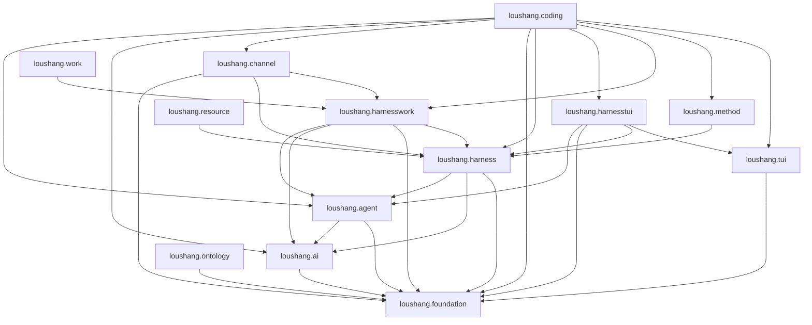

# Current Observed Package Dependencies

<!-- Generated by scripts/architecture/render_current_package_dependencies.py. -->
<!-- Do not edit this file manually. -->

## Status

- Authority: generated — Current package/import fact
- Design status: not-applicable
- Implementation status: not-applicable
- Sources: `loushang.coding.arch`, `src/loushang/**/*.py`, `pyproject.toml`

This document records physical Python packages and source-observed import
dependency edges classified by `coding.arch`.
It is not the semantic runtime sequence and
does not make an observed dependency architecturally desirable. Intended
and forbidden direction remains governed by architecture tests and accepted
scope boundaries.

`A --> B` means Python source in `loushang.A` directly expresses an
eager, typing, deferred, or lazy-export dependency on `loushang.B`.
Categories and duplicate edges are collapsed; transitive dependencies are
not drawn.

## Observed Graph

## Observed Dependency Table

| Package | Direct Loushang dependencies |
| --- | --- |
| `loushang.agent` | `loushang.ai`, `loushang.foundation` |
| `loushang.ai` | `loushang.foundation` |
| `loushang.channel` | `loushang.foundation`, `loushang.harness`, `loushang.harnesswork` |
| `loushang.coding` | `loushang.agent`, `loushang.ai`, `loushang.channel`, `loushang.foundation`, `loushang.harness`, `loushang.harnesstui`, `loushang.harnesswork`, `loushang.method`, `loushang.tui` |
| `loushang.foundation` | None |
| `loushang.harness` | `loushang.agent`, `loushang.ai`, `loushang.foundation` |
| `loushang.harnesstui` | `loushang.agent`, `loushang.foundation`, `loushang.harness`, `loushang.tui` |
| `loushang.harnesswork` | `loushang.agent`, `loushang.ai`, `loushang.foundation`, `loushang.harness` |
| `loushang.method` | `loushang.harness` |
| `loushang.ontology` | `loushang.foundation` |
| `loushang.resource` | `loushang.harness` |
| `loushang.tui` | `loushang.foundation` |
| `loushang.work` | `loushang.harnesswork` |

## Console Entrypoints

| Command | Implementation |
| --- | --- |
| `loushang` | `loushang.coding.cli.__main__:main` |
| `loushang-tui` | `loushang.coding.ui.cli:main` |

## Interpretation Rules

- This graph describes distribution-local physical imports, not Product
  Capability dependencies or ownership by itself.
- Compatibility packages appear while they contain Python source, even if
  their long-term target is removal.
- A missing edge does not prove that two scopes never interact; injected
  ports and runtime values may avoid direct imports.
- A new edge must still satisfy `tests/architecture/` and the relevant
  parent/child scope contracts.
