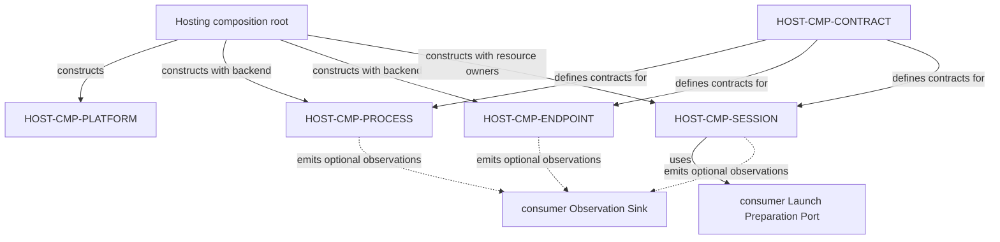

# Loushang Hosting Component Model

## Status

- Scope: `hosting`
- Parent: `loushang`
- Authority: normative — accepted component model
- Design status: accepted
- Implementation status: partial
- Owner: Loushang Hosting architecture

## Component Map

| ID | Component | Owns | Does not own |
| --- | --- | --- | --- |
| `HOST-CMP-CONTRACT` | Hosting Contract Model | immutable launch/session requests, lease/observation shapes, stable failure taxonomy, required and provided port contracts | OS calls, policy decisions, protocol payloads, persistence |
| `HOST-CMP-PROCESS` | Process Lifetime Host | capacity reservation, spawn attachment, bounded streams, exit convergence, terminate/kill/close, process-tree reclamation | executable admission, Sandbox meaning, restart/adoption, domain retirement |
| `HOST-CMP-ENDPOINT` | Inherited Peer Endpoint Host | parent/child endpoint-pair creation, exact handle inheritance material, raw byte transport, peer closure, endpoint cleanup | listening endpoints, accept loops, framing, handshake, RPC, Worker semantics |
| `HOST-CMP-SESSION` | Child Session Host | preparation + endpoint + process transaction, atomic publication, reverse rollback, joint close | Worker supervision, domain publication, durable Session state |
| `HOST-CMP-PLATFORM` | Platform Adapter Set | POSIX/Windows process and endpoint primitives, handle allowlisting, process-tree signals, explicit support detection | caller policy, silent fallback, public plugin extensibility |

## Composition View



This is construction/composition. It does not imply that Contract Model calls
the resource owners or that an Observation Sink owns them.

## Intended Dependency View

```text
session -> contract
session -> process
session -> endpoint
process -> contract
process -> platform contract
endpoint -> contract
endpoint -> platform contract
platform adapters -> contract/private platform contracts

process -/-> session
endpoint -/-> session
platform -/-> process/session owners
hosting -/-> harness or any Product/domain scope
```

The composition root may import all Hosting components. Leaf platform adapter
modules do not import the composition root or public package facade. POSIX and
Windows adapters are mutually independent.

## Component Interfaces

H0 fixes the public Contract Model names and fields in
[Hosting H0 Contract Model](contract-model-h0.md). Names for the four
unimplemented resource/platform components remain architectural roles rather
than reserved Python symbols.

### Contract Model

Provides:

- materialized process-launch and child-session request values;
- process lease, host byte endpoint, and child-session lease protocols;
- neutral lifecycle observation and stable failure categories;
- Launch Preparation and Observation Sink required-port protocols.

It carries no Plugin ID, Capability graph object, Tool request, Policy decision,
Approval record, Sandbox status, Worker frame, or domain generation.

### Process Lifetime Host

Provides a bounded Process Hosting Port. It consumes one exact launch request,
one preparation lease, and an internal platform process backend. It publishes a
lease only after capacity, preparation, OS creation, attachment, and immediate
post-spawn checks succeed.

It owns the process until exit settlement and cleanup finish. A consumer may
observe an exit; it cannot detach or transfer raw process ownership.

Natural exit, explicit close, and cancellation converge on one state machine.
After any caller-supplied semantic stop period has elapsed outside Hosting, the
mechanism sequence is terminate owned process tree, bounded grace, kill
remaining owned tree, reap, close handles, and publish one shared raw exit
result. Failures are aggregated while later reachable reclamation continues.

### Inherited Peer Endpoint Host

Provides a private endpoint-pair operation to Child Session Host. It returns an
owned host side plus single-use child inheritance material. Once spawn
transfer settles, the child material is consumed or closed; it cannot be reused
for a second process.

The host byte endpoint exposes bounded read/write/close primitives. It has no
message kind, correlation ID, heartbeat, or serialization choice.

### Child Session Host

Provides the Child Session Hosting Port. It is the only owner allowed to join
endpoint creation and process start into a returned aggregate lease.

The aggregate lease closes protocol-independent resources in a documented
order and reports independent process, endpoint, and preparation failures. It
does not convert close into domain retirement success.

### Platform Adapter Set

Provides private process and endpoint backend ports. Each concrete adapter
declares an exact capability set; the composition root rejects missing required
capabilities. The set has no dynamic third-party registration or Plugin
loading surface.

## Critical Interaction: Successful Child Session

```text
trusted Harness adapter
  -> Child Session Host: start(exact request, preparation port)
  -> preparation port: prepare
  -> Inherited Peer Endpoint Host: create host/child pair
  -> preparation lease: verify_current at final safe point
  -> Process Lifetime Host: reserve and spawn with child-handle allowlist
  -> Platform Adapter: create process and attach owner
  -> Inherited Peer Endpoint Host: consume/close parent's child-side copy
  -> Child Session Host: publish process lease + host endpoint + observations
  -> Harness Worker Supervisor: perform protocol handshake
```

The last line is outside Hosting. A successful Hosting return proves neither a
Worker handshake nor a domain publication.

## Critical Interaction: Failure Or Cancellation

```text
failure/cancellation at any step
  -> stop publication
  -> reclaim attached or still-settling process tree, if any
  -> close host and child endpoint resources, if any
  -> close preparation lease
  -> release process reservation
  -> settle cleanup observations
  -> propagate the primary failure/cancellation with cleanup context
```

Exact reverse order may be specialized by resource acquisition order, but no
later cleanup is skipped after an earlier cleanup error. Cancellation is
delayed until owned cleanup settles.

## Error Boundary

Hosting distinguishes at least:

- invalid materialized request;
- host closed or capacity exhausted;
- preparation rejected/stale/failed;
- endpoint unavailable or transfer failed;
- platform unsupported;
- spawn failed or child exited before publication;
- read/write bound exceeded or peer closed;
- termination/process-tree reclamation failed;
- aggregate cleanup failed.

Harness maps these neutral categories to Sandbox, Worker, Plugin, Product, and
user-facing diagnostics. Hosting does not collapse or name those higher-level
meanings.

## Public Surface Restraint

The H0 public package surface exposes only Contract Model values and
provided/required ports. H1 keeps its process owner and backend seam private.
Later slices may add restrained composition entrypoints needed by trusted
hosts. Concrete backends, raw spawners, endpoint
factories, inherited-handle values, reservation objects, and cleanup
coordinators remain private.

Python import visibility is not a hostile-code security boundary. Structural
gates prevent accidental cross-scope dependency and author-SDK exposure;
untrusted Worker code is constrained by the external Harness/Sandbox boundary.
