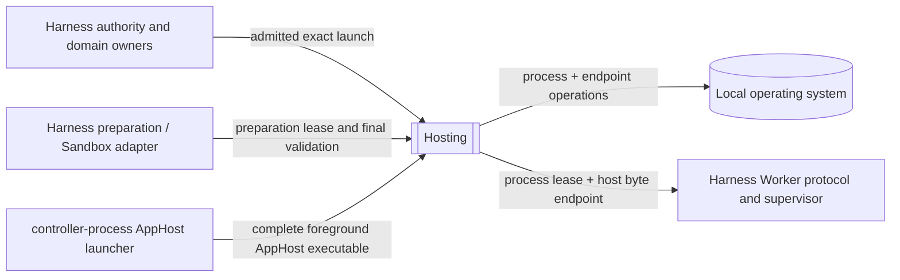

# Loushang Hosting System Context

## Status

- Scope: `hosting`
- Parent: `loushang`
- Authority: normative — accepted black-box context and boundary
- Design status: accepted
- Implementation status: partial
- Owner: Loushang Hosting architecture

## Logical Context



All edges in this diagram are accepted Target relationships; none is a Current
consumer edge in H0. Hosting sees an exact request and a preparation lease. It
does not see user intent, Plugin
selection, policy rules, approval UI, Worker frames, or domain publication.

## Logical Actors And Sources Of Variation

| Actor or variation | Boundary consequence |
| --- | --- |
| trusted consumer | requires narrow provided ports; does not make Hosting an admission owner |
| external preparation owner | requires a one-shot preparation/validation/cleanup port without importing the owner |
| local OS | requires platform adapters for spawn, handle transfer, waiting, and process-tree cleanup |
| process exit and caller cancellation | require convergent lifecycle semantics rather than Product callbacks |
| inherited peer-endpoint kind | requires byte-oriented behavior independent of Worker/RPC framing or AppServer listener semantics |
| diagnostics consumer | requires a redacted observation sink, not a Logging subsystem dependency |
| cross-Product AppHost | may request exact foreground/daemon process mechanics without transferring Product routing or AppServer authority |

The Plugin, Worker protocol, LSP protocol, and Capability graph are not sources
of internal Hosting component variation. They remain meanings above the
black-box boundary.

## Physical Context

### Current observed placement

```text
loushang.harness.workspace.process     process records, local spawn, Host
loushang.harness.tools                 Policy/Approval-bound launcher
loushang.harness.sandbox               containment preparation and cleanup
loushang.harness.worker                Worker launch identity/protocol/supervisor
```

There is no native Worker endpoint binding or Hosting runtime owner. H0 adds
only the `loushang.hosting` Contract Model package.

### Accepted target placement

```text
same installed loushang distribution
  loushang.hosting
    contract model
    process lifetime host
    inherited peer endpoint host
    child session host
    POSIX / Windows platform adapters

  loushang.harness
    authority + Sandbox preparation adapter
    Worker protocol / supervisor / journal / domain adapter
    compatibility facades during migration
```

Separate distribution packaging, a helper daemon, remote RPC, and persisted
reattachment metadata are outside the target.

The relationship to embedded, foreground, sidecar, and daemon application
profiles is defined by the
[Hosted Application Support Boundary](key-designs/hosted-application-support-boundary.md).

## Provided Ports

### Process Hosting Port

Accepts an exact materialized local process request plus an owner-supplied
preparation lease and returns a process lease. The lease owns bounded stream
access, wait, terminate, close, exit observation, and redacted diagnostics.

This port is suitable for trusted consumers such as current LSP hosting. It is
not directly given to a Plugin or Worker child.

### Child Session Hosting Port

Accepts an exact child-session request plus an owner-supplied preparation lease
and atomically returns:

- a process lease;
- the host side of an inherited peer byte endpoint;
- neutral creation/transfer observations.

The port does not return the child endpoint, raw descriptor/handle factory,
spawner, platform backend, or a reconnectable listener.

## Required Ports

### Launch Preparation Port

The consumer provides a narrow adapter that materializes any caller-owned
wrapper/containment setup, supplies a final `verify_current` operation for the
last safe pre-spawn point, and owns idempotent cleanup.

Hosting guarantees when this port is called and cleaned. Hosting does not
claim the returned preparation is authorized, approved, or contained. Harness
may make those claims only from its own Policy/Approval/Sandbox evidence and
composition gates.

### Lifecycle Observation Sink

An optional consumer-owned sink accepts bounded Hosting observation records.
The sink cannot influence launch or cleanup. Failure to record an observation
does not transfer resource ownership or turn logs into lifecycle truth.

### Platform Backend Ports

Process and endpoint components require internal platform ports for exact OS
operations. Only the Hosting composition root selects them. They are not
public extension/plugin contracts.

## Authority And Trust Boundary

| Fact or decision | Sole owner |
| --- | --- |
| Product/Plugin selected and trusted | Product and Harness Plugin owners |
| action allowed/approved/authorized | Harness Policy, Approval, Authorization |
| containment required and active | Harness Sandbox owner |
| exact OS process created/exited/reclaimed | Hosting Process Lifetime Host |
| exact inherited endpoint pair created/transferred/closed | Hosting Inherited Peer Endpoint Host |
| AppServer listener bound/accepted/closed | AppServer transport owner |
| process plus endpoint published atomically | Hosting Child Session Host |
| Worker handshaken/healthy/fenced | Harness Worker protocol/supervisor |
| restart/adoption permitted | Product/Harness Worker lifecycle owner |
| Capability generation published/retired | exact Harness/domain generation owner |

Hosting observations may be inputs to a higher-level evidence record. They are
never substitutes for the other rows.

## State, Temporary Files, Logs, And Handles

- Live Hosting state is in-memory and lease-owned. V1 writes no durable process
  registry or adoption journal.
- Native IPC should be anonymous/handle-based. No filesystem rendezvous or
  stdout-reported address is the normal path.
- AppServer listeners are a different topology. Their admitted path, private
  directory, authentication, accept loop, and connection lifecycle remain with
  the AppServer transport owner.
- If a platform implementation proves an unavoidable temporary artifact, the
  caller supplies the already-admitted runtime root; Hosting creates an
  owner-private, unguessable, lease-bound child and removes it on every close
  path. Hosting never chooses cwd, user home, or workspace as a fallback.
- Stderr tails and lifecycle observations are bounded. Hosting does not choose
  log directories or retention policy.
- Environment values, inherited handle values, and temporary paths are not
  ordinary status or audit fields.
- Clipboard and image payloads have no relationship to Hosting and remain with
  their existing owners.

## Forbidden Boundary Crossings

- `loushang.hosting` importing any Harness or Product module;
- Hosting accepting Plugin declarations, Tool requests, Capability IDs, or
  Worker protocol messages;
- Harness presenting a Hosting observation as containment or publication proof;
- Plugin/Worker code receiving a raw spawner, process host, endpoint factory,
  preparation owner, or inherited ambient credential;
- using PID, an endpoint address, stdout text, or a handshake as durable owner
  identity;
- introducing a transport fallback whose security and cleanup properties have
  not passed the same platform contract.
