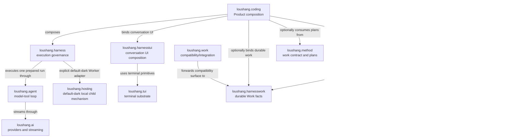
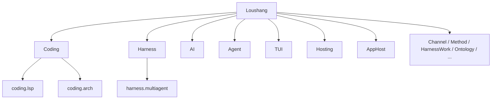

# Loushang Architecture Scope Diagrams

## Status

- Authority: descriptive — Current semantic scope and dependency-policy projections
- Design status: accepted
- Implementation status: partial
- Owner: Loushang architecture

## Reading Rule

This document shows ownership and major semantic relationships. It does not
duplicate the exact physical Python import graph. For observed imports, use the
generated
[Current Package Dependencies](generated/current-package-dependencies.md).

Every diagram states its view and state. `A --> B` has only the meaning written
on that edge; composition, runtime interaction and import dependency are not
interchangeable.

## Current Semantic Runtime And Composition View



The diagram intentionally omits many direct physical imports and Foundation
edges. It describes the primary semantic path and owner relationships.

## Current Architecture Scope Tree



Nested scopes own internal architecture but inherit placement and cross-sibling
dependency governance from their parent.

## Dependency Policy Summary

```text
Product composition -> Harness -> Agent -> AI -> Foundation

HarnessTUI -> Harness + TUI
HarnessWork -> Harness
Work compatibility -> HarnessWork
Ontology -> Foundation
Harness -> Hosting
AppHost A0.1 -> Python standard library only
```

This is a descriptive projection of policy, not its normative source or an
exhaustive allowlist. Exact forbidden and exception edges are executable under
`tests/architecture/` and explained by canonical scope boundaries.

Future Product scopes such as Design, Research, PPT, or Cowork remain peers of
Coding when accepted and implemented. They are not children of Agent, Work, or
Method merely because they consume those capabilities.

The accepted Target allows future AppHost runtime/profile components to depend
on AppHost contracts and injected Product ports. Optional hosted and launcher
adapters may depend on AppServer and Hosting respectively; those optional
edges are not AppHost core dependencies and are not implemented by A0.1.
